<div align="center">

# InterpretaAI

### Alfabetização que conversa com a criança — e devolve a experiência para a turma

[](docs/MVP_STATUS.md)
[](app)
[](server)
[](docs/ARCHITECTURE.md)
[](docs/ORIGEM_HACKTUDO.md)

**Um MVP Android de alfabetização mediada por voz para crianças que ainda não leem.**

A criança ajuda a LEIA e os personagens, formula hipóteses e faz a história avançar — sem chatbot
aberto, sem nota automática e sem transformar o celular em mais tempo de tela.

[📱 Baixar APK](https://github.com/Victorzinn704/InterpretaAI/releases/latest) · [📄 Ler proposta de 10 páginas](dist/InterpretaAI-Proposta-MVP.pdf) · [🖼️ Abrir galeria completa](docs/GALLERY.md) · [✅ Ver auditoria final](docs/FINAL_MVP_AUDIT.md)

</div>

## Nascido no HACKTUDO 2026

O InterpretaAI foi concebido durante o **Hackathon HACKTUDO 2026**, realizado na edição
comemorativa de 10 anos do HACKTUDO. O ponto de partida foi o desafio de construir uma relação mais
consciente entre tecnologia e educação em um ambiente cada vez mais conectado e cheio de distrações.

A resposta do projeto é usar o smartphone por um ciclo curto e intencional: a LEIA conduz uma
experiência de alfabetização, a criança participa como coautora e a aprendizagem continua com a turma
fora da tela. [Conheça a origem e o vínculo com o desafio](docs/ORIGEM_HACKTUDO.md) ou consulte a
[página oficial do Hackathon HACKTUDO 2026](https://www.hacktudo.com.br/amais-hackathon-2026).

> **Transparência:** esta referência registra o contexto em que a ideia surgiu. Não representa, por si
> só, premiação, parceria ou endosso oficial do HACKTUDO ou da organização patrocinadora.

<table>
  <tr>
    <td width="33%" align="center">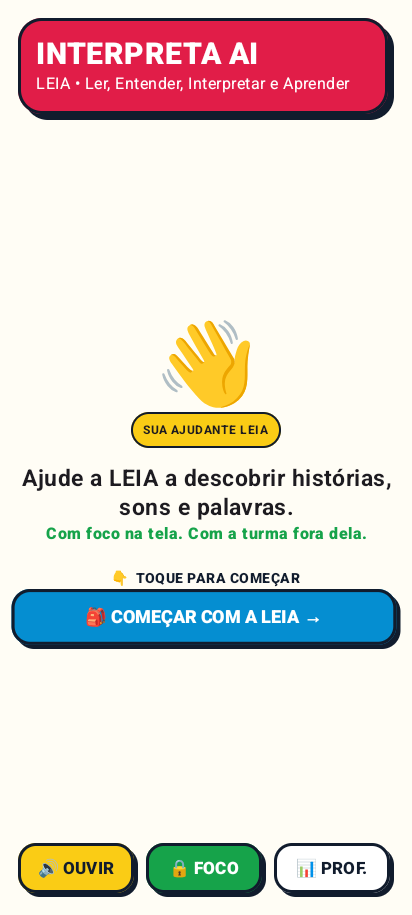<br><strong>Uma ação principal por tela</strong></td>
    <td width="33%" align="center">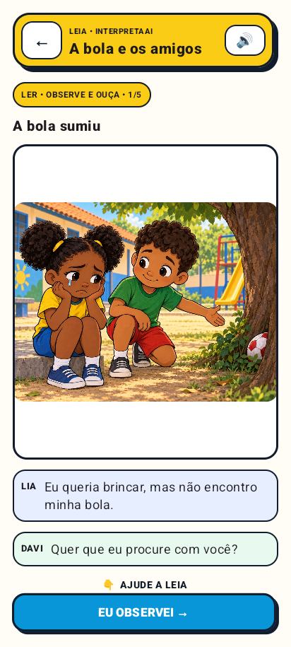<br><strong>História familiar e falada</strong></td>
    <td width="33%" align="center">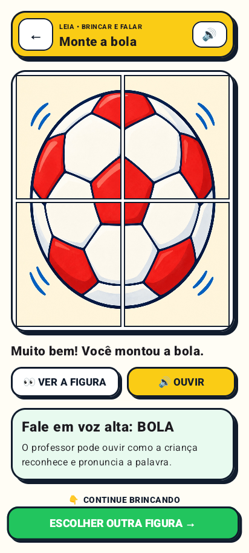<br><strong>Imagem, palavra e fonema</strong></td>
  </tr>
</table>

## A proposta em uma frase

> O InterpretaAI transforma o smartphone em um mediador breve de alfabetização: a LEIA orienta uma
> história por voz, a criança participa como coautora, o professor recebe sinais de participação e,
> ao final, o aparelho descansa para a aprendizagem continuar em dupla ou grupo.

## Por que isso responde ao desafio

O desafio pede uma relação mais consciente entre tecnologia e educação em um ambiente cheio de
distrações. A resposta do InterpretaAI não é manter a criança mais tempo diante da tela. É usar o
celular com propósito, foco e duração curta para iniciar uma experiência que termina no mundo real.

| Critério da comissão | O que pode ser visto no MVP | Limite assumido com transparência |
|---|---|---|
| **Adequação ao tema** | Modo Foco, interface sem rolagem infantil e encerramento “o celular descansa”. | Bloqueio completo requer tablet provisionado como Device Owner. |
| **Originalidade e inovação** | **Coautoria guiada:** a criança ajuda a LEIA e os personagens com sua própria ideia. | O MVP prova um ciclo e uma história; não afirma ser currículo completo. |
| **Solução tecnológica** | APK Kotlin/Compose, API Java/LangChain4j, Qwen, Kokoro, visão local, fallback e missão professor→tablet. | O pacote Oracle existe, mas o endpoint público persistente e a autenticação institucional ainda precisam ser implantados. |
| **Utilidade e aplicabilidade** | Voz, toque, alvos grandes, puzzle, atividade em grupo e métricas de participação. | Voz, ruído, sotaques e compreensão ainda precisam de piloto em sala. |

O mapeamento completo está na [auditoria do regulamento](docs/REGULAMENTO_HACKTUDO_2026.md), com
separação entre evidência técnica e confirmações que dependem da equipe. Bibliotecas, modelos,
licenças e downloads estão em [Créditos de terceiros](THIRD_PARTY_NOTICES.md).

## O “boom”: a criança ajuda a história

O produto não pergunta apenas “qual é a resposta certa?”. Ele coloca a criança em um papel social:
**ajudar Lia, Davi e a própria LEIA**. No Mistério da Bola, a criança recupera uma informação da
história, investiga uma pista, explica onde procurar, consolida `BOLA` no quebra-cabeça e usa o que
entendeu para orientar Davi. O puzzle serve à compreensão; não é o objetivo final. As demais
atividades continuam independentes e novos casos só entram depois da validação desse contrato.

As decisões, referências educacionais, tratamentos de erro e limites estão no
[fluxo pedagógico fechado](docs/FLUXO_PEDAGOGICO_FECHADO.md). A expansão responsável está na
[matriz do 1º ao 5º ano](docs/PEDAGOGICAL_SCOPE_1_TO_5.md), separando o que já é demonstrado do que
ainda exige conteúdo e validação docente.

<table>
  <tr>
    <td width="33%" align="center">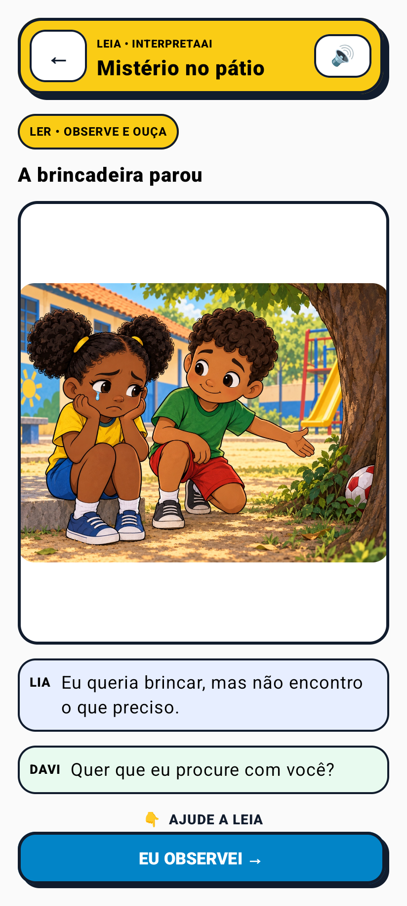<br><strong>1. Ler o contexto</strong><br>História curta, visual e repetível.</td>
    <td width="33%" align="center">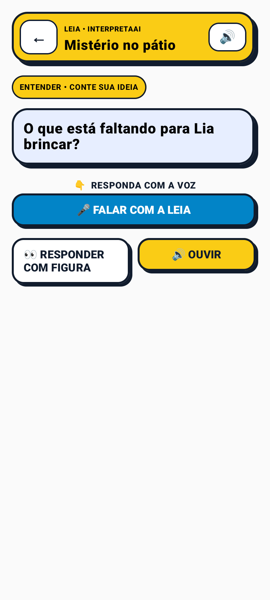<br><strong>2. Localizar informação</strong><br>Voz primeiro, figura quando necessária.</td>
    <td width="33%" align="center">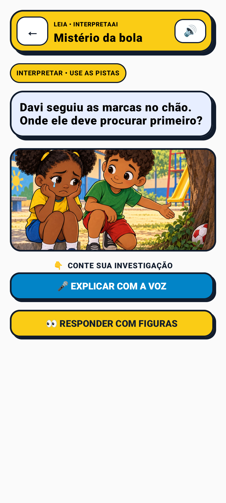<br><strong>3. Investigar pistas</strong><br>A solução não aparece antes da tentativa.</td>
  </tr>
  <tr>
    <td width="33%" align="center">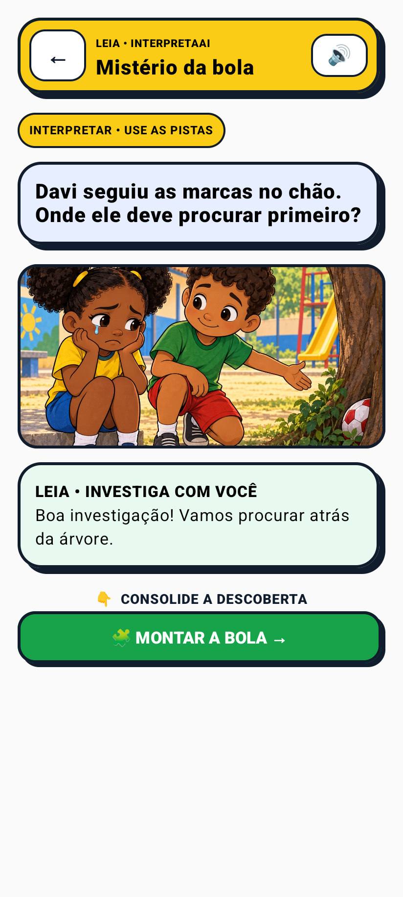<br><strong>4. Explicar</strong><br>A criança explicita a pista usada.</td>
    <td width="33%" align="center">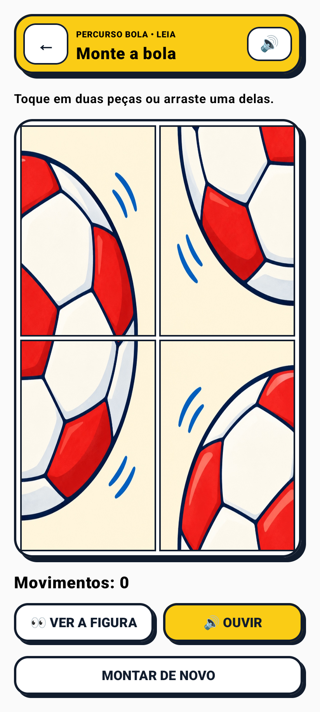<br><strong>5. Manipular</strong><br>Toque ou arraste, com ajuda progressiva.</td>
    <td width="33%" align="center">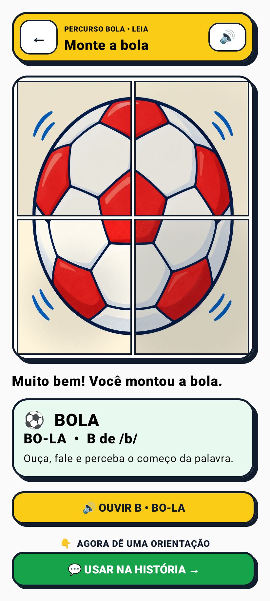<br><strong>6. Consolidar linguagem</strong><br>BOLA, BO-LA, B e /b/.</td>
  </tr>
  <tr>
    <td width="33%" align="center">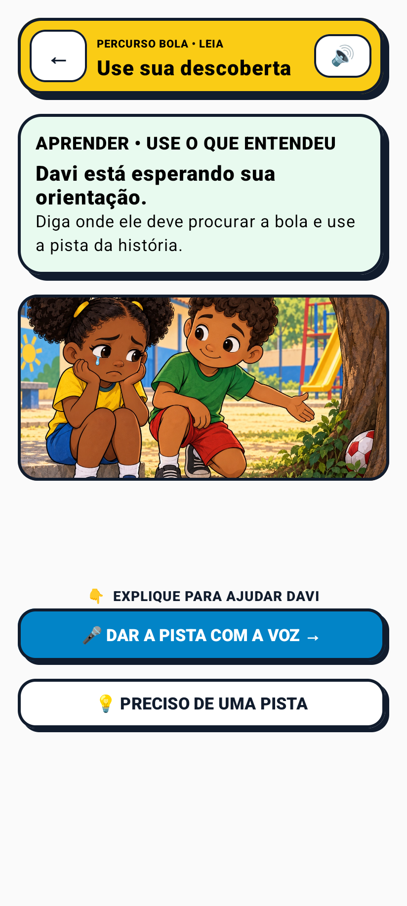<br><strong>7. Aplicar</strong><br>A compreensão vira uma orientação.</td>
    <td width="33%" align="center">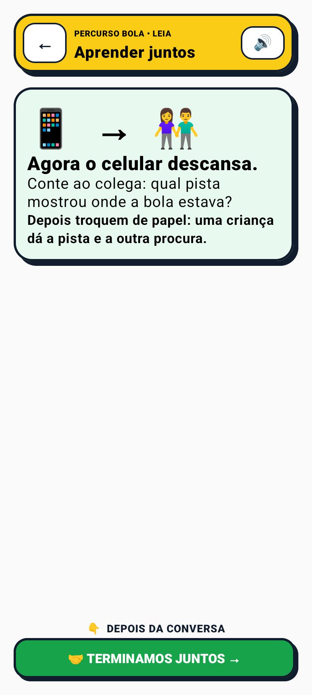<br><strong>8. Compartilhar</strong><br>O celular descansa e a dupla troca de papel.</td>
    <td width="33%" align="center"><strong>Um caso, várias profundidades</strong><br>Nomear, localizar, inferir, explicar e aplicar.</td>
  </tr>
</table>

## Três missões rápidas escolhidas pela professora

O caminho numérico, os pontos que formam uma casa e a foto ilustrativa da bola com letras são
atividades **fechadas e offline no conteúdo**. A LEIA fala a instrução; a criança toca, pede ajuda
se precisar e termina explicando ao colega. O caminho dos números complementa a conversa e não é
apresentado como medida de alfabetização. A nova LEIA é uma personagem adulta original com cachorro,
sem reprodução de personagem de outra obra. A foto da bola é gerada por IA, não retrata escola real.

<table>
  <tr>
    <td width="33%" align="center">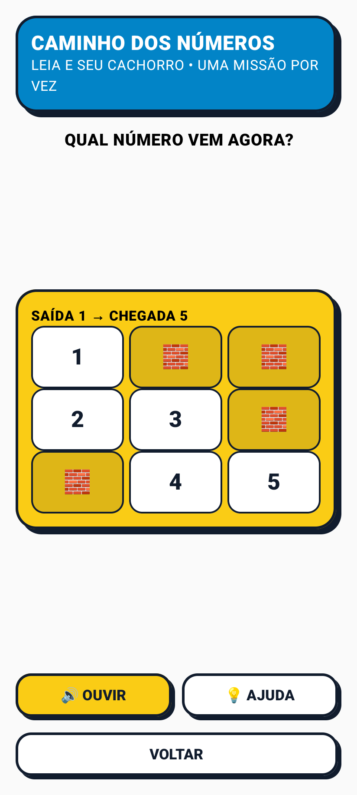<br><strong>1→5 com apoio oral</strong></td>
    <td width="33%" align="center">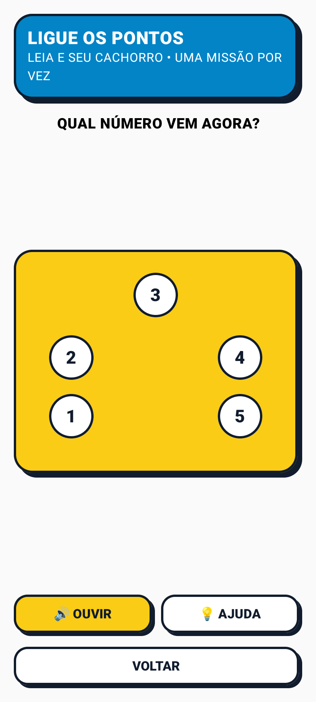<br><strong>Pontos → CASA</strong></td>
    <td width="33%" align="center">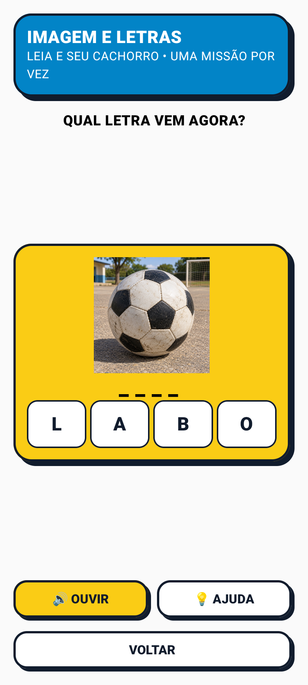<br><strong>Foto → BOLA</strong></td>
  </tr>
</table>

[Capturas em celular e tablet, limites pedagógicos e consumo](docs/NEW_GAMES_TABLET_MOBILE.md).

## LEIA é o coração do produto

| Movimento | No aplicativo | Sinal pedagógico observável |
|---|---|---|
| **Ler** | Observar a cena e ouvir o diálogo. | Atenção a personagens, objetos e sequência. |
| **Entender** | Reconhecer quem aparece, o que acontece e qual é o desafio. | Compreensão de ação, intenção e contexto. |
| **Interpretar** | Contar uma hipótese e sugerir caminhos para a história. | Expressão oral, inferência e escuta de possibilidades. |
| **Aprender** | Relacionar contexto, fala, fonema e palavra e levar a descoberta ao grupo. | Apropriação da linguagem, cooperação e transferência. |

A IA funciona como **mediadora contextual, curta e segura**. Ela reconhece a contribuição, conecta a
ideia com a cena e faz somente uma próxima pergunta. Não diagnostica, não dá nota, não cria ranking e
não declara uma emoção infantil como absolutamente correta.

## Experiência pensada para quem ainda não lê

- uma decisão principal por tela e nenhuma ação infantil dependente de swipe;
- instrução curta, narrável e repetível;
- botões com alvo mínimo, borda grossa, sombra e reação sonora/visual;
- voz como conteúdo pedagógico — bipes não substituem fonemas;
- reconexão suave: pista visual aos 20 segundos e uma única fala aos 40;
- modo **Reduzir estímulos**, preservando voz, contraste e direção;
- resposta por voz ou toque, sem vermelho punitivo e sem culpa;
- quebra-cabeças 2×2 e 3×2 com bola, banana e maçã.
- nível 2×2 ou 3×2 escolhido pelo professor, sem acrescentar uma decisão à jornada infantil;
- alternativas e resposta composta reveladas somente quando a criança pede ajuda;
- troca de peças com som curto, sem fala repetitiva a cada movimento.
- quadro criativo com toque ou arraste, traço suavizado, quatro cores, espessura, borracha e
  desfazer/refazer com estado visual imediatamente atualizado.

### Responsividade auditada, não presumida

<table>
  <tr>
    <td width="25%" align="center">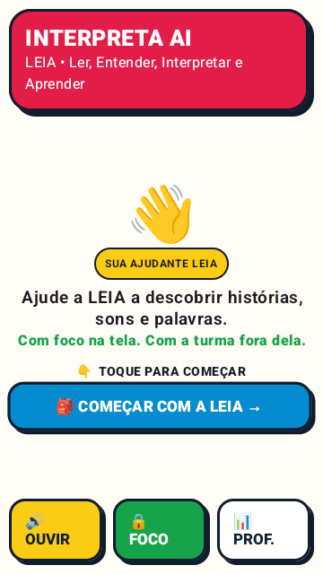<br><strong>360 × 640</strong></td>
    <td width="25%" align="center"><br><strong>412 × 915</strong></td>
    <td width="50%" align="center">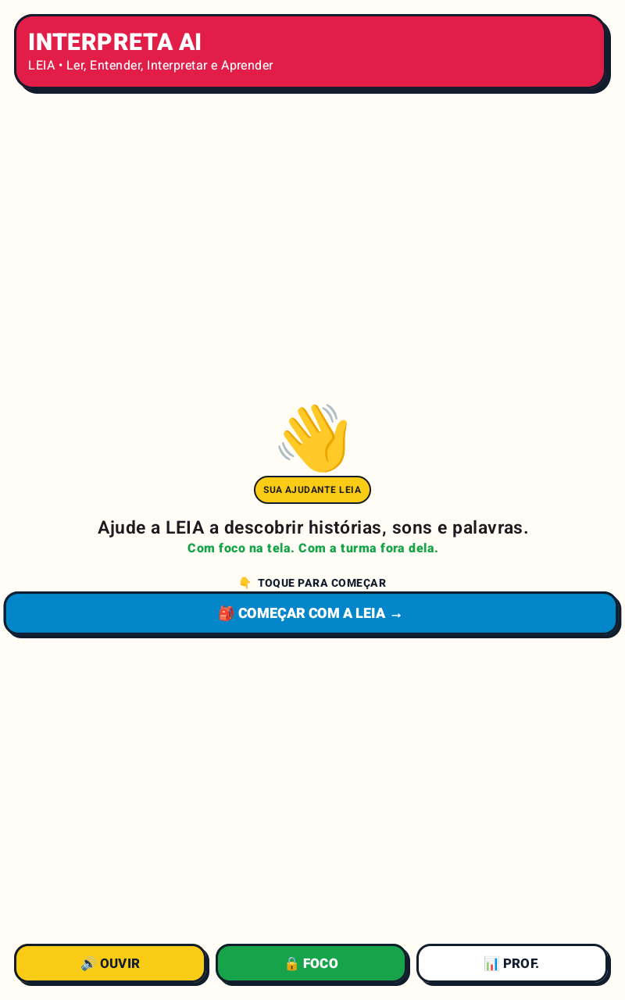<br><strong>Tablet 800 × 1280</strong></td>
  </tr>
</table>

As telas foram verificadas nesses três viewports sem CTA cortado, sobreposição, texto ilegível ou ação
dependente de rolagem. Veja todas as evidências em [Galeria visual](docs/GALLERY.md).

## Arquitetura do MVP

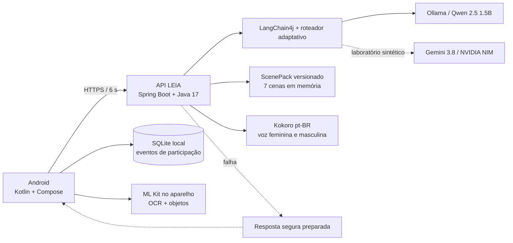

O recorte é deliberado: monólito Android, API pequena e provedores substituíveis. Não há agente
autônomo, RAG, banco vetorial ou LangGraph no MVP. Isso mantém a experiência previsível, testável e
adequada a uma demonstração infantil.

### Contrato da conversa

`POST /api/v1/voice-turn` preserva a resposta única; `/voice-turn/stream` envia
`ACK → FINAL_TEXT → COMPLETE` por NDJSON. A tela recebe texto e reação já validados antes de a voz
terminar, sem transmitir tokens crus. A memória fica em RAM, limitada a seis mensagens; o Android
cancela a chamada ao sair da etapa e, após o texto seguro, espera somente 650 ms pelo áudio remoto
antes de usar a voz local. Durante uma atualização
gradual, um servidor que ainda não ofereça streaming é detectado por `404/405` e o Android recua uma
vez para o endpoint JSON, preservando a mesma chave idempotente.

[Ver contrato completo da API](docs/VOICE_API.md) · [Ver arquitetura](docs/ARCHITECTURE.md)

## Uso consciente e Modo Foco

O Modo Foco foi validado em emulador provisionado como **Device Owner**, com
`mLockTaskModeState=LOCKED`: Home e Recentes permaneceram bloqueados. Em um aparelho comum, o Android
exige confirmação de um adulto para fixar a tela. O repositório não promete uma permissão que o sistema
operacional não concede silenciosamente.

<p align="center">
  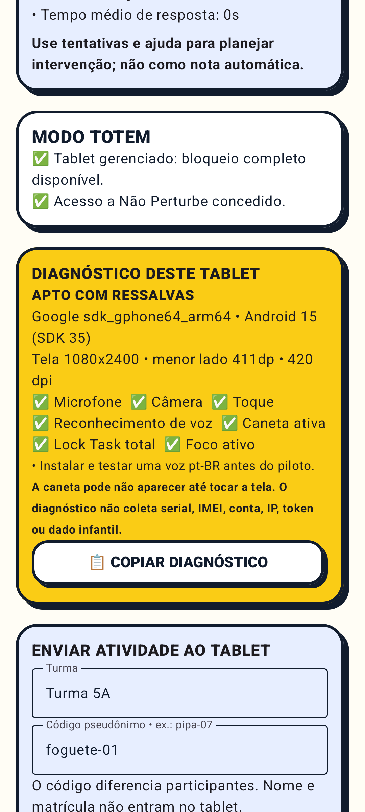<br>
  <strong>Compatibilidade e Lock Task verificados na área do educador, sem identificadores persistentes.</strong>
</p>

Mais importante: foco não é apenas bloqueio técnico. O ciclo termina orientando que o aparelho seja
colocado na mesa e que a dupla continue conversando, representando ou procurando objetos sem a tela.

## Métricas que apoiam — sem rotular

O SQLite local guarda sessão, atividade, modalidade, duração, pedidos de ajuda e participação. A
versão 2 removeu a coluna legada de “acerto/sucesso” e migra eventos anteriores sem esse rótulo.
No piloto online, `learnerAlias` diferencia participantes com o mesmo avatar usando códigos fechados
como `pipa-07`; a Home infantil continua mostrando somente personagem, turma e missão.
O servidor aceita uma sala de até 40 aliases e publicação transacional para toda a turma ou um
subgrupo. A área adulta do Android monta a lista, marca os participantes e envia a mesma missão para
todos ou apenas para a seleção. O MVP não simula gestão institucional.
O painel separa o trabalho em três áreas: **Missão**, para escolher conteúdo e mediação; **Turma**,
para formar grupos e enviar; e **Tablet**, para foco, acessibilidade e diagnóstico. A escolha aparece
antes das métricas, e credenciais técnicas só são exibidas quando o adulto abre a configuração.
Na mesma tela de Missão, o professor filtra as onze missões por `1º`–`5º` ou mantém `TODAS` para
recomposição; o ano organiza o planejamento e nunca vira diagnóstico automático da criança.
Quando duas a quatro crianças compartilham o mesmo `deviceId`, cada uma conserva avatar e pseudônimo
na área adulta, mas a Home mostra somente os avatares e “GRUPO”. A missão é enviada uma vez ao
aparelho e seus eventos são persistidos como participação coletiva, sem atribuição artificial a uma
criança específica. Durante a missão, os avatares recebem turnos falados e visuais — procurar pistas,
contar a ideia, montar/desenhar e explicar — com rodízio automático; o sistema organiza a colaboração
sem fingir que mediu individualmente a resposta do grupo.
No perfil Oracle, a conversa pode exigir o token configurado pelo adulto; ele viaja somente em
cabeçalho e a ausência dele mantém a criança no percurso local.

- **Criança:** recebe encorajamento e progresso, nunca nota.
- **Professor:** observa participação, modalidade, ajuda e tempo para decidir intervenções e grupos.
- **Secretaria:** agregados são evolução futura; não existe dashboard fictício neste MVP.

## Evidência de engenharia

| Verificação | Resultado auditado |
|---|---:|
| Testes unitários Android | **50 aprovados** |
| Testes instrumentados Android | **33 aprovados no Android 15/API 35** |
| Testes do servidor | **72 aprovados** |
| Android Lint | **Aprovado** |
| Viewports infantis auditados | **360×640, 412×915 e 800×1280** |
| Modo Foco gerenciado | **LOCKED; Home/Recentes testados** |
| PDF profissional | **10 páginas A4 inspecionadas** |
| Canal professor→tablet | **publicação, versão incremental e recebimento automático validados em loopback** |
| Endpoint público Oracle | **não implantado; pacote operacional preparado** |

As missões publicadas para 2º–5º ano agora preservam o identificador pedagógico do início ao
fim: o professor envia um pacote fechado, o tablet registra eventos daquela habilidade e a criança
recebe um encerramento específico, uma única vez, antes de voltar ao início.

A área adulta inclui um diagnóstico copiável do tablet para o piloto: modelo, Android, tela,
microfone, câmera, toque, voz, TTS, caneta e Lock Task, sem serial, IMEI, conta, IP, token ou dado
infantil. Isso permite validar aparelhos autorizados sem confundir especificação pública com o
inventário real dos GETs.

Execute o verificador reproduzível:

```bash
./tools/check-delivery.sh --full
```

## Privacidade e riscos declarados

O MVP processa a foto da missão no aparelho e a apaga após a análise concluída. Não cria arquivo de
áudio bruto, não inclui credenciais no APK e não registra transcrição nos logs. Ainda assim, não está
pronto para dados reais de crianças:

- o `SpeechRecognizer` prefere operação offline, mas o mecanismo/OEM pode usar rede;
- autenticação por token de tablet e limite por sessão estão implementados, mas ainda não foram
  comprovados no endpoint Oracle; credenciais individuais e contenção por rede continuam pendentes;
- PIN adulto, identidade institucional, retenção e sincronização institucional são pendências; o
  piloto já sincroniza eventos fechados e expõe somente agregados com tokens separados;
- encerramento abrupto exige endurecer a limpeza de arquivos temporários;
- conteúdo, sotaques, ruído, acessibilidade e compreensão precisam de piloto com educadores.

[Inventário completo de dados e riscos](docs/DATA_AND_PRIVACY.md) ·
[Checklist antes de um piloto](docs/PILOT_CHECKLIST.md)

## Autoria, IA e transparência

O InterpretaAI defende **inovação incremental e contextual**. Voz, histórias interativas, fonética e
puzzles já existem; a contribuição está no ciclo pedagógico que faz a criança ajudar os personagens,
verbalizar pistas, consolidar linguagem e devolver a atividade à turma fora da tela. O projeto não se
apresenta como “primeiro do mundo” nem confunde assistência por IA com autoria automática.

- [Autoria, originalidade, uso de IA e prevenção de plágio](docs/AUTORIA_ORIGINALIDADE_E_IA.md)
- [Inventário e proveniência de imagens e sons](docs/ASSET_PROVENANCE.md)
- [Licença do conteúdo original](LICENSE.md)

## Executar localmente

Requisitos: JDK 21 (bytecode Java 17), Android SDK 35, Python 3.12, Ollama e, para túnel público,
Cloudflared.

```bash
# Testes e build
./gradlew :app:testDebugUnitTest :server:test
./gradlew :app:lintDebug :app:assembleDebug :server:bootJar

# Qwen + Kokoro + Spring na porta 8088
./tools/start-local-mvp.sh

# Em outro terminal, quando precisar demonstrar fora da rede local
./tools/start-demo-tunnel.sh
```

Com a URL HTTPS exibida:

```bash
./tools/build-online-apk.sh https://URL-MOSTRADA.trycloudflare.com
```

O roteiro reproduzível está em [Demonstração do MVP](docs/DEMO_RUNBOOK.md).

## Organização do repositório

```text
app/       aplicativo Android, voz, câmera, métricas e Modo Foco
server/    API Spring Boot, contrato e adaptadores de IA/voz
services/  microservidor local Kokoro
docs/      produto, critérios, arquitetura, operação, riscos e piloto
tools/     testes de entrega, execução, geração e empacotamento
output/    capturas reais e evidências da auditoria visual
dist/      PDF oficial e hashes da entrega local
```

## Documentos para a comissão

- [Proposta técnica e pedagógica — PDF de 10 páginas](dist/InterpretaAI-Proposta-MVP.pdf)
- [Resumo do projeto em exatamente 10 linhas](docs/RESUMO_10_LINHAS.md)
- [Aderência aos critérios do hackathon](docs/HACKATHON_CRITERIA.md)
- [Estado implementado, demonstrado e futuro](docs/MVP_STATUS.md)
- [Galeria completa de telas](docs/GALLERY.md)
- [Fluxo pedagógico fechado e fundamentação](docs/FLUXO_PEDAGOGICO_FECHADO.md)
- [Arquitetura do MVP](docs/ARCHITECTURE.md)
- [Dados, privacidade e riscos](docs/DATA_AND_PRIVACY.md)

---

<div align="center">

**InterpretaAI — a criança ajuda a história, a LEIA ajuda a criança e o professor continua conduzindo a aprendizagem.**

</div>
