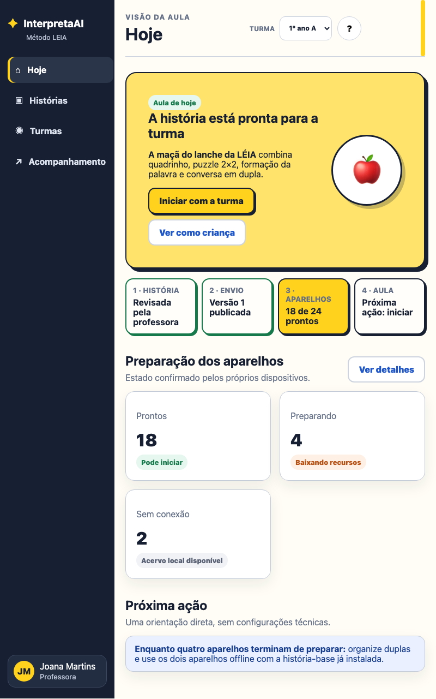
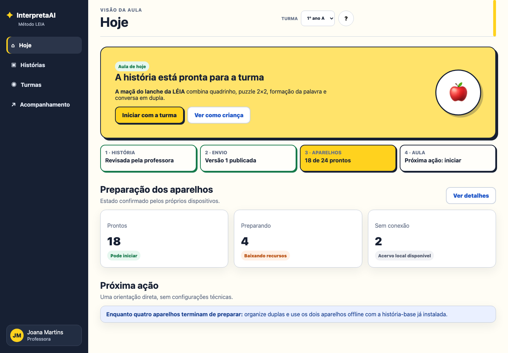
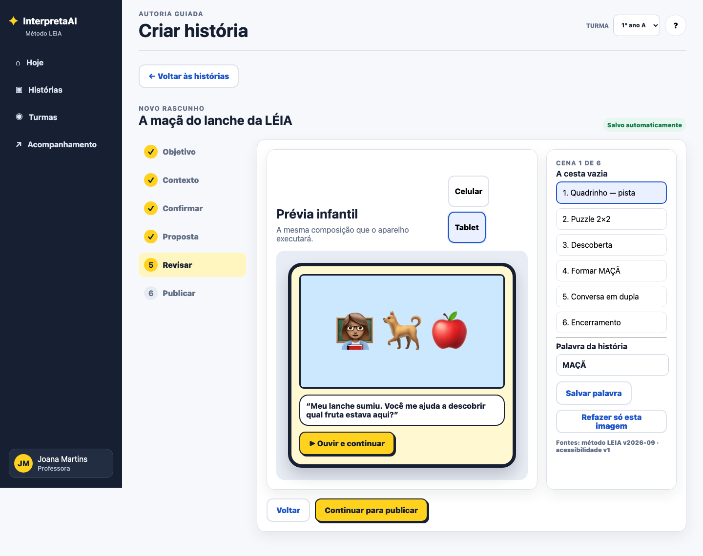
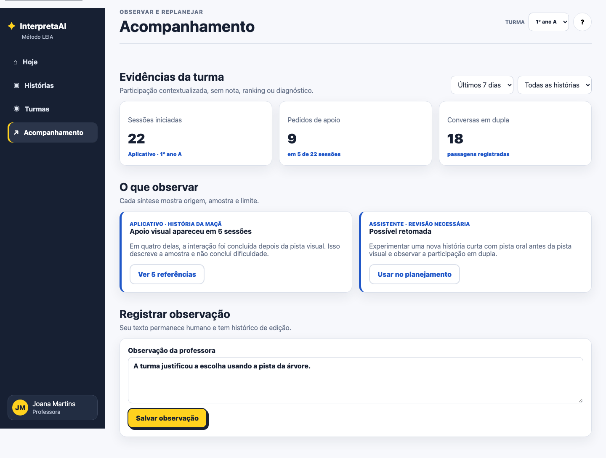
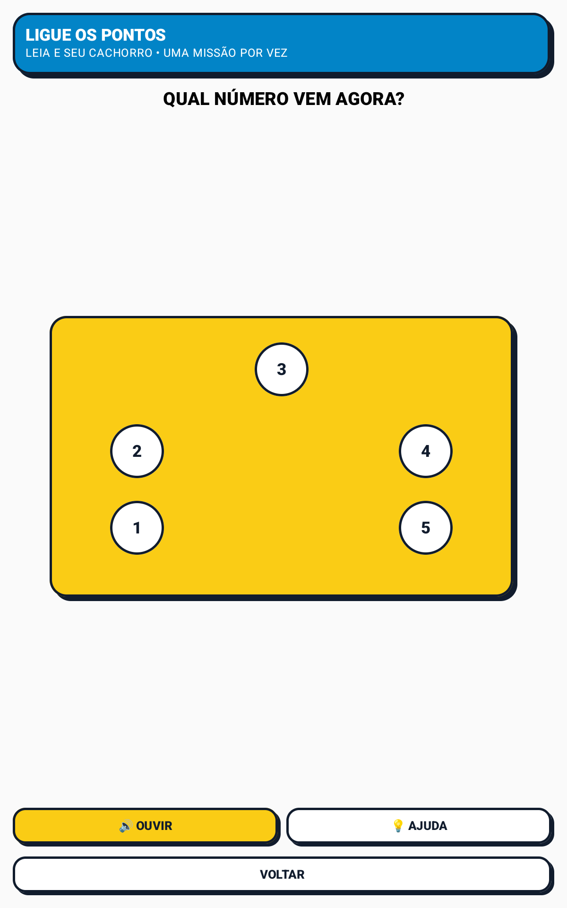
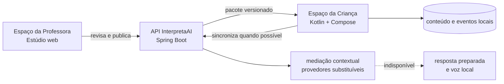

<div align="center">

# InterpretaAI

### Alfabetização que conversa com a criança — e devolve a experiência para a turma

[](docs/MVP_STATUS.md)
[](app)
[](server)
[](docs/FLUXO_PEDAGOGICO_FECHADO.md)
[](docs/ORIGEM_HACKTUDO.md)

**Um produto de alfabetização mediada por histórias, voz e interação para crianças em diferentes etapas de aprendizagem.**

A criança observa, fala, formula hipóteses e ajuda os personagens a avançar. A professora escolhe a
missão, acompanha a participação e leva a experiência de volta à turma.

[📱 Baixar APK](https://github.com/Victorzinn704/InterpretaAI/releases/latest) · [🎬 Conhecer a experiência](docs/EXPERIENCE_CATALOG.md) · [🖼️ Ver galeria](docs/GALLERY.md) · [📄 Ler proposta](dist/InterpretaAI-Proposta-MVP.pdf)

</div>

## A proposta em uma frase

> O InterpretaAI transforma o smartphone ou tablet em um mediador breve de alfabetização: a LÉIA
> conduz uma história por voz, a criança participa como coautora e a atividade termina em conversa,
> explicação ou colaboração com a turma.

O produto foi concebido para aproximar palavra, som, imagem e contexto. A tecnologia organiza a
experiência, oferece apoio progressivo e registra sinais de participação; a decisão pedagógica
continua com a professora.

## Nascido no 10º HACKTUDO

O InterpretaAI surgiu no **Hackathon HACKTUDO 2026**, edição comemorativa de dez anos do evento, a
partir do desafio de construir uma relação mais consciente entre tecnologia e educação em um mundo
conectado e cheio de distrações.

A proposta usa o aparelho em um ciclo curto e intencional. Em vez de disputar atenção com uma
sequência infinita de estímulos, apresenta uma missão com começo, desenvolvimento e encerramento. Ao
final, o dispositivo descansa e a aprendizagem continua entre as crianças.

Entre **227 projetos inscritos**, o InterpretaAI foi selecionado para o grupo de **10 finalistas**.
Esse reconhecimento registra a origem e a aderência da proposta ao desafio; a validação pedagógica em
sala e uma eventual adoção institucional são etapas próprias. A trajetória e as fontes públicas estão
registradas em [Origem no HACKTUDO](docs/ORIGEM_HACKTUDO.md).

## Como a proposta responde ao desafio

O desafio do HACKTUDO pede que o celular deixe de ser somente uma fonte de distração e se torne uma
ferramenta de aprendizagem, colaboração, criatividade e bem-estar. O InterpretaAI responde a esse
enunciado pelo desenho da própria jornada, não apenas pelo uso de tecnologia.

| Critério da comissão | Resposta visível no MVP | Limite tratado com transparência |
|---|---|---|
| **Adequação ao tema** | Sessões curtas, Modo Foco, interface infantil sem rolagem obrigatória e encerramento fora da tela. | Bloqueio integral depende de tablet gerenciado como Device Owner. |
| **Originalidade e inovação** | A criança ajuda a história a avançar, em vez de apenas consumir conteúdo ou marcar respostas. | O MVP demonstra percursos representativos, não um currículo completo. |
| **Solução tecnológica** | APK Kotlin/Compose, API Spring, funcionamento offline, sincronização e mediação de voz substituível. | Serviços remotos ampliam a experiência, mas não são tratados como infalíveis. |
| **Utilidade e aplicabilidade** | Voz, toque, arraste, ajuda progressiva, rodízio de aparelhos e sinais de participação para a professora. | Compreensão de fala, ruído e uso pedagógico ainda exigem piloto acompanhado. |

Os critérios completos, suas evidências e os pontos que dependem de validação humana estão no
[mapa da comissão](docs/HACKATHON_CRITERIA.md) e na
[auditoria do regulamento](docs/REGULAMENTO_HACKTUDO_2026.md).

## O diferencial: a criança ajuda a história

O centro do produto não é uma coleção de jogos nem um chatbot infantil. É a **coautoria guiada**: a
história apresenta uma situação incompleta e convida a criança a observar, falar, testar uma ideia e
ajudar os personagens. O que ela descobre ganha uma função dentro do enredo.

No Mistério da Bola, por exemplo, reconhecer `BOLA` não encerra a atividade. A palavra recuperada no
gibi leva à busca por pistas, à montagem do objeto, à relação entre grafema e som e, finalmente, a uma
orientação útil para Davi. A criança não recebe a narrativa pronta; sua ação é necessária para que ela
continue.

A mediação acompanha sem tomar o lugar da professora. LÉIA reconhece o esforço, oferece uma pista
curta quando necessário e faz uma pergunta por vez. Ela não diagnostica, não dá nota, não cria ranking
e não declara uma interpretação infantil como verdade absoluta. Ao terminar, a descoberta retorna à
dupla, ao grupo ou à conversa conduzida pela professora.

## Como a experiência acontece

```text
História narrada → observação → resposta oral → pista visual → atividade prática
                 → palavra e som → explicação → conversa em dupla ou grupo
```

Cada etapa nasce da narrativa. O quebra-cabeça não aparece como passatempo separado: ele consolida um
objeto importante para a história. A formação de palavra retoma aquilo que a criança viu, ouviu e
manipulou. A explicação final permite que ela conte como chegou à sua hipótese.

<table>
  <tr>
    <td width="25%" align="center"><br><strong>1. Ouvir</strong><br>Conhecer o problema.</td>
    <td width="25%" align="center"><br><strong>2. Responder</strong><br>Contar a própria ideia.</td>
    <td width="25%" align="center"><br><strong>3. Investigar</strong><br>Tocar na pista relevante.</td>
    <td width="25%" align="center"><br><strong>4. Explicar</strong><br>Relacionar pista e hipótese.</td>
  </tr>
  <tr>
    <td width="25%" align="center"><br><strong>5. Manipular</strong><br>Montar por toque ou arraste.</td>
    <td width="25%" align="center"><br><strong>6. Consolidar</strong><br>Palavra, sílaba e som.</td>
    <td width="25%" align="center"><br><strong>7. Aplicar</strong><br>Ajudar o personagem.</td>
    <td width="25%" align="center"><br><strong>8. Compartilhar</strong><br>Levar a ideia ao grupo.</td>
  </tr>
</table>

## LEIA: Ler, Entender, Interpretar e Aprender

LEIA é o método que organiza a jornada. **LÉIA** é a professora-personagem que acompanha a criança ao
lado de **Alfa**, seu companheiro de aventuras.

| Movimento | Experiência da criança | O que a professora pode observar |
|---|---|---|
| **Ler** | Observa a cena e escuta o diálogo. | Atenção a personagens, objetos e sequência. |
| **Entender** | Reconhece quem participa, o que aconteceu e qual é o desafio. | Compreensão de ação, intenção e contexto. |
| **Interpretar** | Formula uma hipótese, compara pistas e explica seu caminho. | Expressão oral, inferência e escuta de possibilidades. |
| **Aprender** | Relaciona história, palavra, sílaba e som e aplica a descoberta. | Apropriação da linguagem, cooperação e transferência. |

O método não resume alfabetização a acertar uma alternativa. Ele organiza oportunidades para nomear,
localizar informação, inferir, explicar e aplicar. A fundamentação e os limites estão descritos no
[fluxo pedagógico](docs/FLUXO_PEDAGOGICO_FECHADO.md) e no
[escopo do 1º ao 5º ano](docs/PEDAGOGICAL_SCOPE_1_TO_5.md).

## Histórias que dão sentido às atividades

No **Mistério da Bola**, Lia e Davi precisam descobrir o que desapareceu e onde procurar. A criança
escuta o contexto, responde por voz, investiga marcas na cena, monta a bola e consolida `BOLA`, `BO-LA`
e o som inicial `/b/` antes de orientar os personagens.

Em **A Água da Chuva**, folhas e caminhos molhados ajudam a criança a investigar como a água chegou ao
jardim. Ela compara evidências e explica o percurso da água sob a ponte até as raízes. A chuva possui
conflito e conclusão próprios; não é utilizada como pretexto para repetir o jogo da bola.

Essa independência é uma regra do produto: cada história possui um foco visual, uma pergunta genuína
e atividades coerentes com seu enredo. O [catálogo de experiências](docs/EXPERIENCE_CATALOG.md) reúne
os percursos existentes, e a [curadoria dos gibis](docs/COMIC_IMAGE_CURATION.md) registra como cada
imagem orienta atenção sem entregar antecipadamente a resposta.

## Dois espaços, uma mesma jornada

O produto separa responsabilidades sem separar a experiência. A criança utiliza o **Espaço da
Criança**, no APK Android. A professora utiliza o **Espaço da Professora**, um Estúdio web responsivo e
autenticado. No Android, a superfície adulta protegida serve apenas para preparar o dispositivo.

<table>
  <tr>
    <td width="50%" align="center"><br><strong>Espaço da Criança</strong><br>História, voz, pistas e atividades.</td>
    <td width="50%" align="center"><br><strong>Espaço da Professora</strong><br>Planejamento, revisão e acompanhamento.</td>
  </tr>
</table>

A professora escolhe a missão, revisa o que será apresentado e envia para a turma ou para um grupo. A
criança recebe somente o que precisa naquele momento. Depois, os eventos de participação ajudam a
professora a observar onde houve autonomia, pedido de ajuda, uso de voz ou necessidade de mais tempo.

[Conheça as responsabilidades e telas dos dois espaços](docs/TEACHER_STUDENT_SPACES.md).

### O ciclo da professora

O Estúdio organiza o trabalho adulto em um percurso próprio. A professora prepara a aula, revisa
texto, imagem e objetivo antes da publicação, seleciona turma ou grupo e acompanha evidências de
participação depois da atividade. A geração assistida não publica diretamente para a criança: todo
conteúdo passa por contrato, validação e decisão humana.

<table>
  <tr>
    <td width="33%" align="center"><br><strong>1. Planejar</strong><br>Ver aulas e missões do dia.</td>
    <td width="33%" align="center"><br><strong>2. Revisar e publicar</strong><br>Conferir a visão da criança.</td>
    <td width="33%" align="center"><br><strong>3. Observar e replanejar</strong><br>Ler sinais sem rotular.</td>
  </tr>
</table>

## Sala de aula e uso consciente

O InterpretaAI foi desenhado para funcionar com poucos aparelhos e em rodízio. Uma missão pode ser
realizada individualmente, em dupla ou por um pequeno grupo. Quando o tablet é compartilhado, a LÉIA
organiza turnos como observar, contar a ideia, montar e explicar, sem atribuir artificialmente a uma
criança aquilo que o grupo produziu junto.

O Modo Foco reduz saídas acidentais durante a atividade. Em tablets gerenciados como **Device Owner**,
o Lock Task foi validado com Home e Recentes bloqueados. Em instalações comuns, o Android exige que um
adulto confirme a fixação de tela. A diferença está documentada para que uma limitação do sistema não
seja apresentada como permissão automática.

O produto foi projetado para conversar com **Ginásios Educacionais Tecnológicos** e também com escolas
municipais regulares. Nos GETs, a narrativa pode iniciar investigação, autoria e produção coletiva. Em
outras escolas, o mesmo núcleo funciona com conteúdo em cache, sessões curtas e aparelhos
compartilhados. Essa é uma proposta para piloto, não uma afirmação de parceria ou homologação pela
rede. Veja a [análise de aplicação escolar](docs/GET_EMR_FIT.md).

| Em um GET | Em uma escola municipal regular |
|---|---|
| A história pode iniciar investigação, desenho, reconto, dramatização ou produção mão na massa. | A mesma missão apoia uma sequência curta conduzida pela professora, sem depender de laboratório maker. |
| O tablet entra como ferramenta em uma experiência maior e depois sai do centro. | Poucos aparelhos podem circular entre indivíduos, duplas ou grupos. |
| A turma pode criar novas explicações e representações a partir do enredo. | Conteúdo em cache mantém a jornada essencial e sincroniza os eventos quando a conexão retorna. |

Nos dois contextos, o aparelho tem propósito e tempo definidos. O valor não está em manter a criança
conectada, mas em ajudá-la a observar, expressar uma hipótese e usar a descoberta com outras pessoas.

## Interação adequada a celular e tablet

- uma decisão principal por etapa, sem exigir rolagem da criança;
- instruções curtas que podem ser ouvidas novamente;
- resposta por voz, toque ou arraste;
- alvos grandes, contraste e indicação visual do próximo passo;
- ajuda progressiva antes de apresentar alternativas;
- retorno acolhedor depois de tentativas diferentes;
- modo **Reduzir estímulos**, que preserva voz, contraste e direção;
- funcionamento local quando a conexão estiver indisponível.

As telas infantis foram verificadas em **360×640**, **412×915** e **800×1280**. A galeria conserva as
capturas completas; o README apresenta apenas uma seleção representativa.

<table>
  <tr>
    <td width="33%" align="center"><br><strong>Caminho lógico</strong></td>
    <td width="33%" align="center"><br><strong>Ligue os pontos</strong></td>
    <td width="33%" align="center"><br><strong>Imagem e palavra</strong></td>
  </tr>
</table>

## Estado atual do MVP

| Situação | Significado neste repositório |
|---|---|
| **Implementado** | Existe no código e possui teste ou evidência de inspeção. |
| **Demonstrado** | Funcionou no ambiente da apresentação, sem equivaler a operação institucional. |
| **Em evolução** | Está projetado ou parcialmente construído e não é apresentado como concluído. |

O APK, o servidor Spring, as jornadas infantis, o Estúdio da Professora, a operação local, o canal de
publicação e as evidências de responsividade compõem o MVP funcional. Piloto com crianças, federação
com identidade institucional, governança de dados da rede e visão agregada para secretaria são etapas
posteriores. A situação detalhada está em [Estado do MVP](docs/MVP_STATUS.md).

## Arquitetura em síntese



O aplicativo mantém conteúdo preparado, voz local e eventos no dispositivo para atravessar períodos
sem conexão. Quando a rede retorna, sincroniza de forma controlada. A mediação remota amplia respostas
abertas, mas não controla o caminho essencial da criança.

O servidor utiliza Java 17, Spring Boot e adaptadores substituíveis. O Android utiliza Kotlin e Jetpack
Compose. Contratos, cache, idempotência, gateway de voz e decisões de segurança estão detalhados na
[arquitetura](docs/ARCHITECTURE.md), na [operação online/offline](docs/ONLINE_OFFLINE_ARCHITECTURE.md)
e no [contrato da voz](docs/VOICE_API.md).

## Participação, privacidade e limites

O produto registra modalidade, duração, pedidos de ajuda e participação para apoiar a observação da
professora. Não produz nota automática, ranking, diagnóstico ou conclusão definitiva sobre a criança. Em atividade
coletiva, preserva o resultado como participação do grupo.

Fotos usadas em missões são tratadas temporariamente; o aplicativo não cria arquivo permanente de
áudio bruto nem inclui credenciais de provedores no APK. Antes de um piloto com dados reais ainda são
necessários acordos de retenção, autorização, identidade institucional e validação do serviço de
reconhecimento de voz em cada aparelho.

[Inventário de dados e riscos](docs/DATA_AND_PRIVACY.md) · [Checklist de piloto](docs/PILOT_CHECKLIST.md) · [Autoria e originalidade](docs/AUTORIA_ORIGINALIDADE_E_IA.md)

## Evidências de engenharia

| Verificação | Evidência atual |
|---|---:|
| Testes unitários Android | **94 aprovados** |
| Testes instrumentados Android | **52 aprovados no Android 15/API 35** |
| Testes do servidor | **172 aprovados e 1 smoke opt-in ignorado** |
| Android Lint | **Aprovado** |
| Viewports infantis | **360×640, 412×915 e 800×1280** |
| Modo Foco gerenciado | **LOCKED; Home e Recentes testados** |
| Canal professora→tablet | **Publicação, versão e recebimento automático validados** |
| Ambiente Oracle | **HTTPS, health, gateway, identidade e Estúdio verificados** |

O comando abaixo executa a conferência reproduzível da entrega:

```bash
./tools/check-delivery.sh --full
```

## Executar localmente

Requisitos principais: JDK 21, Android SDK 35, Python 3.12 e Ollama. O roteiro completo, incluindo
voz local e demonstração externa, está em [Demonstração do MVP](docs/DEMO_RUNBOOK.md).

```bash
# Testes e build
./gradlew :app:testDebugUnitTest :server:test
./gradlew :app:lintDebug :app:assembleDebug :server:bootJar

# Servidor local, modelo e voz
./tools/start-local-mvp.sh
```

## Navegar pela documentação

| Quero entender… | Comece por… |
|---|---|
| **o produto e a experiência** | [Catálogo de experiências](docs/EXPERIENCE_CATALOG.md), [dois espaços](docs/TEACHER_STUDENT_SPACES.md) e [galeria](docs/GALLERY.md) |
| **a proposta pedagógica** | [Fluxo pedagógico](docs/FLUXO_PEDAGOGICO_FECHADO.md) e [escopo do 1º ao 5º ano](docs/PEDAGOGICAL_SCOPE_1_TO_5.md) |
| **a entrega para a comissão** | [Proposta em PDF](dist/InterpretaAI-Proposta-MVP.pdf), [critérios](docs/HACKATHON_CRITERIA.md) e [estado do MVP](docs/MVP_STATUS.md) |
| **a tecnologia** | [Arquitetura](docs/ARCHITECTURE.md), [online/offline](docs/ONLINE_OFFLINE_ARCHITECTURE.md) e [servidor](server/README.md) |
| **privacidade e piloto** | [Dados e privacidade](docs/DATA_AND_PRIVACY.md), [aplicação escolar](docs/GET_EMR_FIT.md) e [checklist](docs/PILOT_CHECKLIST.md) |
| **autoria e licenças** | [Originalidade](docs/AUTORIA_ORIGINALIDADE_E_IA.md), [proveniência](docs/ASSET_PROVENANCE.md) e [créditos](THIRD_PARTY_NOTICES.md) |

O [índice completo](docs/README.md) preserva auditorias, decisões arquiteturais, estudos e documentos
históricos sem exigir que todos façam parte da primeira leitura.

## Estrutura do repositório

```text
app/       aplicativo Android e experiência da criança
server/    API Spring, publicação, sincronização e mediação
services/  serviços locais auxiliares de voz
docs/      produto, pedagogia, engenharia, piloto e histórico
tools/     execução, testes, auditoria e empacotamento
output/    capturas e evidências visuais
dist/      artefatos oficiais da entrega
```

---

<div align="center">

**InterpretaAI — a criança ajuda a história, a LÉIA ajuda a criança e a professora conduz a aprendizagem.**

</div>
