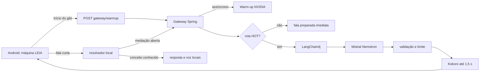
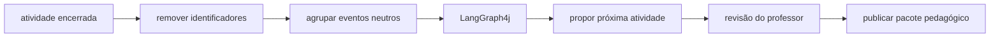

# Gateway de IA e caminho quente da LEIA

## Objetivo

Fazer a criança perceber reação imediata mesmo quando a IA externa estiver fria, congestionada ou
offline. Navegação, confirmação de conceitos essenciais e próxima etapa nunca dependem da nuvem. A
IA melhora a formulação; ela não controla o percurso.

## Arquitetura do MVP

O Android chama o aquecimento em uma coroutine sem aguardar resposta, ao mesmo tempo em que narra a
história. O gateway mantém uma janela quente de 150 segundos após uma sonda bem-sucedida. Se a sonda
falhar ou um turno remoto der erro, o circuito fecha e os próximos turnos recebem fala preparada sem
esperar o timeout externo. O agendamento tenta aquecer novamente a cada dois minutos.

Endpoints:

- `POST /api/v1/gateway/warmup`: agenda aquecimento e responde `202` imediatamente; cooldown de 30 s
  e fila única impedem chamadas concorrentes;
- `GET /api/v1/gateway/status`: retorna `HOT` ou `COLD`, sem revelar credencial;
- `POST /api/v1/voice-turn`: preserva o contrato do aplicativo.

## Orçamentos de latência

| Etapa | Orçamento | Comportamento quando excede |
|---|---:|---|
| reação visual no Android | até 100 ms | sempre local |
| gateway com circuito frio | até 200 ms no servidor | fala preparada |
| inferência remota quente | até 4 s | fecha circuito e usa fallback |
| Kokoro | até 1,5 s | devolve texto e Android usa TTS local |
| chamada Android completa | até 6 s | experiência offline já existente |

O smoke test local do circuito frio respondeu em aproximadamente 54 ms. Isso é evidência do
gateway, não da rede. O endpoint gratuito da NVIDIA variou entre 2,31 s e timeout; não há SLA.

## LangChain4j e LangGraph4j

LangChain4j permanece na borda dos modelos: monta a chamada, limita tokens e converte a resposta em
um contrato Java. Ele só é chamado se o gateway considerar a rota quente.

LangGraph4j não entra no caminho quente do MVP. Quando adotado, sua função será executar fluxos
assíncronos e auditáveis:

Nenhum grafo autônomo avalia, diagnostica ou muda a tela da criança. Para estabilidade, avaliar a
linha LTS 1.8.x do LangGraph4j antes de adicionar a dependência; a linha 1.9 ainda é beta.

## RAG sem atrasar a conversa

RAG não aquece modelo e adicionaria busca, montagem de contexto e mais tokens. Para as poucas cenas
do MVP, `sceneId` seleciona diretamente um pacote pedagógico pequeno, versionado e carregado em RAM.
Isso é mais rápido e mais testável que banco vetorial.

RAG passa a fazer sentido quando houver um acervo curricular grande. Mesmo então, a recuperação deve
acontecer no caminho frio: professor publica a atividade, o servidor recupera referências, revisa o
conteúdo e grava um `ScenePack` pronto. Durante a aula, o gateway apenas lê esse pacote por chave.

## WebSocket e webhook

O `POST` atual é suficiente enquanto o aparelho envia texto curto e recebe uma resposta curta.
WebSocket será útil quando o produto transmitir áudio bidirecional, interrupção de fala e áudio em
chunks. Nesse estágio, o gateway emitirá `turn.ack`, `turn.audio`, `turn.complete` e `turn.fallback`.
Não se deve transmitir raciocínio interno do modelo.

Webhook não é apropriado: ele atende callbacks entre servidores, não uma conversa síncrona com uma
criança esperando retorno.

## Gemini e dados infantis

Gemini Live oferece WebSocket bidirecional e tokens efêmeros, mas os termos atuais do Gemini
Developer API vedam clientes direcionados ou provavelmente acessados por menores de 18 anos. Por
isso, a chave de desenvolvedor não é usada na jornada infantil. Uma evolução com Gemini exige
produto/contrato que permita o público, avaliação jurídica e de privacidade, consentimento e testes.
Além disso, nos serviços gratuitos o Google informa que entradas e respostas podem ser usadas para
melhorar produtos e analisadas por revisores; dados pessoais ou sensíveis não devem ser enviados.

Fontes técnicas:

- [Gemini Live por WebSocket](https://ai.google.dev/gemini-api/docs/live-api/get-started-websocket)
- [Tokens efêmeros do Gemini Live](https://ai.google.dev/gemini-api/docs/live-api/ephemeral-tokens)
- [Termos adicionais do Gemini API](https://ai.google.dev/gemini-api/terms)
- [Streaming no LangChain4j](https://docs.langchain4j.dev/tutorials/response-streaming/)
- [LangGraph4j](https://github.com/langgraph4j/langgraph4j)

## Critério para avançar

WebSocket, RAG ou LangGraph4j só entram na versão demonstrável quando reduzirem uma métrica observada
sem prejudicar fallback. Antes disso, o caminho correto é: reação local imediata, contexto pronto,
modelo quente quando disponível e continuidade local quando não estiver.
