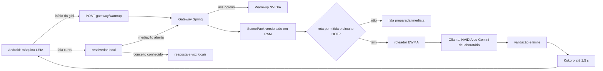
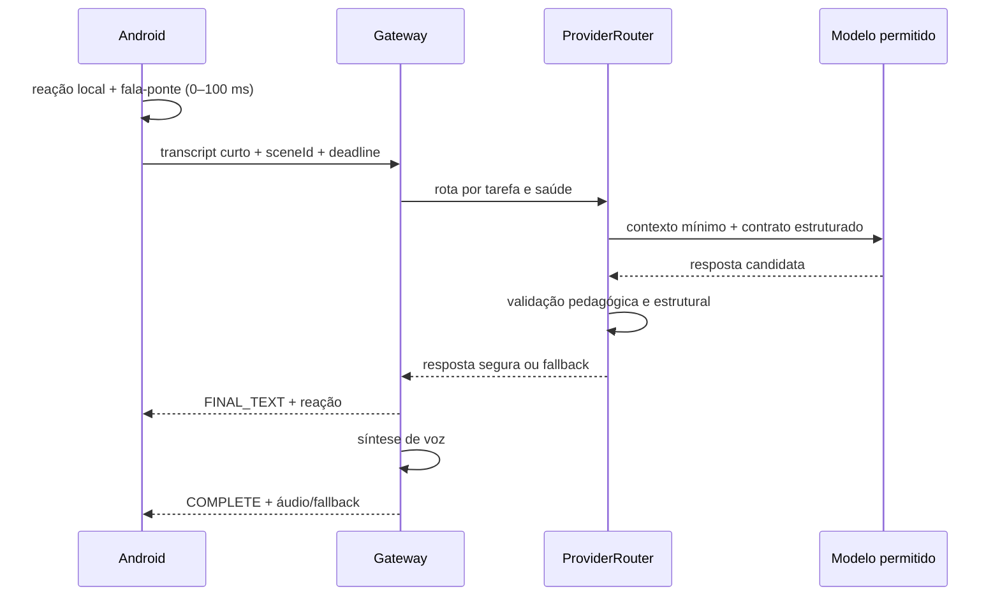
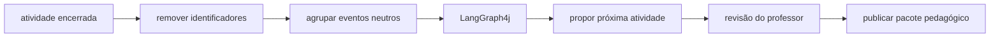

# Gateway de IA e caminho quente da LEIA

## Objetivo

Fazer a criança perceber reação imediata mesmo quando a IA externa estiver fria, congestionada ou
offline. Navegação, confirmação de conceitos essenciais e próxima etapa nunca dependem da nuvem. A
IA melhora a formulação; ela não controla o percurso.

## Arquitetura do MVP



O Android chama o aquecimento em uma coroutine sem aguardar resposta, ao mesmo tempo em que narra a
história. O gateway mantém uma janela quente de 150 segundos após uma sonda bem-sucedida. Se a sonda
falhar ou um turno remoto der erro, a rota fica indisponível ou o circuito abre, e os próximos turnos recebem fala preparada sem
esperar o timeout externo. O agendamento tenta aquecer novamente a cada dois minutos.

Endpoints:

- `POST /api/v1/gateway/warmup`: agenda aquecimento e responde `202` imediatamente; cooldown de 30 s
  e fila única impedem chamadas concorrentes;
- `GET /api/v1/gateway/status`: retorna `HOT` ou `COLD`, sem revelar credencial;
- `POST /api/v1/voice-turn`: preserva o contrato do aplicativo.

## Orçamentos de latência

| Etapa | Orçamento | Comportamento quando excede |
|---|---:|---|
| reação visual no Android | até 100 ms | sempre local |
| gateway com circuito frio | até 200 ms no servidor | fala preparada |
| inferência remota quente | até 4 s | fecha circuito e usa fallback |
| Kokoro | até 1,5 s | devolve texto e Android usa TTS local |
| chamada Android completa | até 6 s | experiência offline já existente |

O smoke test local do circuito frio respondeu em aproximadamente 54 ms. Isso é evidência do
gateway, não da rede. O endpoint gratuito da NVIDIA variou entre 2,31 s e timeout; não há SLA.

## Troca de respostas: arquitetura incremental

O caminho recomendado não transmite tokens crus do modelo para a criança. A resposta precisa estar
completa para que os limites pedagógicos e de segurança sejam validados antes da fala. O streaming
implementado transporta estados e texto já validado — nunca JSON ou raciocínio parcial do modelo.



Evolução em três passos, sem reescrever o MVP:

1. **Implementado:** `POST /voice-turn/stream` envia `ACK`, `FINAL_TEXT` e `COMPLETE` em NDJSON. O
   Android usa uma conexão OkHttp compartilhada, mostra o texto validado antes do áudio e cancela a
   chamada ao sair da etapa. O endpoint JSON único permanece compatível e serve como fallback de
   rolling deploy quando o endpoint progressivo responde `404/405`.
2. **Implementado:** o `AdaptiveConversationRouter` mantém circuito independente por provedor,
   orçamento total, bulkhead de fila zero e seleção por latência EWMA com penalidade recuperável por
   falhas consecutivas. Nunca envia o mesmo dado infantil simultaneamente a dois serviços.
3. **Áudio realmente contínuo:** acrescentar `AUDIO_CHUNK` ao contrato somente quando a síntese
   também oferecer streaming. WebSocket entra apenas quando houver áudio bidirecional e interrupção.

Não é necessário migrar agora para WebFlux: Spring MVC suporta `ResponseBodyEmitter`, SSE e NDJSON.
No Android, o `HttpURLConnection` foi substituído por um único `OkHttpClient` compartilhado, com
pooling, timeout total, retry interno desativado e cancelamento ligado à coroutine. O projeto usa
OkHttp 4.12 por compatibilidade com Kotlin 2.0; a versão 5.3 exige metadados Kotlin 2.2 e não justifica
uma migração completa do toolchain neste incremento. A fala-ponte continua local e aprovada.

### Componentes aprovados para cada responsabilidade

| Responsabilidade | Escolha | Motivo |
|---|---|---|
| fronteira dos modelos | LangChain4j | contrato comum, streaming e observabilidade |
| limite/circuito/concorrência | Resilience4j | isola a saúde de cada provedor; duas vagas globais e fila zero |
| métricas | Micrometer | mede TTFT, total, timeout, fallback e resposta válida |
| contexto aprovado | `ScenePack` imutável em `Map` | lookup O(1), sem banco vetorial, rede ou dado pessoal |
| áudio repetido | Caffeine ponderado por bytes | coalesce TTS igual e limita RAM a 32 MiB/10 min |
| fluxo infantil | máquina de estados Kotlin | previsibilidade e operação offline |
| preparação curricular | LangGraph4j futuro, assíncrono | não acrescenta nós ou latência à conversa |

Não usar retry no turno infantil. Não fazer corrida Gemini × Mistral com fala real: além de dobrar
custo e exposição de dados, o perdedor continua processando. Testes A/B devem atribuir um provedor
por sessão sintética e comparar p50/p95, TTFT, validade do contrato e taxa de fallback.

O repositório inclui `tools/benchmark-ai-latency.sh`: ele inicia uma rota por vez, aquece DNS, TLS,
pool HTTP e endpoint com uma fala sintética fora da amostra, e mede o tempo até o `FINAL_TEXT` já
validado. Assim a comparação inclui gateway e LangChain4j, em vez de medir somente um `curl` direto
ao provedor. O script não aceita chaves como argumentos, apaga sua amostra temporária e não deve ser
usado com fala real de criança.

### Configuração das rotas

O modo fixo continua sendo o padrão mais previsível: `CONVERSATION_PROVIDER=ollama`, `nvidia` ou
`gemini`. O modo aprendido é habilitado explicitamente:

```bash
export CONVERSATION_PROVIDER=adaptive
export CONVERSATION_ROUTE=ollama,nvidia
export CONVERSATION_ROUTING_DEADLINE_MS=4000
export CONVERSATION_FAST_FAILOVER_MS=350
export CONVERSATION_FAILURE_COOLDOWN_MS=5000
```

Antes da rota, `sceneId` seleciona o contexto e o objetivo pedagógico no `ScenePack` ativo. O endpoint
de status revela apenas versão e quantidade de cenas. `SCENE_PACK_VERSION=v1` permite rollback do
conteúdo no próximo reinício; pacote inexistente ou inconsistente falha na inicialização.

O primeiro turno mede cada candidato disponível; os seguintes preferem o menor EWMA. Uma falha
rápida pode avançar para o próximo candidato. Uma falha lenta não empilha outra inferência, pois a
fala local é mais útil do que consumir o resto do orçamento. Depois de qualquer falha, a rota entra
em cooldown por cinco segundos; assim o turno seguinte não repete imediatamente um timeout enquanto
o circuito ainda reúne sua amostra mínima. O endpoint `/api/v1/gateway/status` expõe disponibilidade,
elegibilidade, circuito, amostras, falhas e EWMA de cada rota, sem credenciais.

O smoke com um endereço Ollama deliberadamente inválido revelou duas tentativas automáticas ocultas
no cliente. `maxRetries(0)` passou a ser explícito em Ollama, NVIDIA e Gemini. Depois da correção, o
primeiro fallback levou aproximadamente 84 ms no cliente e o turno seguinte, protegido por cooldown,
aproximadamente 3 ms. É evidência local de falha controlada, não SLA de rede.

No smoke HTTP do contrato progressivo, usando fallback local deliberado, `ACK` chegou em 31 ms,
`FINAL_TEXT` em 33 ms e `COMPLETE` em 48 ms. O replay idempotente entregou os três eventos em cerca
de 3 ms. Esses números provam flush e replay locais; não medem Gemini, NVIDIA nem internet pública.

## Gemini 3.8 no laboratório

O adaptador experimental usa `gemini-3.8-flash`, `thinkingLevel=LOW`, zero retry e saída curta. A
documentação oficial lista o 3.8 Flash como estável e voltado a fluxos longos e complexos; isso não
implica menor latência na mediação curta da LEIA. O modelo é configurável por `GEMINI_MODEL` e o
nível por `GEMINI_THINKING_LEVEL`, permitindo benchmark sem alterar código. A seleção adaptativa usa
a latência observada, não a reputação do modelo.

No smoke sintético de 14/09/2026, já com o deadline externo, o primeiro turno válido terminou em
2,46 s. Os dois seguintes excederam o orçamento e receberam fallback em 4,02 s. Antes do deadline,
uma chamada do SDK permaneceu executando por cerca de 21 s mesmo após o cliente HTTP desistir. Isso
justifica manter o prazo no gateway e o `Bulkhead`, e não confiar apenas no timeout do adaptador.
Kokoro não estava ativo nesse ensaio; por isso o log separa `conversation_fallback` de
`speech_fallback`.

## LangChain4j e LangGraph4j

LangChain4j permanece na borda dos modelos: monta a chamada, limita tokens e converte a resposta em
um contrato Java. Ele só é chamado se o gateway considerar a rota quente.

LangGraph4j não entra no caminho quente do MVP. Quando adotado, sua função será executar fluxos
assíncronos e auditáveis:



Nenhum grafo autônomo avalia, diagnostica ou muda a tela da criança. Para estabilidade, avaliar a
linha LTS 1.8.x do LangGraph4j antes de adicionar a dependência; a linha 1.9 ainda é beta.

## RAG sem atrasar a conversa

RAG não aquece modelo e adicionaria busca, montagem de contexto e mais tokens. Para as poucas cenas
do MVP, `sceneId` já seleciona diretamente um pacote pedagógico pequeno, versionado e carregado em
RAM. As versões `v1` e `v2` ficam no artefato; `v2` tem sete cenas e é o padrão. Isso é mais rápido e
mais testável que banco vetorial.

RAG passa a fazer sentido quando houver um acervo curricular grande. Mesmo então, a recuperação deve
acontecer no caminho frio: professor publica a atividade, o servidor recupera referências, revisa o
conteúdo e grava um `ScenePack` pronto. Durante a aula, o gateway apenas lê esse pacote por chave.

## WebSocket e webhook

O `POST` atual é suficiente enquanto o aparelho envia texto curto e recebe uma resposta curta.
WebSocket será útil quando o produto transmitir áudio bidirecional, interrupção de fala e áudio em
chunks. Nesse estágio, o gateway emitirá `turn.ack`, `turn.audio`, `turn.complete` e `turn.fallback`.
Não se deve transmitir raciocínio interno do modelo.

Webhook não é apropriado: ele atende callbacks entre servidores, não uma conversa síncrona com uma
criança esperando retorno.

## Gemini e dados infantis

Gemini Live oferece WebSocket bidirecional e tokens efêmeros, mas os termos atuais do Gemini
Developer API vedam clientes direcionados ou provavelmente acessados por menores de 18 anos. Por
isso, a chave de desenvolvedor não é usada na jornada infantil. Uma evolução com Gemini exige
produto/contrato que permita o público, avaliação jurídica e de privacidade, consentimento e testes.
Além disso, nos serviços gratuitos o Google informa que entradas e respostas podem ser usadas para
melhorar produtos e analisadas por revisores; dados pessoais ou sensíveis não devem ser enviados.

Fontes técnicas:

- [Modelos Gemini e identificador do 3.8 Flash](https://ai.google.dev/gemini-api/docs/models)
- [Thinking levels do Gemini](https://ai.google.dev/gemini-api/docs/thinking)
- [Saída estruturada do Gemini](https://ai.google.dev/gemini-api/docs/structured-output)
- [Gemini Live por WebSocket](https://ai.google.dev/gemini-api/docs/live-api/get-started-websocket)
- [Tokens efêmeros do Gemini Live](https://ai.google.dev/gemini-api/docs/live-api/ephemeral-tokens)
- [Termos adicionais do Gemini API](https://ai.google.dev/gemini-api/terms)
- [Streaming no LangChain4j](https://docs.langchain4j.dev/tutorials/response-streaming/)
- [Requisições assíncronas e streaming no Spring MVC](https://docs.spring.io/spring-framework/reference/web/webmvc/mvc-ann-async.html)
- [Circuit breaker Resilience4j no Spring](https://docs.spring.io/spring-cloud-circuitbreaker/reference/spring-cloud-circuitbreaker-resilience4j.html)
- [Histogramas e percentis no Micrometer](https://docs.micrometer.io/micrometer/reference/1.14/concepts/histogram-quantiles.html)
- [Cache Caffeine](https://github.com/ben-manes/caffeine/wiki/Eviction)
- [Streaming da API NVIDIA NIM](https://docs.nvidia.com/nim/large-language-models/latest/api-reference.html)
- [EventSource/SSE no OkHttp](https://square.github.io/okhttp/3.x/okhttp-sse/)
- [LangGraph4j](https://github.com/langgraph4j/langgraph4j)

## Critério para avançar

WebSocket, RAG ou LangGraph4j só entram na versão demonstrável quando reduzirem uma métrica observada
sem prejudicar fallback. Antes disso, o caminho correto é: reação local imediata, contexto pronto,
modelo quente quando disponível e continuidade local quando não estiver.
