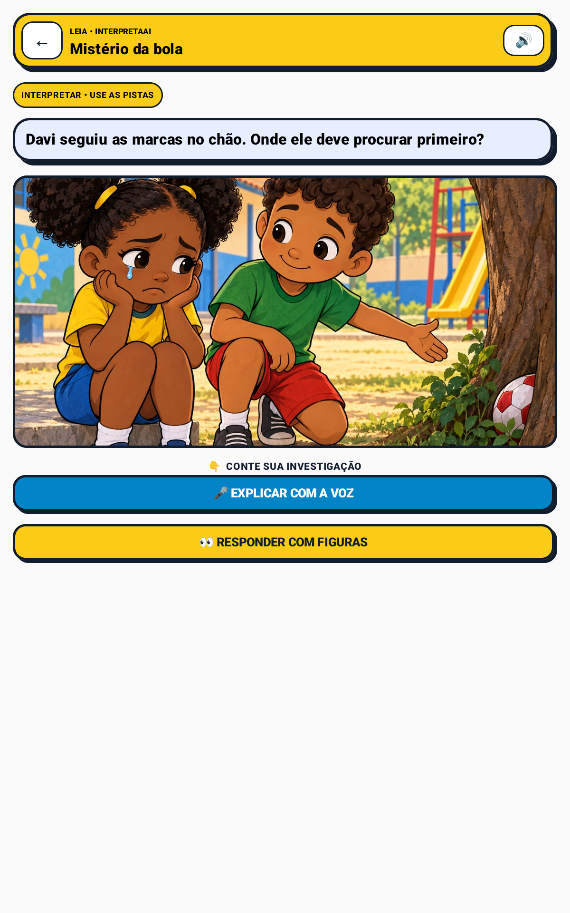
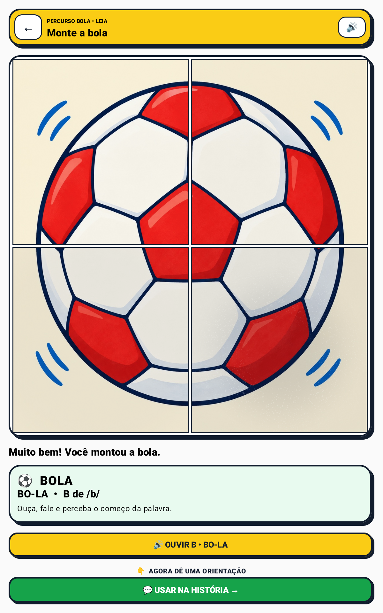
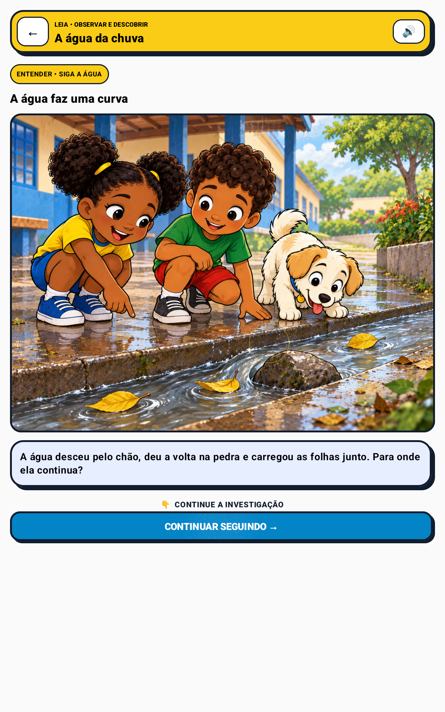
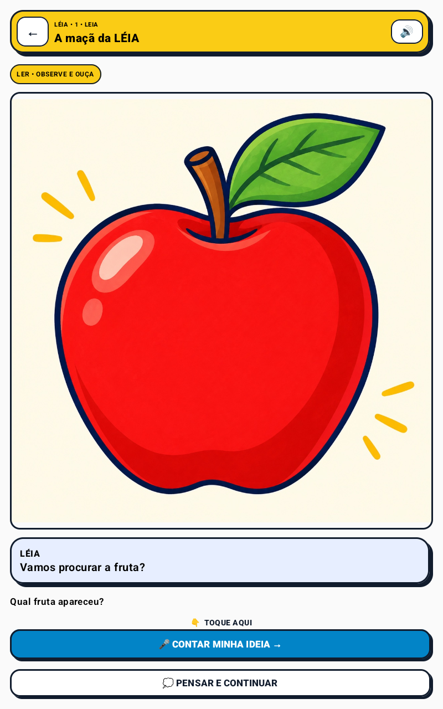
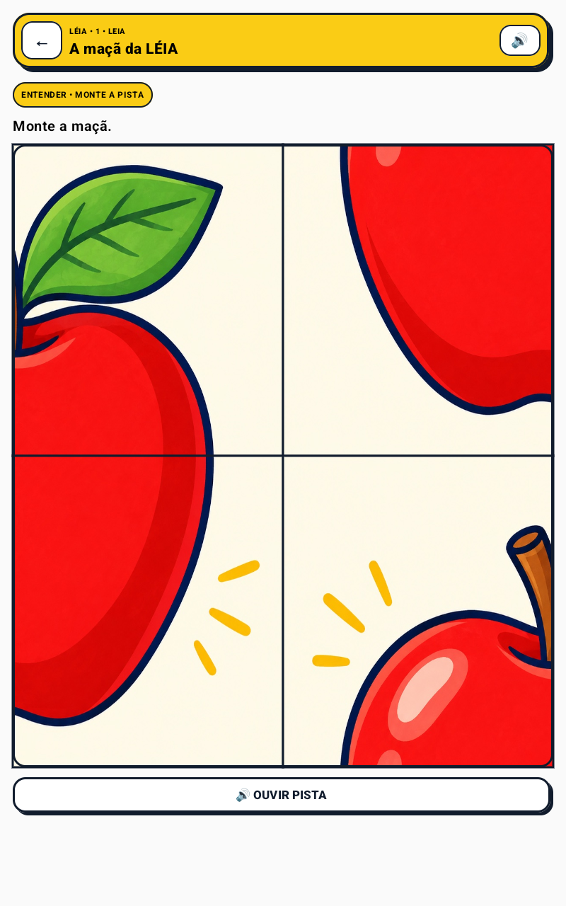
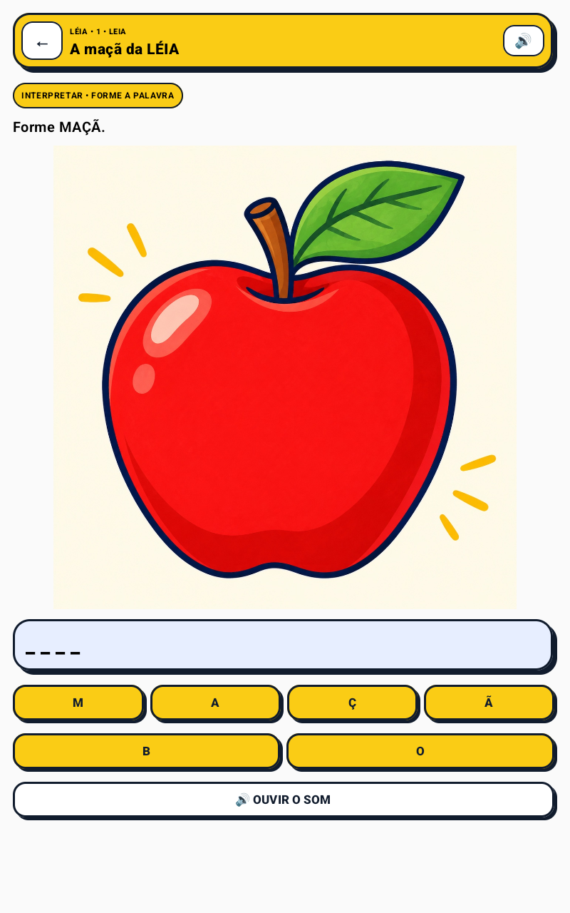
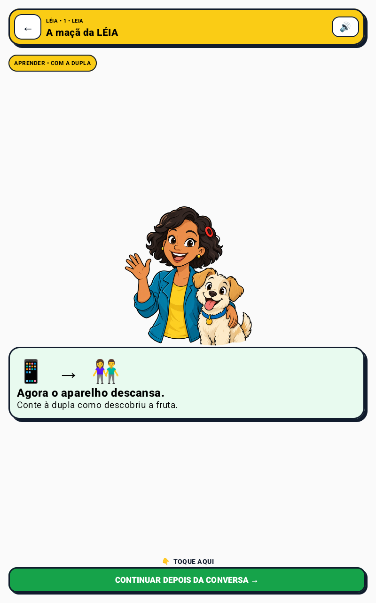
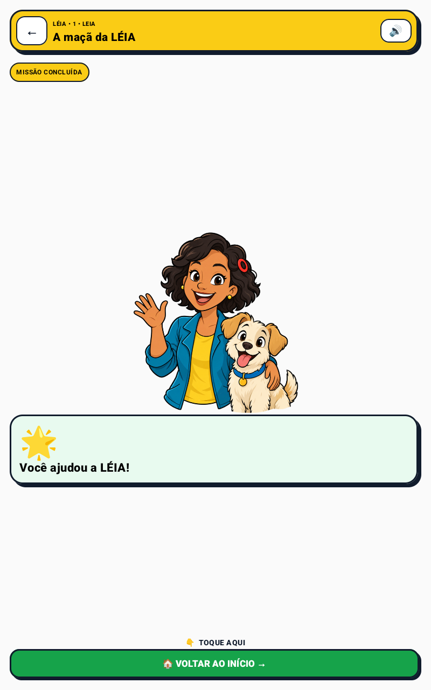

# Catálogo de experiências — histórias, jogos e tablet

Este catálogo apresenta o que uma criança e uma professora conseguem percorrer no APK `0.28.0`.
As imagens são capturas reais do aplicativo em emulador Android, não mockups nem fotografias de
crianças. O perfil principal desta página é **tablet 800×1280 dp**; celular compacto e celular alto
continuam cobertos pela [galeria completa](GALLERY.md).

[← Voltar ao README](../README.md) · [Galeria completa](GALLERY.md) ·
[Estado auditado](MVP_STATUS.md)

## A experiência em uma linha

```text
ouvir a história → observar uma pista → contar uma ideia → manipular → relacionar som e palavra
                  → explicar para alguém → deixar o tablet descansar
```

O método **LEIA — Ler, Entender, Interpretar e Aprender —** mantém as atividades ligadas ao
contexto. **LÉIA** é a professora-personagem que conduz a jornada; **Alfa** acompanha o elenco.
A proposta atende crianças de 6 a 10 anos sem presumir leitura autônoma e sem infantilizar quem já
possui maior repertório oral.

## História 1 — Mistério da Bola

Lia e Davi percebem que a bola não está onde deveria. A criança recupera a informação ouvida,
investiga marcas, explica sua hipótese, monta a bola, relaciona `BOLA`, `BO-LA`, `B` e `/b/` e usa
a compreensão para orientar o personagem. O quebra-cabeça não é um jogo solto: ele resolve uma
etapa da narrativa.

<table>
  <tr>
    <td width="25%" align="center"><br><strong>1. Ouvir o contexto</strong></td>
    <td width="25%" align="center"><br><strong>2. Investigar</strong></td>
    <td width="25%" align="center"><br><strong>3. Manipular</strong></td>
    <td width="25%" align="center"><br><strong>4. Palavra e som</strong></td>
  </tr>
</table>

## História 2 — A Água da Chuva

Lia, Davi e Alfa observam a chuva carregar folhas amarelas. A criança segue a evidência visual,
compara um caminho molhado com outro seco e explica como a água passou sob a ponte e chegou à terra
próxima das raízes. A resposta é comprovável pela cena; não depende de adivinhar a intenção do autor.

<table>
  <tr>
    <td width="25%" align="center"><br><strong>1. A chuva começa</strong></td>
    <td width="25%" align="center"><br><strong>2. Seguir as folhas</strong></td>
    <td width="25%" align="center"><br><strong>3. Comparar evidências</strong></td>
    <td width="25%" align="center"><br><strong>4. Explicar a pista</strong></td>
  </tr>
</table>

## História variável — o contrato `LearningStoryPack`

O mesmo renderer aceita um pacote fechado com cena, áudio, imagem, puzzle, palavra e fechamento em
dupla. A história da maçã abaixo é uma **fixture de interface**: prova que o aplicativo executa outro
conteúdo pelo mesmo contrato, mas não prova geração automática nem publicação por uma professora.

<table>
  <tr>
    <td width="20%" align="center"><br><strong>Gibi</strong></td>
    <td width="20%" align="center"><br><strong>Puzzle</strong></td>
    <td width="20%" align="center"><br><strong>Palavra</strong></td>
    <td width="20%" align="center"><br><strong>Dupla</strong></td>
    <td width="20%" align="center"><br><strong>Conclusão</strong></td>
  </tr>
</table>

## Modos de jogo implementados

| Modo | O que a criança faz | Relação com a aprendizagem | Operação |
|---|---|---|---|
| **Quebra-cabeça 2×2 ou 3×2** | monta bola, banana ou maçã por toque ou arraste | recompõe imagem, nomeia e relaciona palavra/som | offline |
| **Caminho dos números** | toca 1→5 respeitando as passagens | organiza sequência e explica qual número veio antes | offline |
| **Ligue os pontos** | conecta 1→5 para formar uma casa | antecipa forma, nomeia `CASA` e conversa sobre `/k/` | offline |
| **Imagem e letras** | organiza B-O-L-A a partir de uma imagem | relaciona objeto, ordem das letras e som inicial `/b/` | offline |
| **Quadro criativo** | desenha por toque ou arraste, apaga, desfaz e refaz | segue uma pista, representa e explica a própria criação | offline |
| **Missão fonêmica** | procura palavras/objetos por som inicial | atenção fonológica sem depender de leitura autônoma | local; câmera opcional |

<table>
  <tr>
    <td width="25%" align="center"><br><strong>Caminho 1→5</strong></td>
    <td width="25%" align="center"><br><strong>Ligue os pontos</strong></td>
    <td width="25%" align="center"><br><strong>Imagem e letras</strong></td>
    <td width="25%" align="center"><br><strong>Quadro criativo</strong></td>
  </tr>
</table>

## Como a professora usa

1. escolhe uma missão e consulta seu foco pedagógico;
2. define uso individual, dupla, grupo ou turma;
3. publica um pacote versionado para o tablet;
4. o aparelho mantém o conteúdo aprovado em cache e continua a jornada com rede fraca ou ausente;
5. eventos neutros de participação ficam na outbox e sincronizam quando a conexão retorna;
6. a professora observa etapa, modalidade, duração e ajuda — nunca nota, ranking ou diagnóstico.

Em tablet compartilhado, dois a quatro avatares recebem turnos falados e visuais. O sistema registra
participação coletiva sem inventar qual criança foi autora de uma resposta feita pelo grupo.

<table>
  <tr>
    <td width="50%" align="center"><br><strong>Missão do grupo</strong></td>
    <td width="50%" align="center"><br><strong>Rodízio colaborativo</strong></td>
  </tr>
</table>

## Princípios comuns a todas as experiências

- uma decisão infantil por viewport, sem ação obrigatória por rolagem;
- voz e toque como caminhos equivalentes; arraste nunca é a única opção;
- pista progressiva e uma reconexão suave, sem repetição insistente;
- tentativa diferente recebe curiosidade e apoio, não vermelho punitivo;
- modo **Reduzir estímulos** remove partículas e pulsos automáticos, preservando direção e voz;
- conteúdo essencial disponível offline; IA remota é um reforço, nunca dona do caminho crítico;
- final da sessão devolve a atividade à dupla, ao grupo ou à professora fora da tela.

## O que as imagens provam — e o que não provam

As capturas comprovam renderização real do APK, fluxo de estados, adaptação ao tablet e ausência de
CTA cortado no ambiente auditado. Elas não comprovam ganho de aprendizagem, aceitação prolongada,
compatibilidade com todo parque municipal nem operação em sala real. Esses resultados dependem de
piloto autorizado com educadores e crianças.
