# Galeria visual do InterpretaAI

Esta galeria reúne capturas reais do APK. Elas são evidência da jornada infantil, da identidade em
gibi e da auditoria sem rolagem em três tamanhos de tela — não são mockups externos ao produto.

[← Voltar ao README](../README.md) · [Catálogo de experiências](EXPERIENCE_CATALOG.md) ·
[Estado auditado](MVP_STATUS.md) · [Critérios do hackathon](HACKATHON_CRITERIA.md)

## Visão executiva — a jornada no tablet

O perfil 800×1280 dp deixa explícito que o tablet não exibe jogos isolados. A criança entra por uma
história, investiga, manipula e termina explicando ou colaborando. As quatro telas abaixo representam
os principais tipos de interação do MVP.

<table>
  <tr>
    <td width="25%" align="center">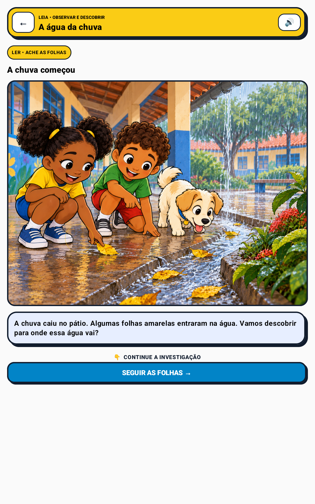 <strong>História narrada</strong></td>
    <td width="25%" align="center">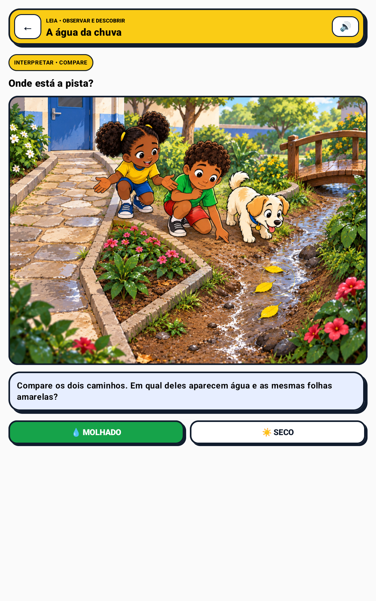 <strong>Interpretação</strong></td>
    <td width="25%" align="center">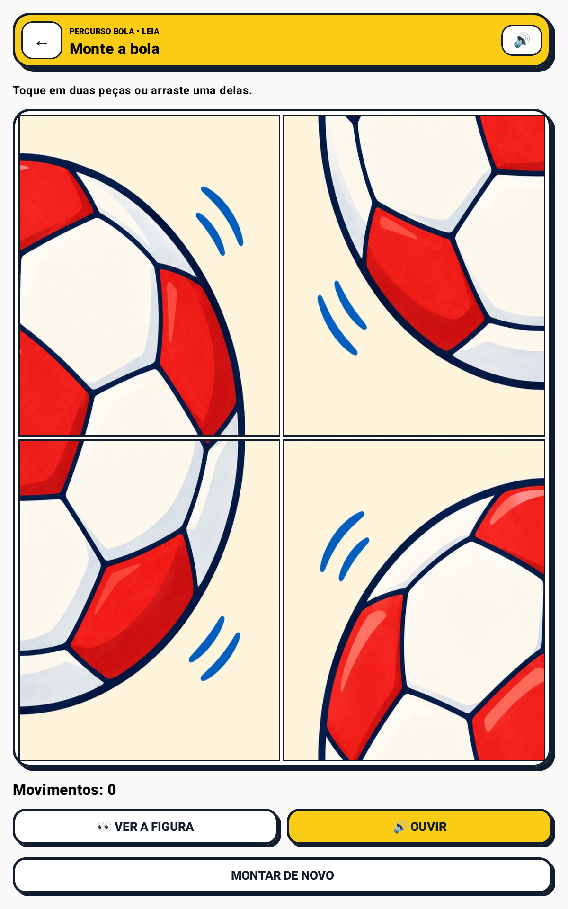 <strong>Manipulação</strong></td>
    <td width="25%" align="center">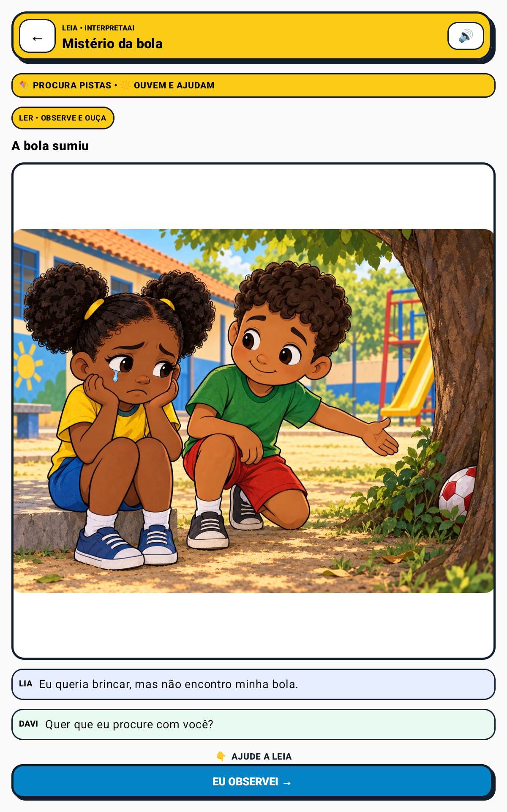 <strong>Colaboração</strong></td>
  </tr>
</table>

## História variável — mesmo renderer no celular e no tablet

Estas capturas vêm do teste instrumentado do novo `LearningStoryPack`, em 360×640, 412×915 e
800×1280dp. A maçã é um recurso local usado como **fixture de interface**: demonstra a execução
por dados e o enquadramento, não comprova upload/publicação real de professora nem uso por crianças.
O quadrinho definitivo será a imagem aprovada pela docente e recebida pelo cache privado.

<table>
  <tr>
    <td width="20%" align="center">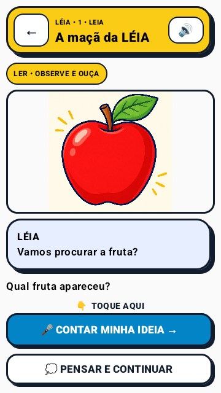 <strong>Ouvir e observar</strong></td>
    <td width="20%" align="center">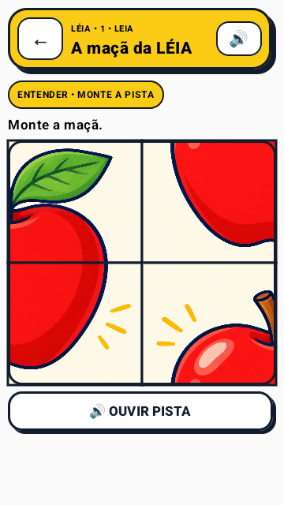 <strong>Montar a pista</strong></td>
    <td width="20%" align="center">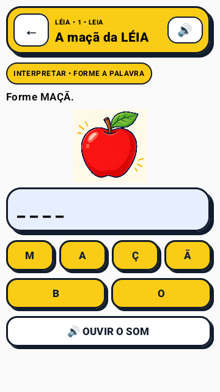 <strong>Formar a palavra</strong></td>
    <td width="20%" align="center">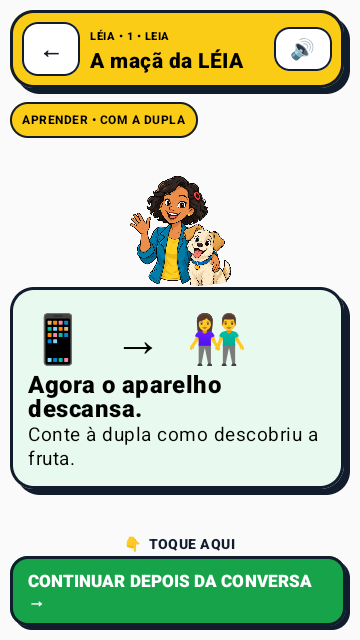 <strong>Conversar fora da tela</strong></td>
    <td width="20%" align="center">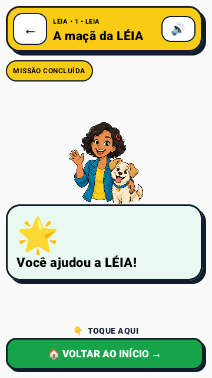 <strong>Encerrar</strong></td>
  </tr>
</table>

Veja o [mesmo percurso em 412×915 e 800×1280dp](../output/screenshots/story-pack/).

## História independente — A água da chuva

<table>
  <tr>
    <td width="33%" align="center"> <strong>Ler: achar as folhas</strong></td>
    <td width="33%" align="center"> <strong>Interpretar: comparar</strong></td>
    <td width="33%" align="center">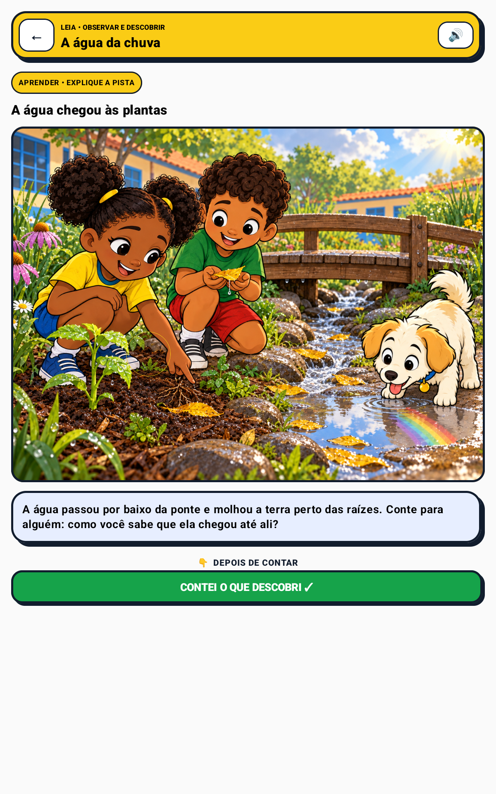 <strong>Aprender: explicar</strong></td>
  </tr>
</table>

LÉIA guia por voz, mas não ocupa os quadros de ação. Lia, Davi e Alfa vivem um episódio independente:
chuva, folhas viajantes, dois caminhos e água chegando ao jardim. Não há bola, objeto perdido ou
puzzle neste enredo. Veja a concepção e os prompts em
[Gibi situacional da chuva](SITUATIONAL_RAIN_COMIC.md). As telas foram verificadas em
[360×640](../output/screenshots/rain-clarified/360x640/),
[412×915](../output/screenshots/rain-clarified/412x915/) e
[800×1280](../output/screenshots/rain-clarified/800x1280/).
Os elementos centrais e os critérios de recorte estão na
[Curadoria visual dos gibis](COMIC_IMAGE_CURATION.md).

## Pistas tocáveis dentro do gibi

<table>
  <tr>
    <td width="33%" align="center">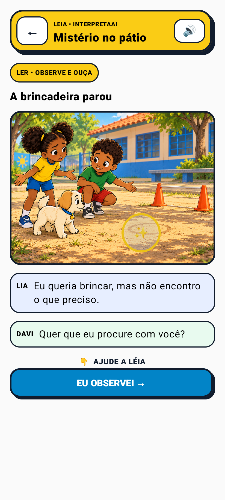 <strong>Descobrir o que falta</strong></td>
    <td width="33%" align="center">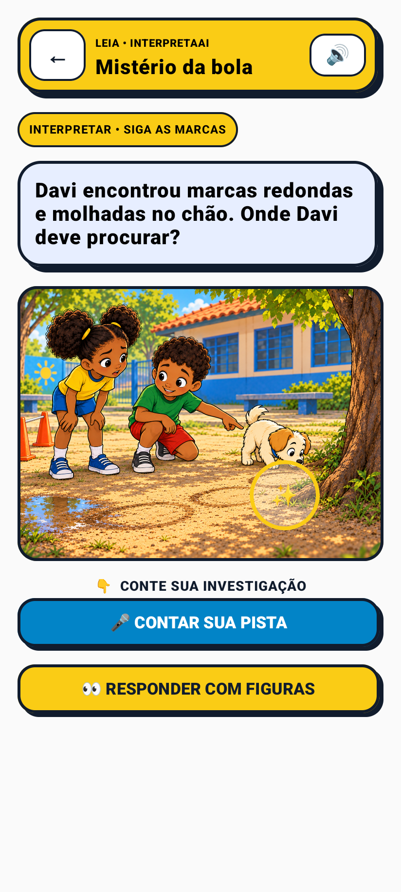 <strong>Seguir as marcas</strong></td>
    <td width="33%" align="center">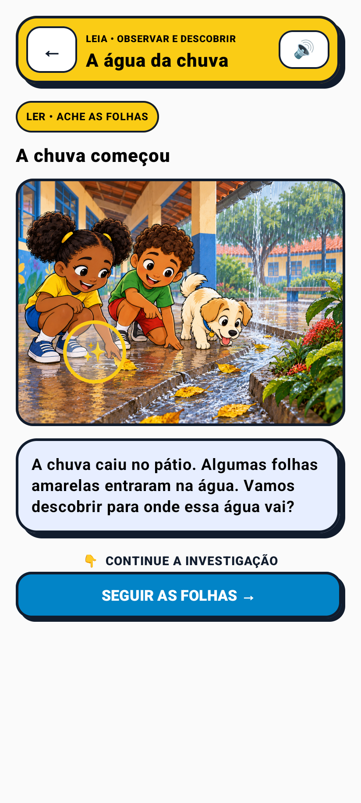 <strong>Achar as folhas</strong></td>
  </tr>
</table>

O brilho aparece onde a criança tocou, toca um efeito curto e chama uma fala contextual da LÉIA.
Ele não fica piscando continuamente e a indicação automática é desativada com “Reduzir estímulos”.
As evidências cobrem [360×640](../output/screenshots/interactive-comics/360x640/),
[412×915](../output/screenshots/interactive-comics/412x915/) e
[800×1280](../output/screenshots/interactive-comics/800x1280/).

## LÉIA, Alfa e três missões novas

Capturas reais do APK emulado, **não** fotografia de crianças ou de tablet físico. A bola na
atividade de letras é uma fotografia sintética gerada por IA; a personagem também é original e
gerada para o projeto. [Escopo, consumo e proveniência](NEW_GAMES_TABLET_MOBILE.md).

<table>
  <tr>
    <td width="25%" align="center">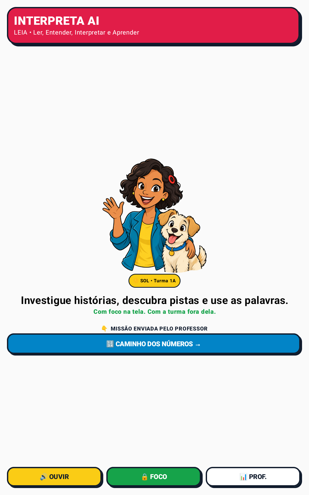 <strong>LÉIA e Alfa</strong></td>
    <td width="25%" align="center">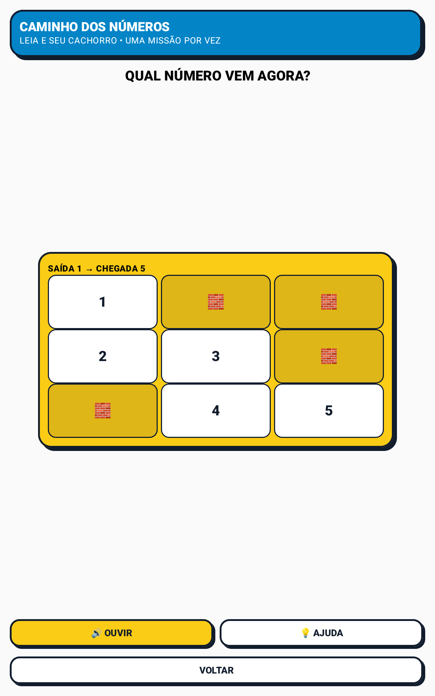 <strong>Caminho 1→5</strong></td>
    <td width="25%" align="center">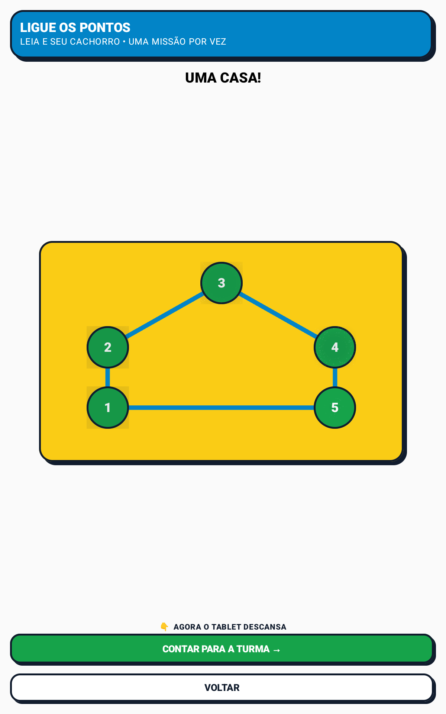 <strong>CASA revelada</strong></td>
    <td width="25%" align="center">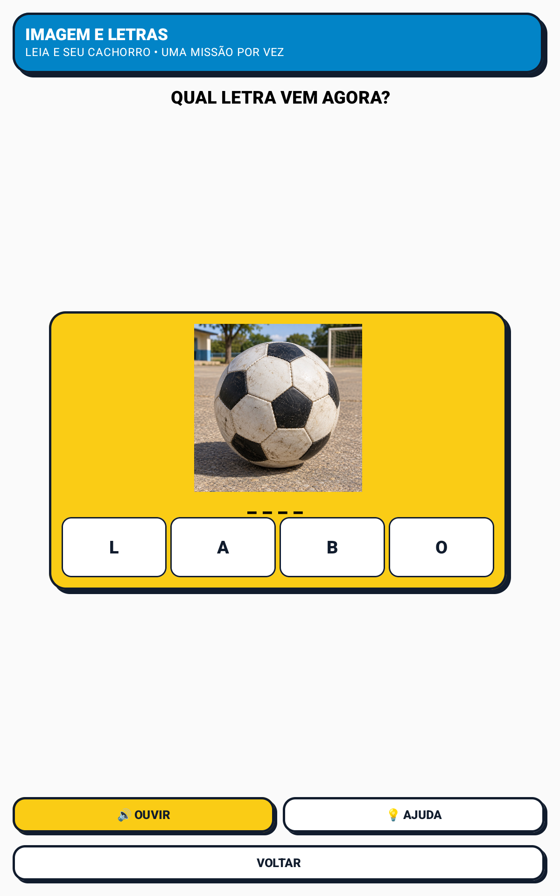 <strong>Foto e letras</strong></td>
  </tr>
</table>

O mesmo fluxo foi capturado em [celular compacto 360×640](../output/screenshots/new-games/360x640/),
[celular 412×915](../output/screenshots/new-games/412x915/) e
[tablet emulado 800×1280](../output/screenshots/new-games/800x1280/). A professora seleciona uma
das três missões no painel adulto e pode publicá-la no canal de piloto já existente.

## Mistério da Bola — estados conectados para compreensão funcional

Estas são capturas reais do percurso fechado. O mesmo conceito segue da informação explícita à
inferência e à aplicação; o quebra-cabeça consolida a palavra dentro da história.

As capturas atuais mostram ajuda progressiva: a pergunta sobre o objeto convida primeiro à fala,
oferece uma figura sem exigir microfone e só mostra “BOLA” após o pedido. A pista seguinte é
observada antes de revelar alternativas; a aplicação também pede uma formulação antes da ajuda.

<table>
  <tr>
    <td width="33%" align="center">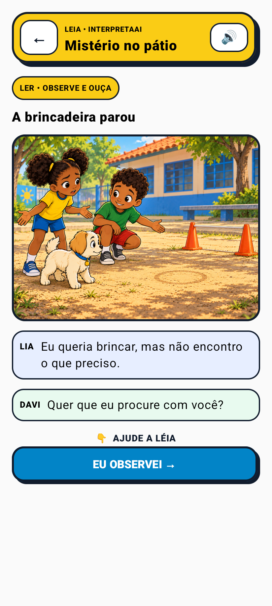 <strong>1. Ler sem revelar</strong></td>
    <td width="33%" align="center"> <strong>2. Localizar</strong></td>
    <td width="33%" align="center">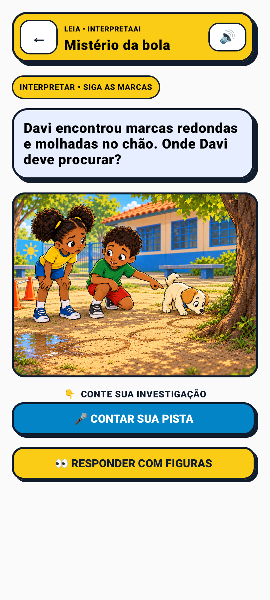 <strong>3. Seguir as marcas</strong></td>
  </tr>
  <tr>
    <td width="33%" align="center"> <strong>4. Explicar</strong></td>
    <td width="33%" align="center"> <strong>5. Manipular</strong></td>
    <td width="33%" align="center"> <strong>6. Palavra e som</strong></td>
  </tr>
  <tr>
    <td width="33%" align="center"> <strong>7. Aplicar</strong></td>
    <td width="33%" align="center"> <strong>8. Compartilhar</strong></td>
    <td width="33%" align="center"><strong>Um conceito contínuo</strong> O puzzle não interrompe a história.</td>
  </tr>
</table>

O percurso completo foi recapturado em [412×915](../output/screenshots/progressive-help/412x915/)
e [800×1280](../output/screenshots/galaxy-tab-a8/); os três passos iniciais também foram
inspecionados em [360×640](../output/screenshots/progressive-help/360x640/).

<table>
  <tr>
    <td width="33%" align="center">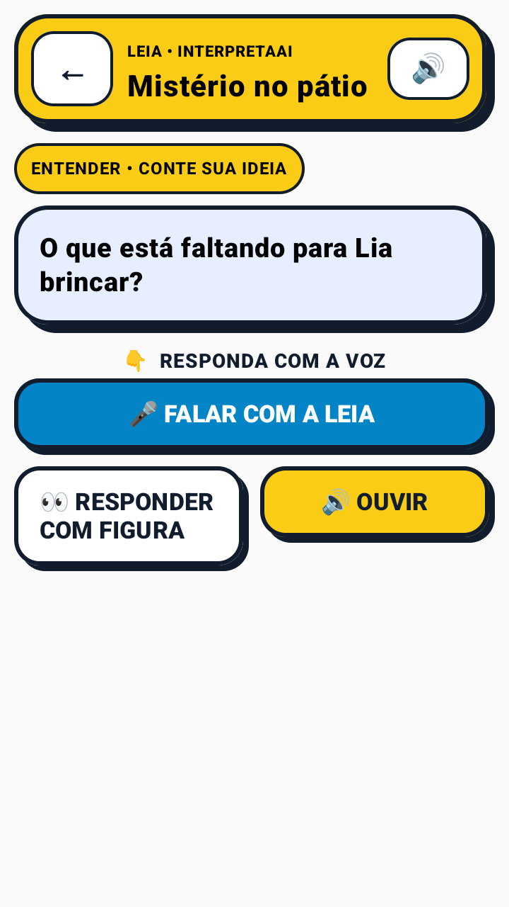 <strong>Primeiro: conte sua ideia</strong></td>
    <td width="33%" align="center"> <strong>Depois: figura opcional</strong></td>
    <td width="33%" align="center">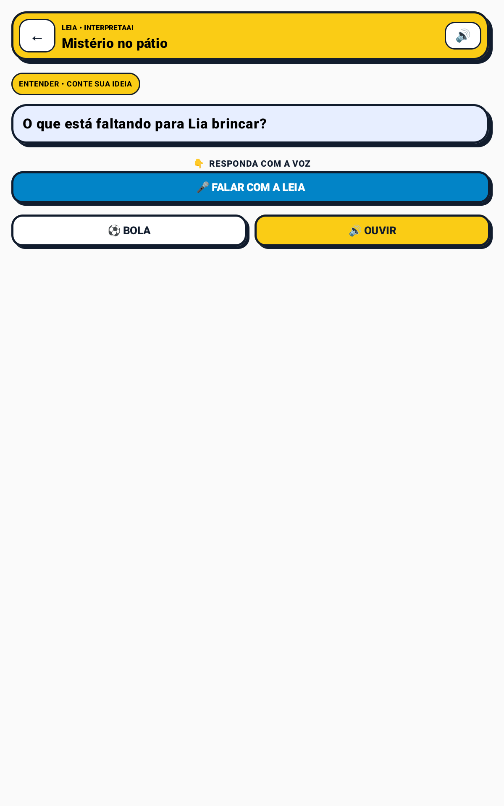 <strong>Também no tablet</strong></td>
  </tr>
</table>

## Entrada e escolha da experiência

<table>
  <tr>
    <td width="33%" align="center"> <strong>Home — 360×640</strong></td>
    <td width="33%" align="center"> <strong>Home — 412×915</strong></td>
    <td width="33%" align="center"> <strong>Home — tablet</strong></td>
  </tr>
</table>

<table>
  <tr>
    <td width="33%" align="center">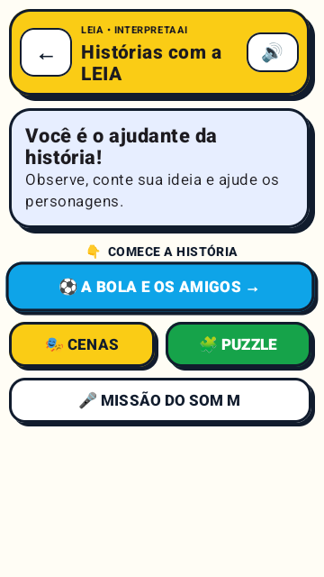 <strong>Histórias — compacto</strong></td>
    <td width="33%" align="center">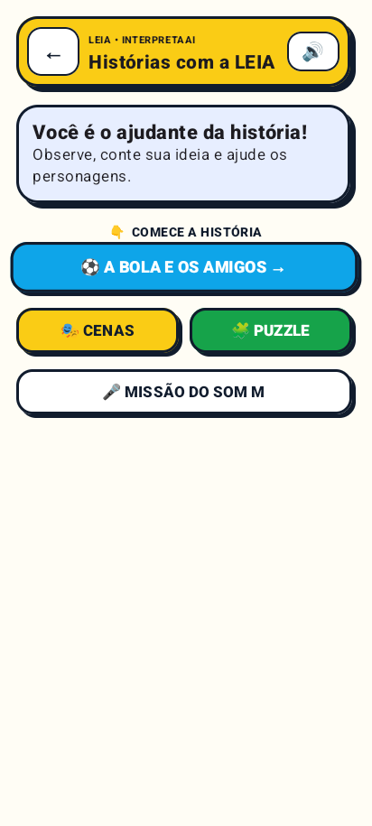 <strong>Histórias — celular</strong></td>
    <td width="33%" align="center">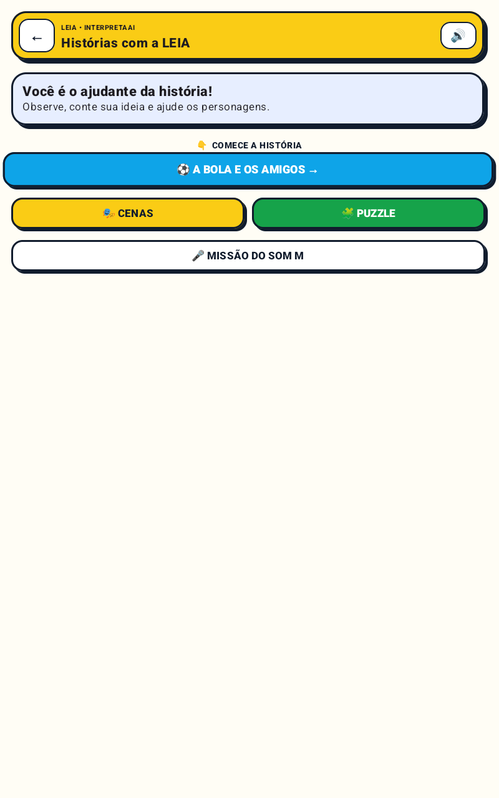 <strong>Histórias — tablet</strong></td>
  </tr>
</table>

## Gibi falado e coautoria guiada

### Estado 1 — observar e ouvir

<table>
  <tr>
    <td width="33%" align="center">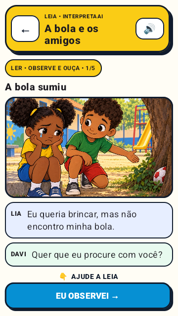 <strong>360×640</strong></td>
    <td width="33%" align="center"> <strong>412×915</strong></td>
    <td width="33%" align="center">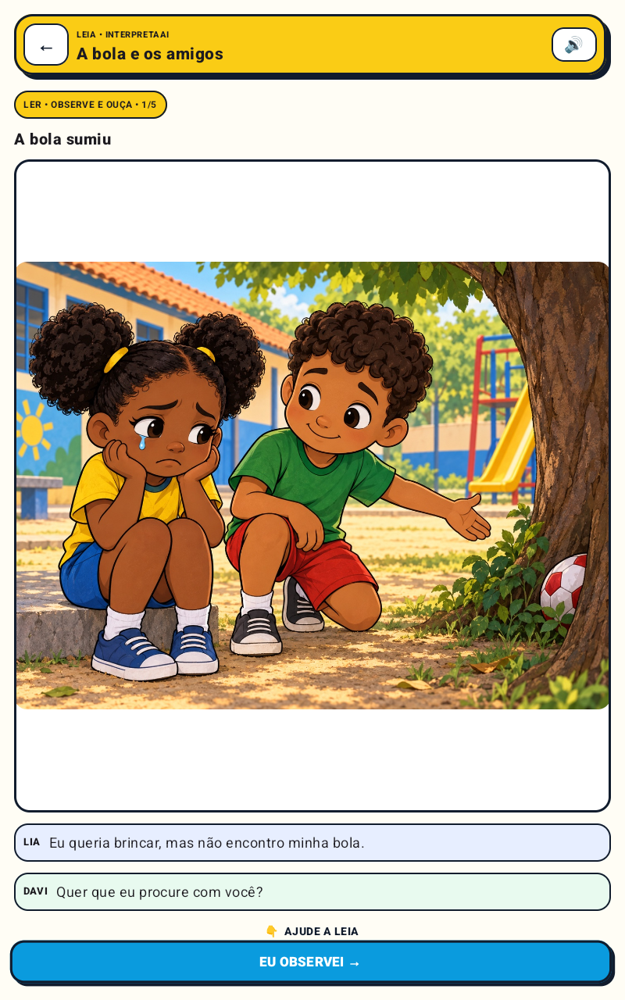 <strong>800×1280</strong></td>
  </tr>
</table>

### Estado 2 — contar uma ideia

<table>
  <tr>
    <td width="33%" align="center">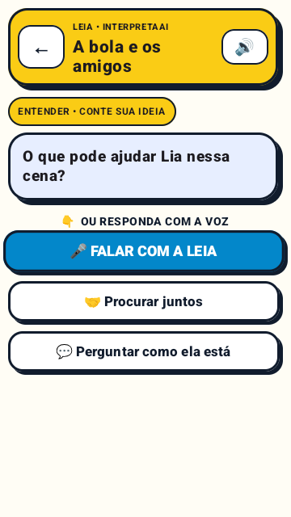 <strong>Voz ou toque — compacto</strong></td>
    <td width="33%" align="center">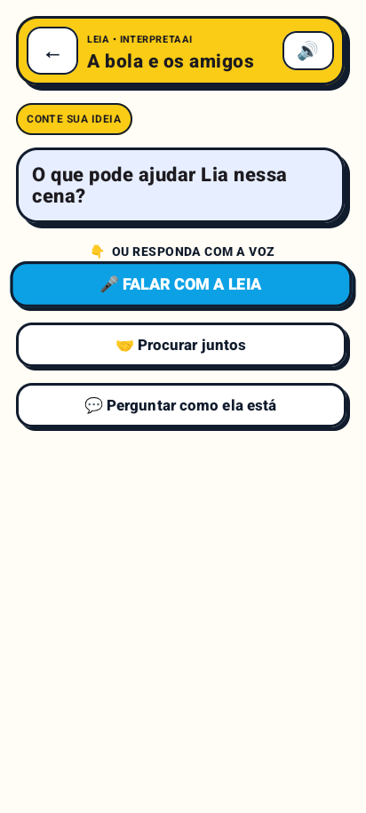 <strong>Voz ou toque — celular</strong></td>
    <td width="33%" align="center">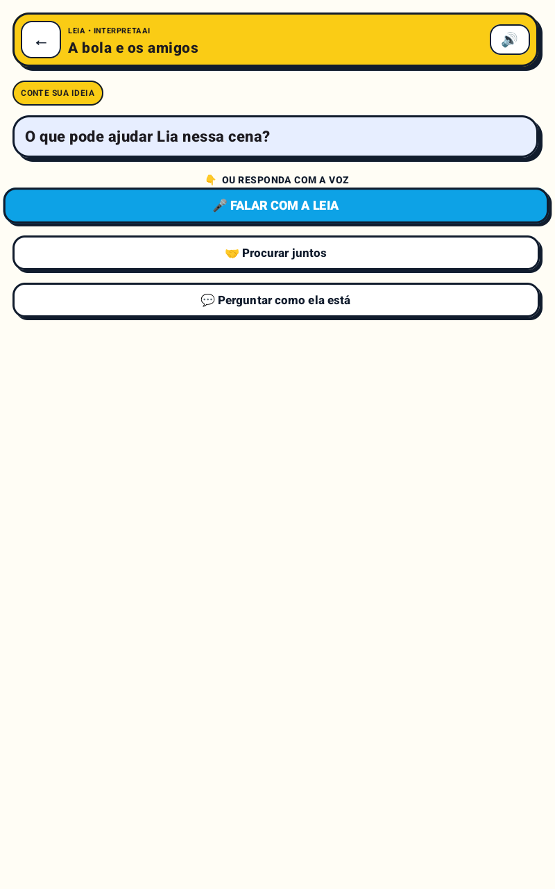 <strong>Voz ou toque — tablet</strong></td>
  </tr>
</table>

### Estado 3 — receber a reação da LÉIA

<table>
  <tr>
    <td width="33%" align="center">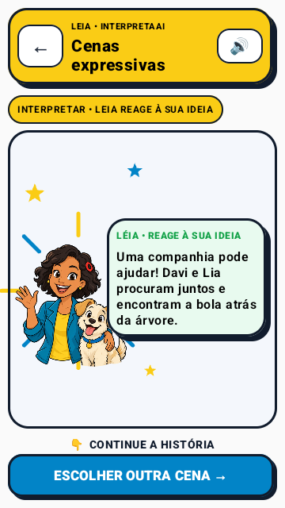 <strong>Personagem e balão — 360×640</strong></td>
    <td width="33%" align="center">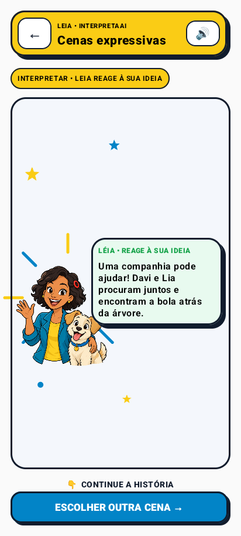 <strong>Reação contextual — 412×915</strong></td>
    <td width="33%" align="center">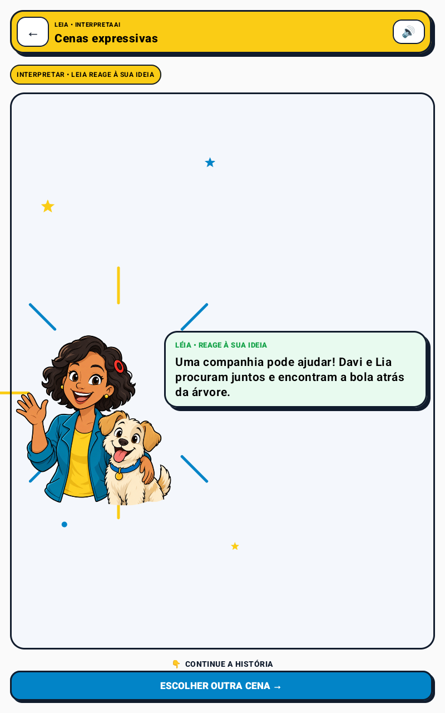 <strong>Mesmo foco — tablet</strong></td>
  </tr>
</table>

A resposta reconhece a contribuição, mantém a LÉIA dentro da história e orienta o próximo passo. A
[auditoria visual infantil](CHILD_VISUAL_UX_AUDIT.md) registra critérios, riscos e modo reduzido.

## Quebra-cabeça: imagem, palavra e fala

### Escolha com poucas possibilidades

<table>
  <tr>
    <td width="33%" align="center">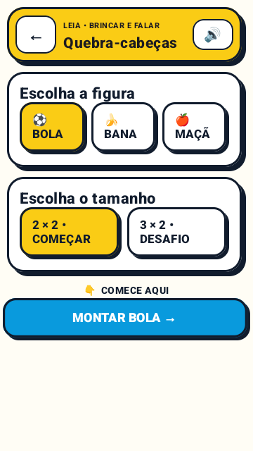 <strong>360×640</strong></td>
    <td width="33%" align="center">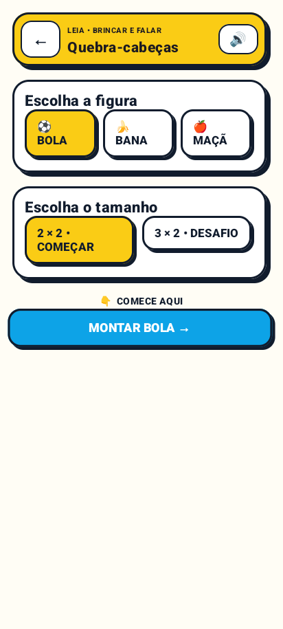 <strong>412×915</strong></td>
    <td width="33%" align="center">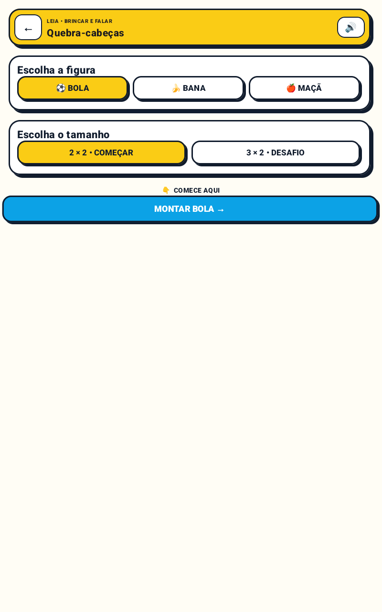 <strong>800×1280</strong></td>
  </tr>
</table>

## Quadro criativo guiado pelo professor — versões 0.7 e 0.17

O professor escolhe uma pista visual; a criança marca por toque ou desenha por arraste, pode mudar o
traço, apagar por gesto sem remover a pista visual, desfazer e refazer. Na versão 0.17, o traço foi
suavizado, o buffer do gesto deixou de copiar toda a linha a cada movimento e os controles passaram
a refletir o histórico imediatamente. A tela não depende de rolagem e termina devolvendo a criação
para a conversa em turma.

<table>
  <tr>
    <td width="33%" align="center">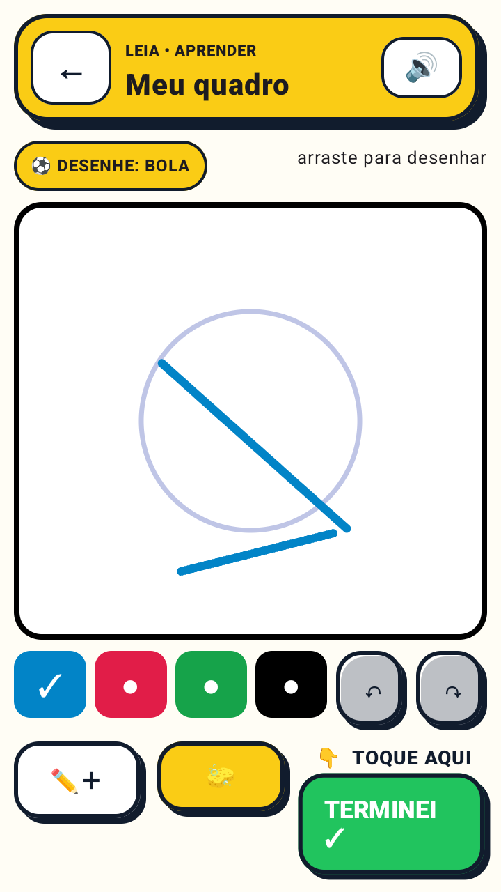 <strong>360×640dp • interação real</strong></td>
    <td width="33%" align="center"> <strong>412×915dp</strong></td>
    <td width="33%" align="center">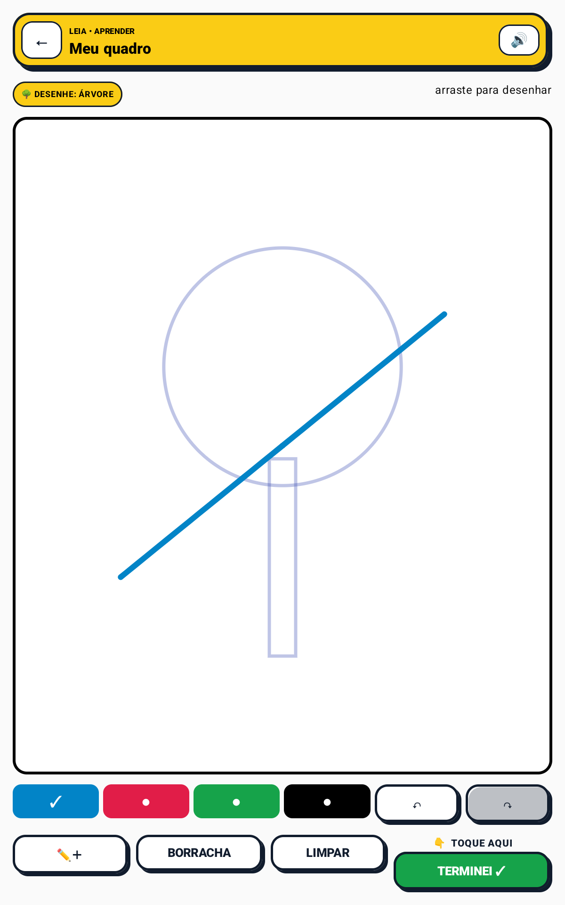 <strong>Tablet 800×1280dp • versão 0.17</strong></td>
  </tr>
</table>

As duas capturas de celular acima são da versão 0.7; a captura de tablet foi refeita com o quadro
0.17. O emulador foi configurado em 1200×1920 px e densidade 240 (800×1280 dp), proporção da tela
do Galaxy Tab A8 identificado em compra da SME. Não é fotografia nem validação em aparelho de GET.

### Jornada infantil no perfil de tablet

<table>
  <tr>
    <td width="25%" align="center">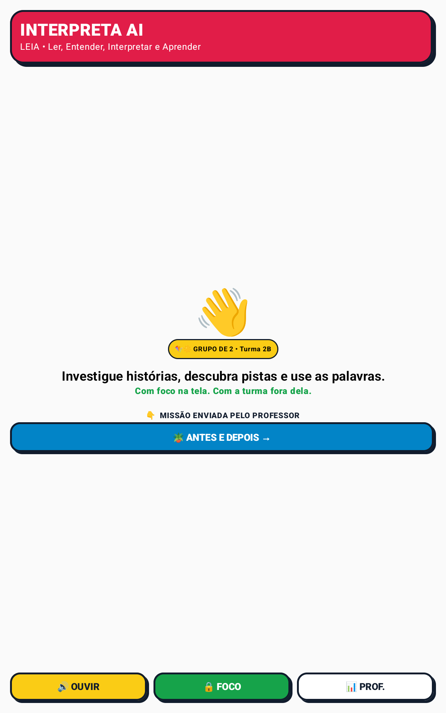 <strong>Missão do grupo</strong></td>
    <td width="25%" align="center">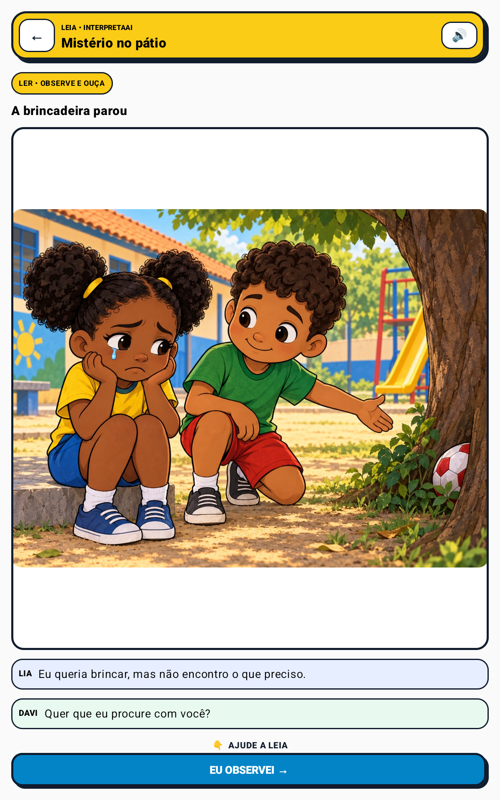 <strong>Ouvir e observar</strong></td>
    <td width="25%" align="center"> <strong>Montar por toque ou arraste</strong></td>
    <td width="25%" align="center"> <strong>Desenhar e explicar</strong></td>
  </tr>
</table>

As [capturas completas deste perfil](../output/screenshots/galaxy-tab-a8/) cobrem 18 estados do
percurso. A inspeção visual não encontrou CTA cortado, sobreposição ou ação dependente de swipe.
Etapas curtas deixam área livre considerável: isso preserva foco, mas ainda requer observação em
sala para verificar se mantém a atenção e facilita o rodízio entre crianças.

### Professor publica; a criança recebe uma missão

<table>
  <tr>
    <td width="33%" align="center">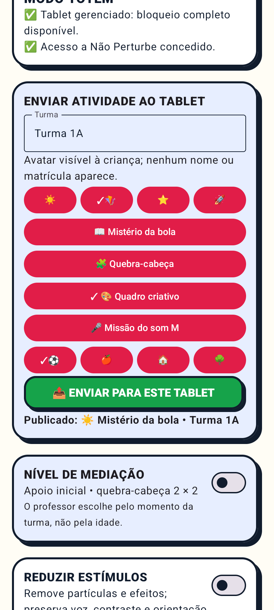 <strong>1. Preparar</strong></td>
    <td width="33%" align="center">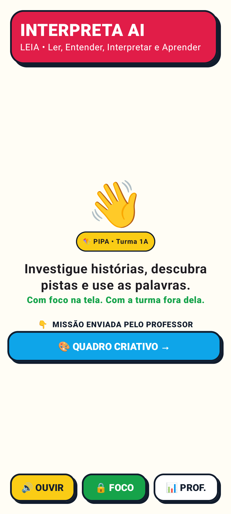 <strong>2. Receber</strong></td>
    <td width="33%" align="center">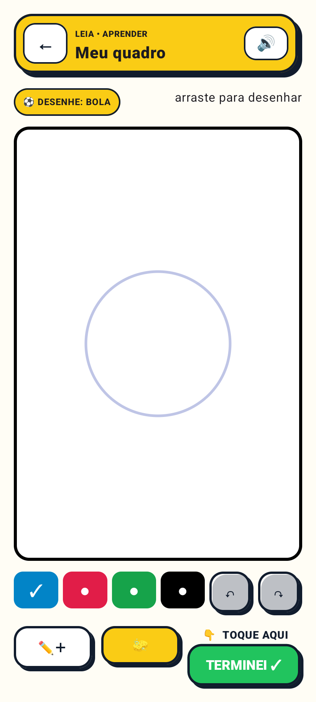 <strong>3. Fazer</strong></td>
  </tr>
</table>

O fluxo local permanece disponível. O canal online de piloto também foi validado em loopback: a
atribuição versionada saiu pelo servidor e alterou a Home para outro avatar, turma e atividade. A
criança vê somente o avatar, nunca pseudônimo, nome ou matrícula; identidade institucional permanece
fora do MVP.

<table>
  <tr>
    <td width="50%" align="center">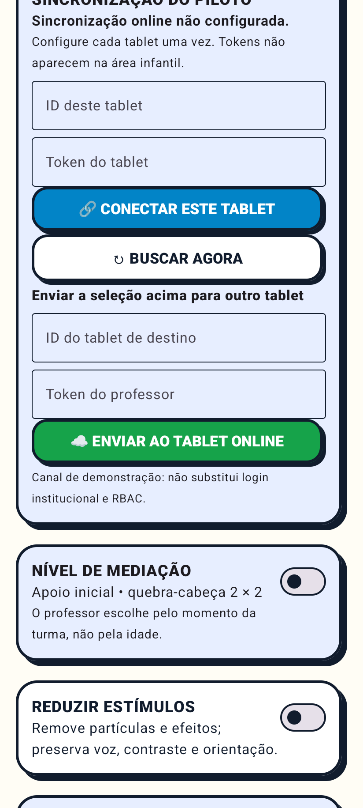 <strong>Canal online do piloto</strong></td>
    <td width="50%" align="center">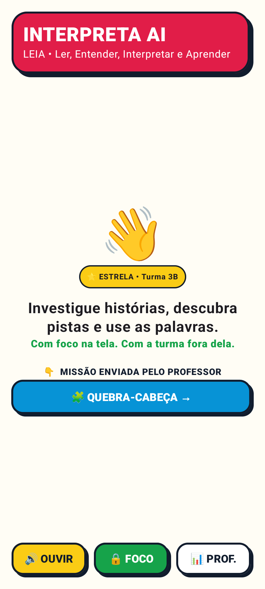 <strong>Missão remota recebida</strong></td>
  </tr>
</table>

Na versão 0.9, a mesma área adulta permite reunir aliases e tablets em uma sala, marcar participantes
e enviar a missão para todos ou um grupo. O editor continua separado da experiência infantil e deixa
explícito que o token do piloto não substitui autenticação institucional.

Antes do envio, a atividade selecionada também expõe foco pedagógico, faixa de mediação, evidência
observável e referências de planejamento. Isso torna a escolha docente explícita sem transformar a
faixa em classificação automática da criança.

<table>
  <tr>
    <td width="50%" align="center">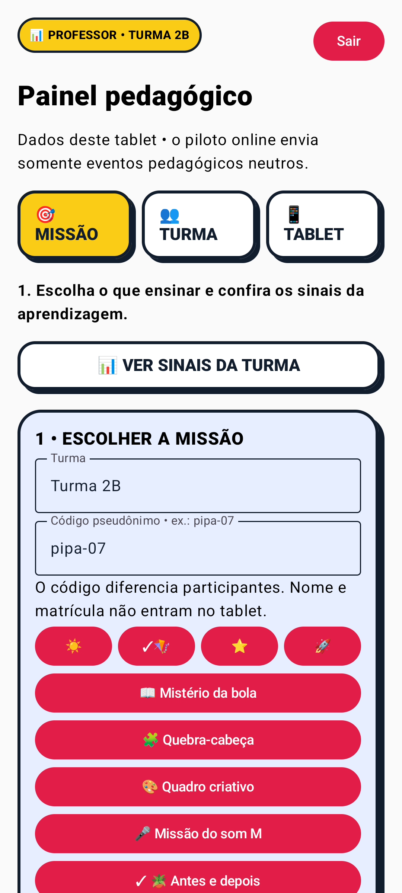 <strong>1. Escolher a missão sem atravessar configurações técnicas</strong></td>
    <td width="50%" align="center">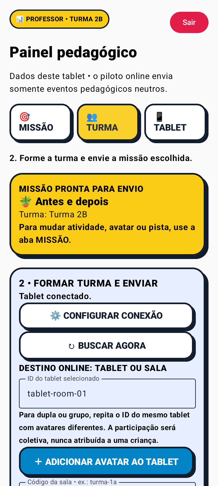 <strong>2. Confirmar a missão, formar a turma e enviar</strong></td>
  </tr>
</table>

  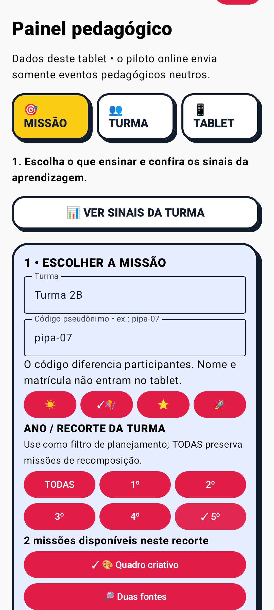 
  <strong>O ano reduz a lista na mesma tela; TODAS preserva missões de recomposição e não classifica a criança.</strong>

   
  <strong>O piloto identifica ressalvas de hardware, voz e Modo Foco sem coletar serial, IMEI ou dado infantil.</strong>

  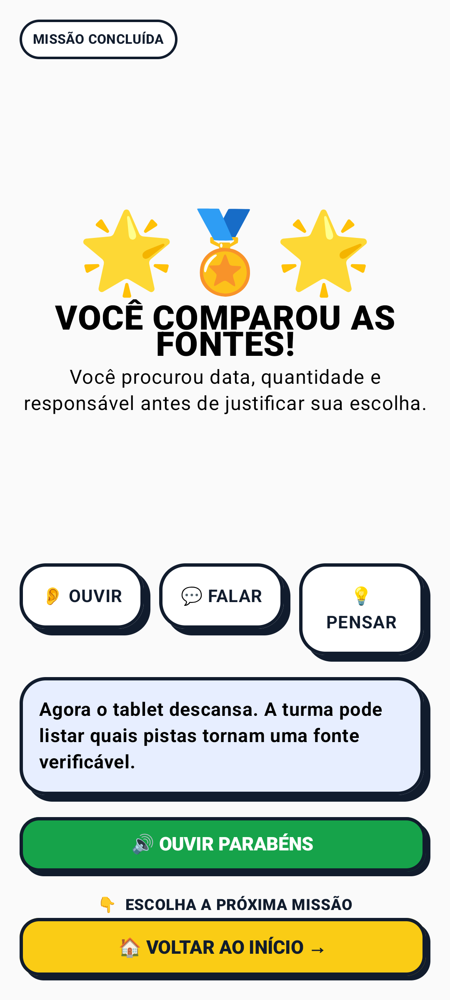 
  <strong>A missão enviada pelo professor termina com a habilidade praticada e devolve a turma para uma atividade fora da tela.</strong>

  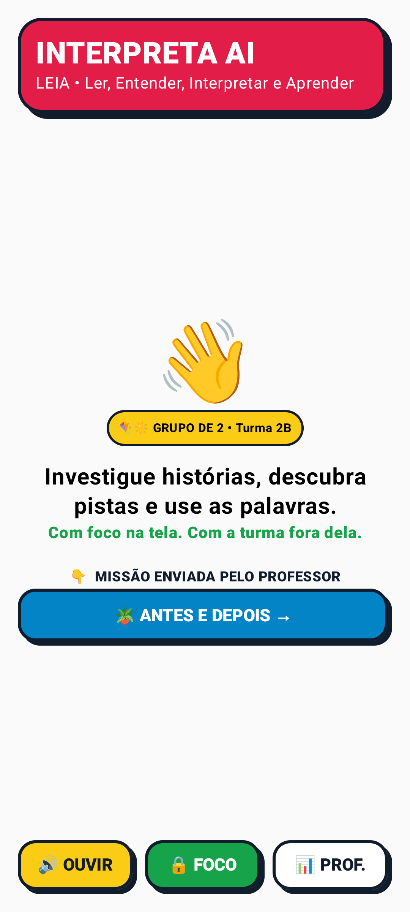 
  <strong>O grupo vê seus avatares e a missão; pseudônimos e identidade permanecem fora da interface infantil.</strong>

  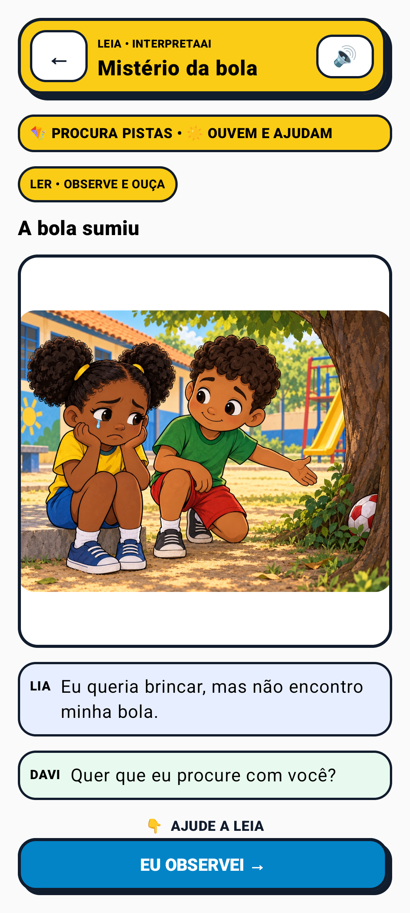 
  <strong>O rodízio é visual e falado: um avatar procura pistas enquanto o outro ouve e ajuda; os papéis mudam nas etapas seguintes.</strong>

  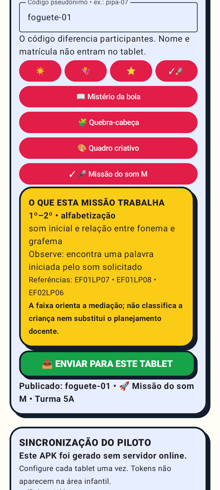 
  <strong>O professor vê o propósito da missão antes de publicá-la.</strong>

<table>
  <tr>
    <td width="33%" align="center">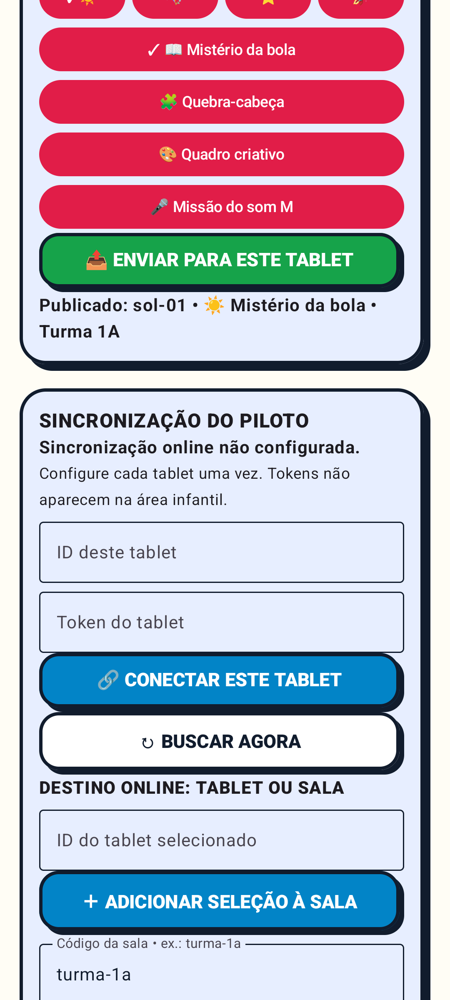 <strong>Montar a sala</strong></td>
    <td width="33%" align="center">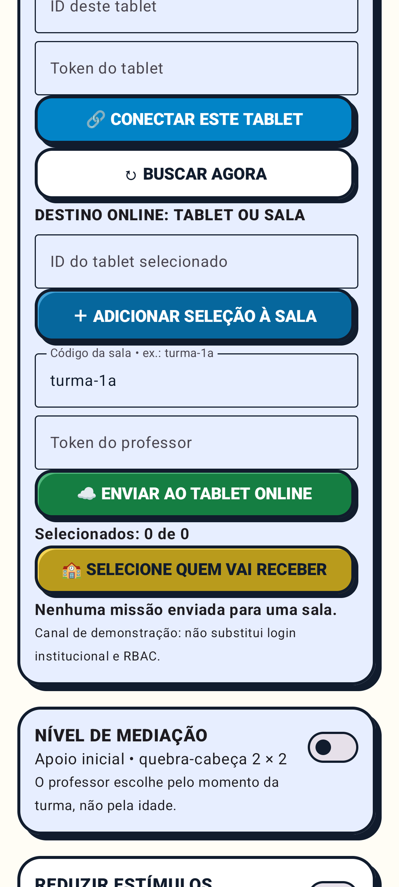 <strong>Seleção obrigatória</strong></td>
    <td width="33%" align="center">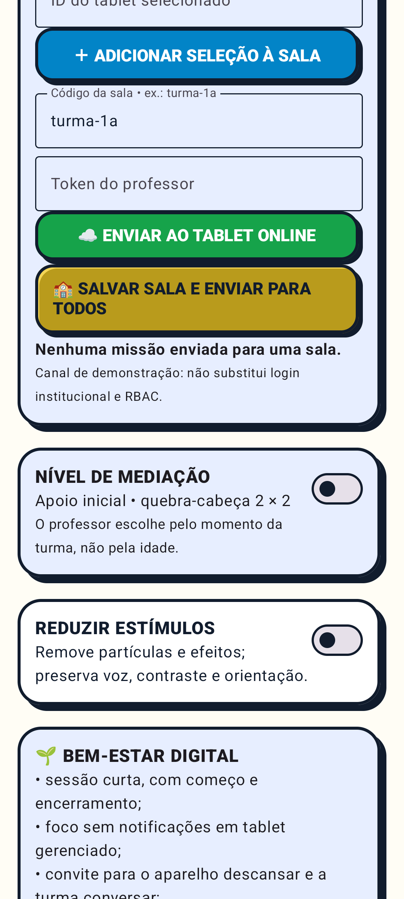 <strong>Enviar para todos</strong></td>
  </tr>
</table>

### Montagem por toque ou arraste

<table>
  <tr>
    <td width="33%" align="center">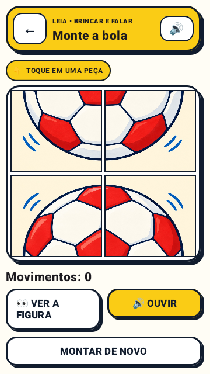 <strong>Jogo — compacto</strong></td>
    <td width="33%" align="center">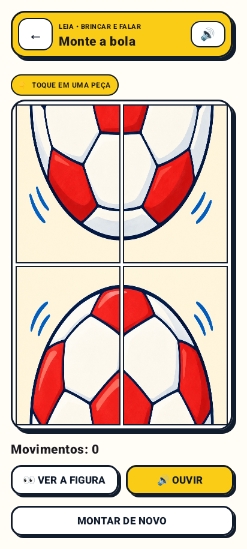 <strong>Jogo — celular</strong></td>
    <td width="33%" align="center">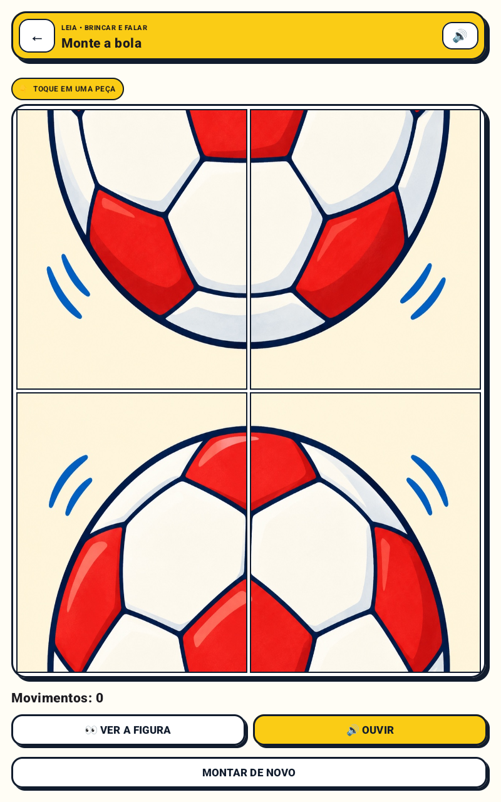 <strong>Jogo — tablet</strong></td>
  </tr>
</table>

### Conclusão falada

<table>
  <tr>
    <td width="33%" align="center">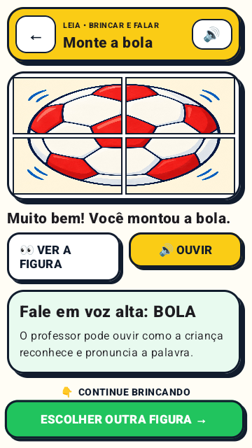 <strong>Palavra completa — compacto</strong></td>
    <td width="33%" align="center"> <strong>Palavra completa — celular</strong></td>
    <td width="33%" align="center">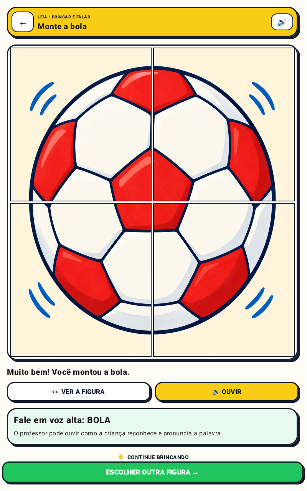 <strong>Palavra completa — tablet</strong></td>
  </tr>
</table>

## Evidência da correção de enquadramento

A versão anterior dependia de rolagem para expor a ação principal em telas menores. A versão atual
prioriza o CTA, reduz ilustração e espaçamento antes de reduzir texto e mantém uma decisão por viewport.

<table>
  <tr>
    <td width="50%" align="center">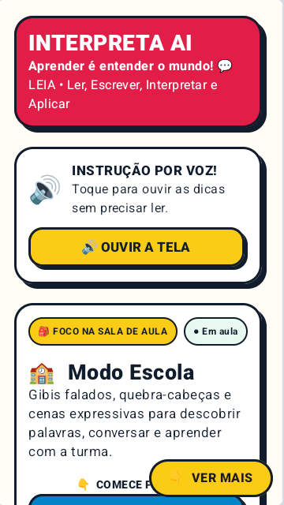 <strong>Antes — CTA disputava espaço e leitura</strong></td>
    <td width="50%" align="center"> <strong>Depois — próximo passo sempre visível</strong></td>
  </tr>
</table>

## O que estas imagens comprovam

- identidade visual consistente em celular compacto, celular alto e tablet;
- história, pergunta, reação e avanço separados em estados controlados;
- CTA infantil sem depender de rolagem;
- alvos grandes e alternativas por voz ou toque;
- puzzle por toque ou arraste no mesmo viewport, incluindo conclusão e convite falado;
- rodízio de ações por avatar no tablet compartilhado, sem alias ou autoria individual inventada;
- preservação da linguagem de gibi: bordas grossas, sombras, balões e cores reconhecíveis.

[← Voltar à apresentação principal](../README.md)
