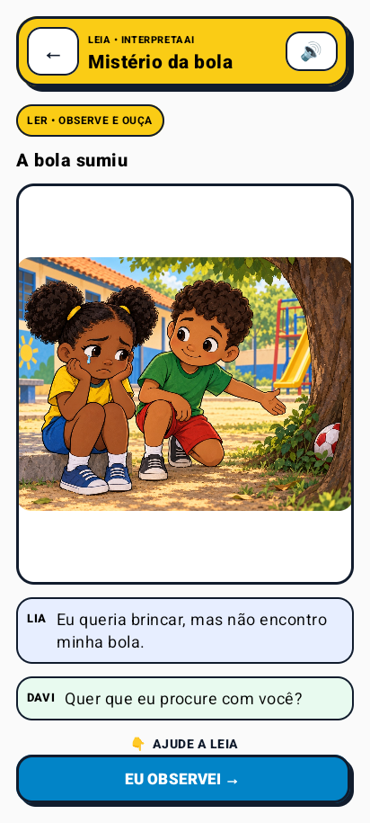
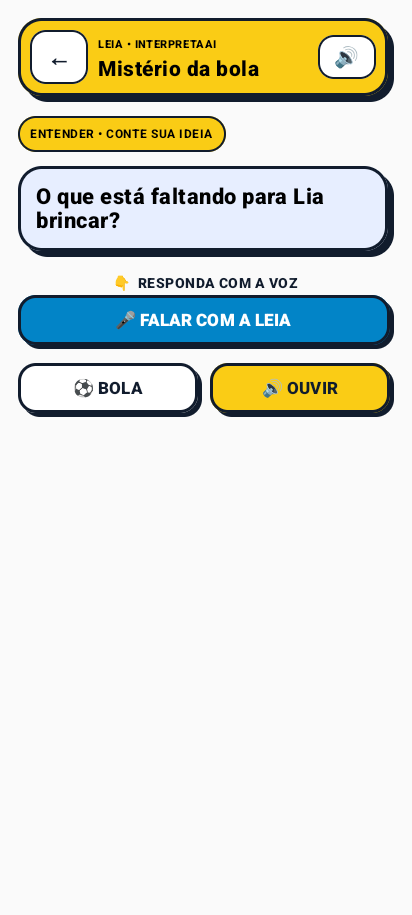
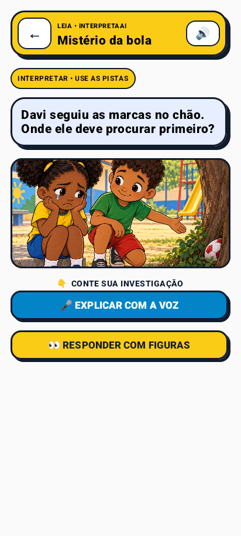
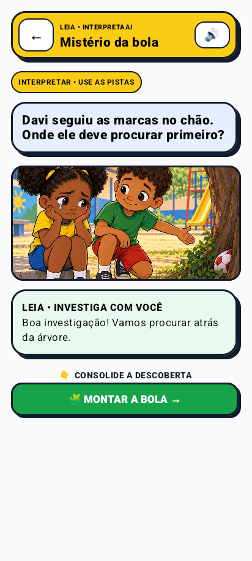
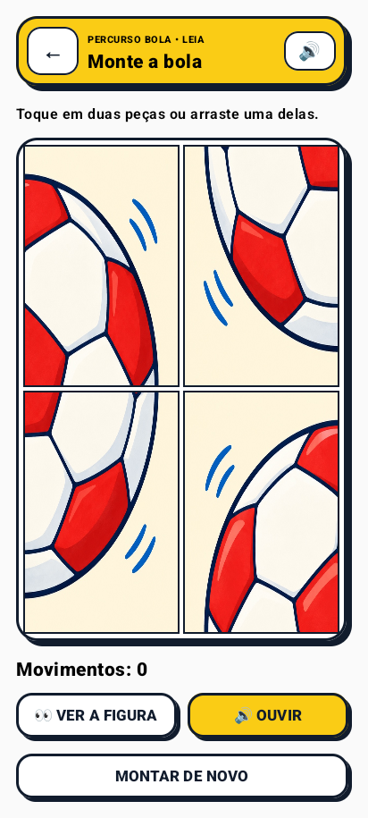
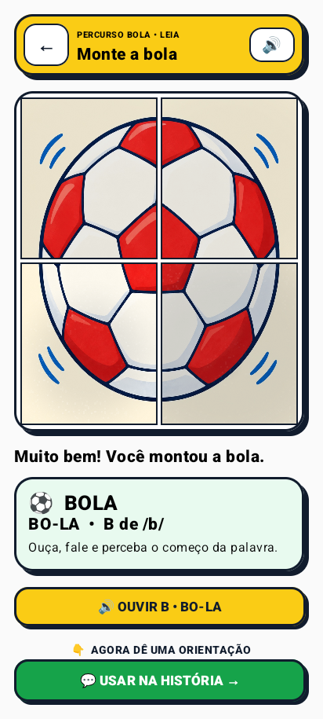
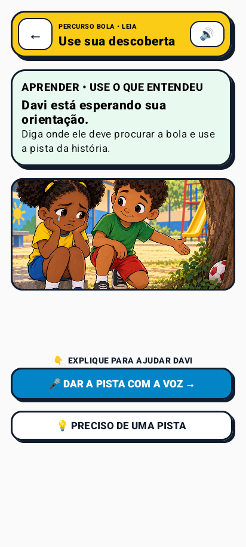
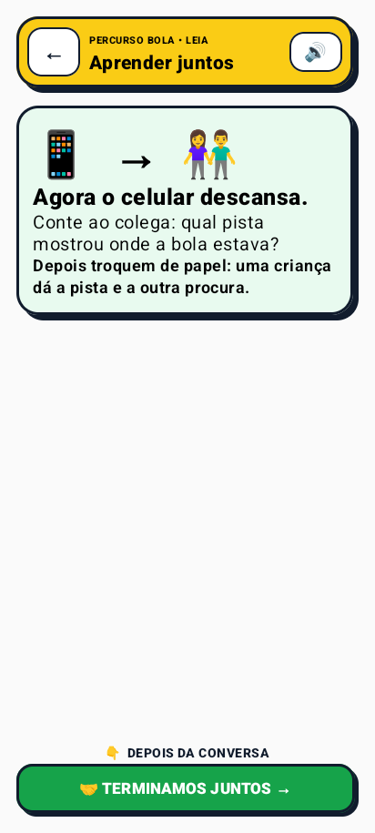
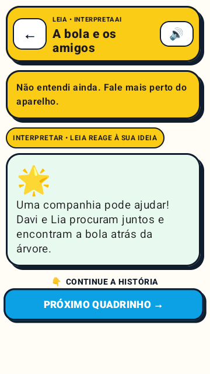
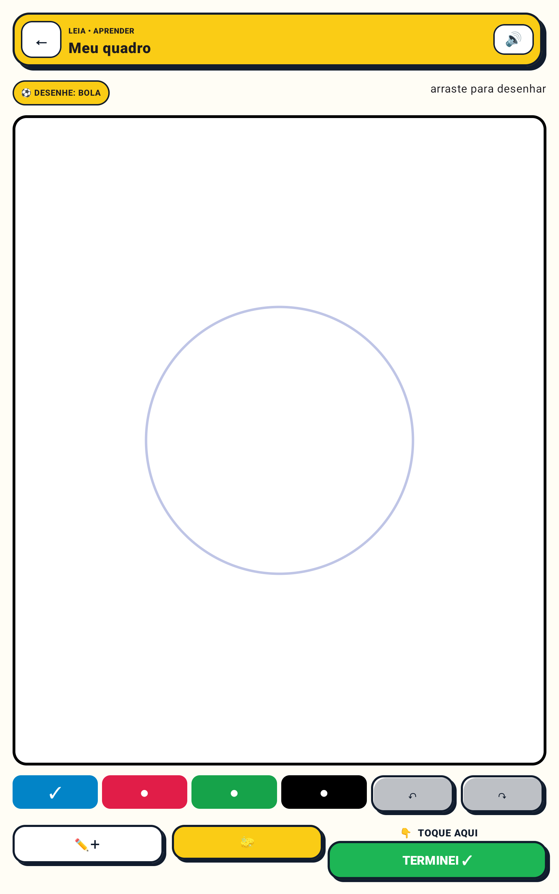

# Galeria visual do InterpretaAI

Esta galeria reúne capturas reais do APK. Elas são evidência da jornada infantil, da identidade em
gibi e da auditoria sem rolagem em três tamanhos de tela — não são mockups externos ao produto.

[← Voltar ao README](../README.md) · [Estado auditado](MVP_STATUS.md) ·
[Critérios do hackathon](HACKATHON_CRITERIA.md)

## Mistério da Bola — estados conectados para compreensão funcional

Estas são capturas reais do percurso fechado. O mesmo conceito segue da informação explícita à
inferência e à aplicação; o quebra-cabeça consolida a palavra dentro da história.

As capturas mais recentes mostram o **fluxo equilibrado da versão 0.4**: a pista visual é observada
antes de revelar alternativas, e a aplicação pede uma formulação antes de oferecer ajuda composta.

<table>
  <tr>
    <td width="33%" align="center"> <strong>1. Ler/ouvir</strong></td>
    <td width="33%" align="center"> <strong>2. Localizar</strong></td>
    <td width="33%" align="center"> <strong>3. Investigar</strong></td>
  </tr>
  <tr>
    <td width="33%" align="center"> <strong>4. Explicar</strong></td>
    <td width="33%" align="center"> <strong>5. Manipular</strong></td>
    <td width="33%" align="center"> <strong>6. Palavra e som</strong></td>
  </tr>
  <tr>
    <td width="33%" align="center"> <strong>7. Aplicar</strong></td>
    <td width="33%" align="center"> <strong>8. Compartilhar</strong></td>
    <td width="33%" align="center"><strong>Um conceito contínuo</strong> O puzzle não interrompe a história.</td>
  </tr>
</table>

Os doze estados visuais foram capturados em `360×640`, `412×915` e `800×1280` em
[`output/screenshots/attention-balanced`](../output/screenshots/attention-balanced/).

## Entrada e escolha da experiência

<table>
  <tr>
    <td width="33%" align="center"> <strong>Home — 360×640</strong></td>
    <td width="33%" align="center"> <strong>Home — 412×915</strong></td>
    <td width="33%" align="center"> <strong>Home — tablet</strong></td>
  </tr>
</table>

<table>
  <tr>
    <td width="33%" align="center"> <strong>Histórias — compacto</strong></td>
    <td width="33%" align="center"> <strong>Histórias — celular</strong></td>
    <td width="33%" align="center"> <strong>Histórias — tablet</strong></td>
  </tr>
</table>

## Gibi falado e coautoria guiada

### Estado 1 — observar e ouvir

<table>
  <tr>
    <td width="33%" align="center"> <strong>360×640</strong></td>
    <td width="33%" align="center"> <strong>412×915</strong></td>
    <td width="33%" align="center"> <strong>800×1280</strong></td>
  </tr>
</table>

### Estado 2 — contar uma ideia

<table>
  <tr>
    <td width="33%" align="center"> <strong>Voz ou toque — compacto</strong></td>
    <td width="33%" align="center"> <strong>Voz ou toque — celular</strong></td>
    <td width="33%" align="center"> <strong>Voz ou toque — tablet</strong></td>
  </tr>
</table>

### Estado 3 — receber a reação da LEIA

   
  <strong>A resposta reconhece a contribuição e orienta o próximo passo.</strong>

## Quebra-cabeça: imagem, palavra e fala

### Escolha com poucas possibilidades

<table>
  <tr>
    <td width="33%" align="center"> <strong>360×640</strong></td>
    <td width="33%" align="center"> <strong>412×915</strong></td>
    <td width="33%" align="center"> <strong>800×1280</strong></td>
  </tr>
</table>

## Quadro criativo guiado pelo professor — versão 0.7

O professor escolhe uma pista visual; a criança desenha por arraste, pode mudar o traço, desfazer e
refazer. A tela não depende de rolagem e termina devolvendo a criação para a conversa em turma.

<table>
  <tr>
    <td width="33%" align="center"> <strong>360×640dp • interação real</strong></td>
    <td width="33%" align="center"> <strong>412×915dp</strong></td>
    <td width="33%" align="center"> <strong>Tablet 800×1280dp</strong></td>
  </tr>
</table>

### Professor publica; a criança recebe uma missão

<table>
  <tr>
    <td width="33%" align="center"> <strong>1. Preparar</strong></td>
    <td width="33%" align="center"> <strong>2. Receber</strong></td>
    <td width="33%" align="center"> <strong>3. Fazer</strong></td>
  </tr>
</table>

O fluxo local permanece disponível. O canal online de piloto também foi validado em loopback: a
atribuição versionada saiu pelo servidor e alterou a Home para outro avatar, turma e atividade. A
criança vê somente o avatar, nunca pseudônimo, nome ou matrícula; identidade institucional permanece
fora do MVP.

<table>
  <tr>
    <td width="50%" align="center"> <strong>Canal online do piloto</strong></td>
    <td width="50%" align="center"> <strong>Missão remota recebida</strong></td>
  </tr>
</table>

Na versão 0.9, a mesma área adulta permite reunir aliases e tablets em uma sala e enviar a missão
para todos. O editor continua separado da experiência infantil e deixa explícito que o token do
piloto não substitui autenticação institucional.

<table>
  <tr>
    <td width="50%" align="center"> <strong>Montar a sala</strong></td>
    <td width="50%" align="center"> <strong>Enviar para todos</strong></td>
  </tr>
</table>

### Montagem por toque ou arraste

<table>
  <tr>
    <td width="33%" align="center"> <strong>Jogo — compacto</strong></td>
    <td width="33%" align="center"> <strong>Jogo — celular</strong></td>
    <td width="33%" align="center"> <strong>Jogo — tablet</strong></td>
  </tr>
</table>

### Conclusão falada

<table>
  <tr>
    <td width="33%" align="center"> <strong>Palavra completa — compacto</strong></td>
    <td width="33%" align="center"> <strong>Palavra completa — celular</strong></td>
    <td width="33%" align="center"> <strong>Palavra completa — tablet</strong></td>
  </tr>
</table>

## Evidência da correção de enquadramento

A versão anterior dependia de rolagem para expor a ação principal em telas menores. A versão atual
prioriza o CTA, reduz ilustração e espaçamento antes de reduzir texto e mantém uma decisão por viewport.

<table>
  <tr>
    <td width="50%" align="center"> <strong>Antes — CTA disputava espaço e leitura</strong></td>
    <td width="50%" align="center"> <strong>Depois — próximo passo sempre visível</strong></td>
  </tr>
</table>

## O que estas imagens comprovam

- identidade visual consistente em celular compacto, celular alto e tablet;
- história, pergunta, reação e avanço separados em estados controlados;
- CTA infantil sem depender de rolagem;
- alvos grandes e alternativas por voz ou toque;
- puzzle por toque ou arraste no mesmo viewport, incluindo conclusão e convite falado;
- preservação da linguagem de gibi: bordas grossas, sombras, balões e cores reconhecíveis.

[← Voltar à apresentação principal](../README.md)
