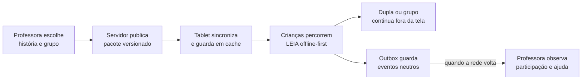

# Como o InterpretaAI conversa com GETs e escolas municipais regulares

O InterpretaAI foi desenhado para iniciar pequeno: uma professora, uma turma, uma história curta e
um conjunto de tablets. Ele não exige que a escola mude seu currículo ou que cada criança tenha um
aparelho. O mesmo núcleo pode apoiar um ambiente tecnológico estruturado ou uma sala com poucos
dispositivos e conectividade irregular.

> Neste documento, **EMR** é uma abreviação descritiva para **escola municipal regular**. Não a
> apresentamos como nome de programa ou sigla oficial da SME-Rio sem fonte institucional específica.

[← Voltar ao README](../README.md) · [Catálogo de experiências](EXPERIENCE_CATALOG.md) ·
[Pesquisa completa para o piloto](GET_RJ_TABLET_PILOT_RESEARCH.md)

## Dois contextos, o mesmo objetivo

| Contexto | O que já existe na proposta escolar | Como o InterpretaAI se encaixa | Cuidado necessário |
|---|---|---|---|
| **GET — Ginásio Educacional Tecnológico** | aprendizagem ativa, tecnologia, colaboração, autoria e atividades mão na massa | o gibi inicia uma investigação; o jogo consolida linguagem; a turma termina explicando, desenhando ou construindo fora da tela | não reduzir a proposta GET a “usar tablets”; o valor está na mediação e na produção dos estudantes |
| **Escola municipal regular** | alfabetização conduzida pela professora, rotina de turma e recursos que variam por unidade | funciona em celular ou tablet compartilhado, com conteúdo em cache, voz, toque e sessões curtas; não exige laboratório maker | validar parque, conectividade, formação, privacidade e rotina antes de escalar |

## Por que o encaixe com os GETs é forte

Fontes públicas da SME-Rio descrevem os GETs com protagonismo estudantil, práticas ativas, abordagem
integrada, uso pedagógico da tecnologia e atividades mão na massa. O InterpretaAI traduz esses
princípios em um ciclo de alfabetização:

```text
história narrada → investigação visual → hipótese oral → manipulação → explicação → produção em grupo
```

O tablet não entrega uma sequência de respostas. Ele distribui papéis, sustenta uma pista e depois
deixa de ser o centro da atividade. Isso permite conectar o aplicativo a dramatização, desenho,
caça a palavras no ambiente, reconto, cartaz ou construção orientada pela professora.

## Por que também faz sentido em escolas regulares

- **Baixa dependência de infraestrutura:** jogos e histórias aprovadas ficam disponíveis localmente.
- **Rede instável:** manifesto e recursos são baixados quando há conexão; eventos seguem por outbox
  e tentam novamente sem bloquear a criança.
- **Poucos aparelhos:** uma missão pode ser individual ou compartilhada por dois a quatro avatares.
- **Sem leitura autônoma como pré-requisito:** instruções são curtas, faladas e repetíveis.
- **Planejamento docente:** a professora escolhe a habilidade e o nível de apoio; o aplicativo não
  diagnostica nem seleciona trilha sozinho.
- **Uso consciente:** a sessão é breve e termina em conversa ou produção fora da tela.
- **Equidade de dispositivo:** o mesmo fluxo é auditado em 360×640, 412×915 e 800×1280 dp.

## Operação proposta para um piloto



Um piloto honesto começaria com três turmas, duas atividades por habilidade e sessões de 8 a 12
minutos. A observação deve verificar compreensão da fala, pedidos de ajuda, conclusão, explicação
oral, rodízio, ruído, perda de rede e adequação do nível. Não deve usar nota automática nem afirmar
redução do analfabetismo funcional antes de evidência longitudinal.

## O que está pronto e o que ainda depende da rede

| Camada | Estado atual |
|---|---|
| APK Android, histórias, jogos e cache local | implementado e testado em emulador |
| Publicação professor→tablet e eventos por outbox | implementado; canal e contratos testados |
| Oracle, HTTPS, Keycloak e Estúdio do Professor | ativos e verificados no ambiente piloto próprio |
| Tablet físico de uma GET ou escola municipal | ainda não validado |
| Inventário/MDM da rede e Device Owner | dependem da SME e da unidade parceira |
| Identidade institucional, consentimento e governança | exigem acordo e avaliação da rede |
| Eficácia pedagógica | hipótese a ser medida em piloto, não resultado declarado |

## Transparência institucional

O InterpretaAI **não afirma parceria, homologação, contratação ou implantação pela SME-Rio**. A
aderência descrita aqui é uma proposta técnica e pedagógica baseada em fontes públicas e em recursos
reais do MVP. A entrada numa escola exige autorização, proteção de dados, validação docente,
compatibilidade dos aparelhos e protocolo de acompanhamento.

## Fontes primárias consultadas

- [Ginásios Educacionais Tecnológicos — SME-Rio](https://educacao.prefeitura.rio/get/)
- [316 GETs e metas de expansão — SME-Rio, agosto de 2026](https://educacao.prefeitura.rio/noticias/get-iv-centenario-no-complexo-da-mare-conquista-em-pequim-china-mais-um-premio-internacional/)
- [Banco de interesse para Professores Articuladores de GET](https://educacao.prefeitura.rio/wp-content/uploads/sites/42/2025/03/BANCO-DE-INTERESSE-PA-GET.pdf)
- [Mobilidade interna para PA de GET — atribuições em 2026](https://educacao.prefeitura.rio/wp-content/uploads/sites/42/2026/05/DIVULGACAO_MOBIN-06_2026_PA-DE-GET.pdf)
- [Currículo Carioca](https://educacao.prefeitura.rio/curriculo/)
- [BNCC](https://basenacionalcomum.mec.gov.br/images/BNCC_EI_EF_110518_versaofinal_site.pdf)
- [Pesquisa técnica e documental completa](GET_RJ_TABLET_PILOT_RESEARCH.md)
