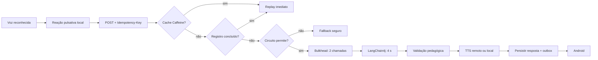

# Arquitetura on/off da LEIA

## Princípio

A atividade nunca depende de uma resposta remota para continuar. A IA melhora a mediação quando
está disponível; a máquina de estados Kotlin, as falas aprovadas, o reconhecimento de conceitos
essenciais e o próximo passo continuam locais. O objetivo de latência é reação visual em até 100 ms,
resposta remota útil em até 4 s e fallback sem nova espera quando circuito ou capacidade recusarem.

## Caminho quente implementado



- `Idempotency-Key` identifica uma tentativa lógica. O Android reutiliza a chave em um único retry
  transitório; o servidor coalesce duplicatas simultâneas, guarda a resposta em RAM por dez minutos
  e persiste a mesma resposta para sobreviver a reinícios.
- Não são persistidos áudio da criança nem transcrição. A impressão da requisição contém apenas
  sessão aleatória, cena, turno, voz e preferência de estímulo.
- O bulkhead usa duas execuções e fila zero. No caminho infantil, rejeitar rapidamente é melhor que
  esconder congestionamento em uma fila crescente.
- O circuito Resilience4j usa janela deslizante de oito chamadas, mínimo de quatro, limite de 50%
  para falha ou lentidão, chamada lenta acima de 2,5 s e vinte segundos aberto.
- O deadline de quatro segundos é externo ao SDK. Mesmo que o cliente do modelo ignore interrupção,
  as duas vagas limitam o dano e novas chamadas recebem fallback imediato.

## Fila, retry e rollback

A fila persistente é a `operational_outbox`, fora do caminho quente. A conclusão idempotente e a
criação do evento `VOICE_TURN_COMPLETED` ocorrem na mesma transação: ou ambas são confirmadas, ou o
banco reverte ambas. Um worker busca até oito eventos, aplica lease de trinta segundos, entrega
métrica neutra e, se falhar, reagenda com backoff exponencial. Depois de cinco tentativas, o evento
vai para `DEAD` para inspeção, sem bloquear a criança.

Retry do modelo permanece desligado: repetir uma inferência de quatro segundos pioraria abandono.
Retry de transporte ocorre uma única vez no Android, entre 80 e 180 ms, somente para timeout, HTTP
425 ou falhas 502/503/504, sempre com a mesma chave idempotente.

Rollback remoto não existe: uma chamada de IA já enviada não pode ser “desenviada”. O rollback
defensável é transacional no banco, cancelamento/isolamento da tarefa e descarte de resposta tardia
no Android quando sessão ou tela mudarem.

## Árvore de decisão do provedor

O roteador multi-provedor é a próxima evolução e deve seguir esta árvore, sem corrida paralela com
dados infantis:

```text
conceito essencial conhecido localmente? -> resposta local
senão, aparelho sem rede?                 -> ScenePack/fallback local
senão, provedor permitido e circuito HOT? -> modelo rápido da tarefa
senão, modelo local saudável?             -> Ollama
senão                                     -> fallback aprovado
```

Cada ramo precisa considerar `taskType`, autorização contratual, circuito, capacidade e p95 recente.
Nunca escolher por identidade, desempenho atribuído ou diagnóstico da criança. Gemini fica restrito
a benchmark sintético enquanto seus termos não permitirem o público infantil pretendido.

## Estruturas e algoritmos com função real

| Elemento | Uso defensável |
|---|---|
| fila | outbox persistente e trabalhos frios de métricas/sincronização |
| deque limitado | seis mensagens efêmeras da conversa, com TTL de dez minutos |
| pilha | somente para desfazer/refazer desenho no futuro; não é necessária no diálogo atual |
| árvore | roteamento determinístico por tarefa, permissão e saúde |
| cache | replay idempotente e `ScenePack`, nunca perfil psicológico |
| janela deslizante | abrir/fechar circuito por falha e lentidão recente |
| backoff exponencial | reenviar eventos de segundo plano sem tempestade de chamadas |

## Experiência por condição

| Condição | O que a criança percebe | Execução |
|---|---|---|
| online + IA saudável | botão vivo, pausa curta e resposta contextual | rota remota validada |
| online + IA lenta | reação local e fallback até 4 s | deadline + circuito |
| online + resposta repetida | mesma resposta quase imediata | cache/banco idempotente |
| offline | atividade e voz continuam | regras, conteúdo e TTS locais |
| troca de tela durante chamada | nenhuma fala atrasada invade a nova tela | job cancelado + session guard |
| estímulos reduzidos | indicação estática, sem pulsação | mesma orientação e voz |

## Próximos incrementos, por evidência

1. Introduzir `ProviderRouter` apenas quando dois provedores juridicamente permitidos estiverem
   ativos; cada um terá circuito e métricas próprios.
2. Medir TTFT, p50/p95, taxa de JSON válido, fallback e saturação via Micrometer/Prometheus.
3. Criar `ScenePack` versionado em cache para respostas e pistas da atividade, sem RAG no turno.
4. Adicionar NDJSON/SSE apenas para `ACK`, texto final validado e áudio; nunca falar token parcial.
5. Adotar WebSocket quando houver streaming bidirecional de áudio, VAD e interrupção de fala.

## Evidência local de 14/09/2026

- primeira execução idempotente: aproximadamente 51 ms usando fallback local;
- replay em memória: aproximadamente 1,6 ms;
- replay persistido após reiniciar o Spring: aproximadamente 36 ms;
- 23 testes do servidor e 12 testes Android unitários aprovados.

Esses valores provam os mecanismos locais, não constituem SLA de rede ou de provedor.
