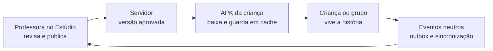

# Espaço da Criança e Espaço da Professora

O InterpretaAI separa a experiência infantil do trabalho docente. Essa separação é de público,
linguagem, autenticação e responsabilidade — não apenas de aparência.

> **Arquitetura atual:** a criança utiliza o **APK Android**. A professora utiliza o **Estúdio web
> responsivo**, autenticado por OIDC. O APK mantém uma configuração adulta protegida apenas para
> operações rápidas no aparelho. Portanto, hoje não existem dois APKs independentes.

[← Voltar ao README](../README.md) · [Catálogo de experiências](EXPERIENCE_CATALOG.md) ·
[Galeria completa](GALLERY.md)

## 1. Espaço da Criança — APK Android

O espaço infantil é falado, visual e organizado em uma decisão por tela. Ele não mostra nome,
matrícula, relatório, configuração de rede ou controle da turma. A criança encontra LÉIA, Alfa,
Lia e Davi, ouve uma história, observa pistas e participa por voz, toque ou arraste.

<table>
  <tr>
    <td width="25%" align="center"> <strong>Entrada infantil</strong> LÉIA e Alfa fazem o convite.</td>
    <td width="25%" align="center"> <strong>História falada</strong> Ouvir e observar.</td>
    <td width="25%" align="center"> <strong>Interação</strong> Toque ou arraste.</td>
    <td width="25%" align="center"> <strong>Linguagem</strong> Imagem, letra e som.</td>
  </tr>
</table>

### O que caracteriza esse espaço

- uma ação principal por viewport, sem rolagem obrigatória;
- instrução falada e repetível;
- toque e voz como alternativas; arraste nunca é obrigatório;
- ajuda progressiva, sem expor a resposta no primeiro momento;
- tentativa diferente recebe apoio, não nota ou vermelho punitivo;
- conteúdo essencial em cache para continuar com conexão fraca;
- término em conversa, explicação ou atividade coletiva fora da tela.

## 2. Espaço da Professora — Estúdio web

O Estúdio acompanha o trabalho real da professora: **preparar, aplicar, observar e replanejar**.
Ele usa uma interface mais calma e densa que a infantil, pode rolar e exige autenticação. A professora
seleciona a turma, revisa a história, acompanha o preparo dos aparelhos e observa evidências sem nota,
ranking ou diagnóstico automático.

<table>
  <tr>
    <td width="33%" align="center"> <strong>Hoje</strong> Aula e aparelhos prontos.</td>
    <td width="33%" align="center"> <strong>Revisar</strong> Prévia antes de publicar.</td>
    <td width="33%" align="center"> <strong>Acompanhar</strong> Participação e observação docente.</td>
  </tr>
</table>

O mesmo Estúdio se adapta ao equipamento disponível para a professora:

<table>
  <tr>
    <td width="35%" align="center"> <strong>Celular</strong> Acompanhar a aula sem levar a interface infantil.</td>
    <td width="65%" align="center"> <strong>Tablet</strong> Revisar cenas e conferir a prévia infantil.</td>
  </tr>
</table>

### O que caracteriza esse espaço

- escola e turma vêm do vínculo autenticado, não de texto livre no navegador;
- histórias passam por revisão humana antes de chegar às crianças;
- estado dos aparelhos diferencia pronto, preparando e sem conexão;
- evidências mostram origem, amostra e limite;
- observação escrita pela professora continua humana e possui histórico;
- assistente sugere retomadas, mas não emite parecer pedagógico final;
- informações técnicas ficam fora da ação principal.

## 3. Configuração adulta no APK do tablet

O APK da criança conserva uma área adulta protegida para situações em que a professora está diante
do aparelho: escolher conteúdo pronto, formar um grupo, verificar conectividade, acessibilidade,
voz e Modo Foco. Essa área não substitui o Estúdio e não fica acessível pela Home infantil.

<table>
  <tr>
    <td width="33%" align="center"> <strong>Missão</strong> Escolher conteúdo pronto.</td>
    <td width="33%" align="center"> <strong>Turma</strong> Formar grupo e enviar.</td>
    <td width="33%" align="center"> <strong>Tablet</strong> Diagnóstico e Modo Foco.</td>
  </tr>
</table>

## Como os dois espaços se conectam

| Informação | Espaço da Criança | Espaço da Professora |
|---|---|---|
| Identidade | avatar ou grupo | vínculo autenticado com escola e turma |
| Conteúdo | pacote aprovado e imutável durante a sessão | revisão, publicação e versão |
| Resposta | voz, toque ou arraste | observação e planejamento |
| Evidência | progresso e apoio imediato | participação, ajuda, duração e contexto |
| Configuração | oculta | explícita somente quando necessária |
| Objetivo | aprender sem depender de leitura autônoma | mediar e decidir o próximo passo |

## Estado das evidências

- As imagens do APK são capturas reais de emulador Android.
- As imagens do Estúdio são capturas reais da interface web executada localmente com dados de teste.
- Os nomes, turmas, quantidades e relatórios exibidos são fixtures; não representam crianças reais.
- O Estúdio e a autenticação OIDC foram verificados no ambiente Oracle piloto.
- O percurso completo professora→tablet ainda precisa de ensaio autorizado em aparelho escolar físico.
