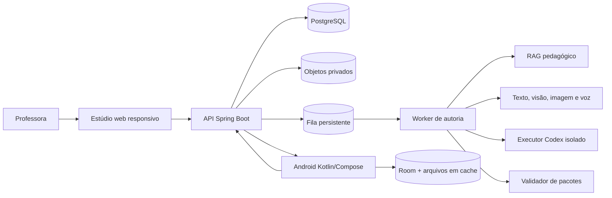
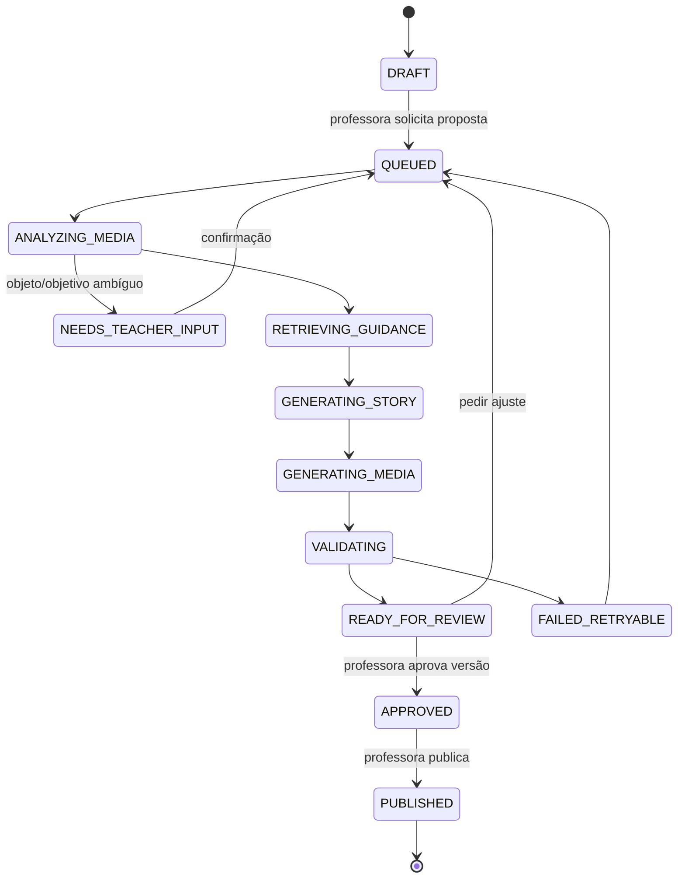
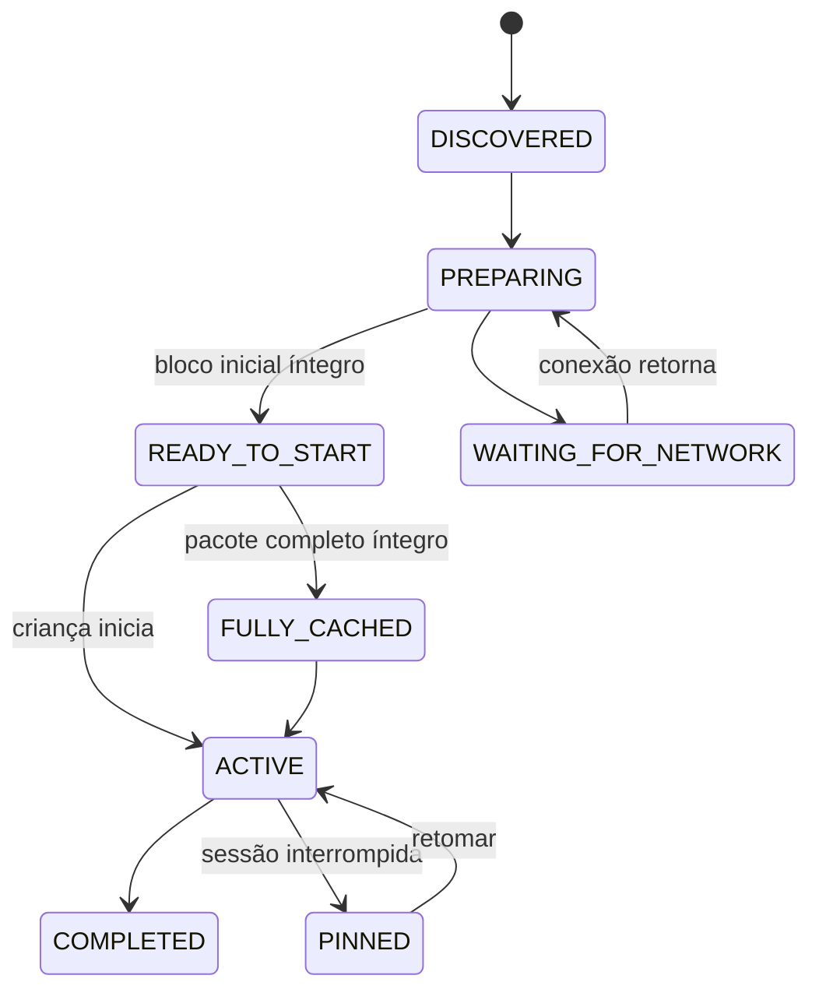

# Arquitetura InterpretaAI 2.0

## Objetivo

Permitir que uma professora transforme um tema ou imagem em uma história educativa imersiva,
revise o resultado dentro do InterpretaAI e publique uma versão executável para a turma. O Android
atualiza o cache automaticamente quando há rede e continua a jornada sem conexão.

## Contexto do sistema



O produto mantém dois caminhos distintos:

- **autoria assíncrona:** pode levar segundos ou minutos e sempre termina em revisão docente;
- **jornada infantil:** responde localmente e usa rede somente para sincronização ou mediação
  opcional com fallback.

## Backend: monólito modular com dois processos

O mesmo projeto Spring gera uma aplicação web e um worker. Eles compartilham contratos e banco,
mas tarefas pesadas não ocupam as threads que entregam conteúdo aos tablets.

| Módulo | Responsabilidade | Não pode fazer |
|---|---|---|
| `identity` | escola, usuário, função, turma e dispositivo | inferir autorização a partir do cliente |
| `authoring` | rascunho, revisão, versão e aprovação | publicar sem ação docente autenticada |
| `media` | upload, sanitização, derivados, hash e procedência | disponibilizar arquivo bruto publicamente |
| `curriculum` | objetivos, referências, RAG e regras LEIA | usar relatório infantil como fonte do RAG |
| `story` | contrato, validação e montagem do pacote | aceitar componente desconhecido pelo app |
| `delivery` | atribuição, manifesto, cache e confirmação de preparo | alterar pacote já publicado |
| `evidence` | sessões, eventos, observações e agregados | emitir nota, ranking ou diagnóstico |
| `ai` | provedores, orçamentos, auditoria e fallback | expor chaves ao navegador ou Android |

Separar esses módulos em serviços só será considerado quando carga, equipe ou fronteira de
segurança justificar. O primeiro deploy cabe em uma VM Oracle com PostgreSQL, proxy HTTPS e
armazenamento privado de objetos.

## Pipeline de imagem

1. O navegador solicita uma sessão de upload autenticada.
2. O arquivo entra em área temporária privada com limite de tamanho, pixels e formato.
3. O worker decodifica e regrava a imagem, remove metadados e calcula SHA-256.
4. Visão sugere objetos e recorte, com confiança e alternativas.
5. A professora confirma a palavra/objeto e o objetivo antes da geração pedagógica.
6. O sistema cria derivados para quadrinho, puzzle, miniatura e formação de palavra.
7. Imagens geradas ou editadas recebem procedência, prompt, provedor, modelo e revisão.
8. Somente derivados aprovados entram no pacote publicado.

Formatos iniciais: JPEG, PNG e WebP. O original não é entregue ao tablet. Imagem ambígua entra no
estado `NEEDS_TEACHER_INPUT`; o sistema não escolhe silenciosamente um objeto.

## Autoria assistida



Cada transição é persistida. Um retry repete somente a etapa falha e usa a mesma chave idempotente.
Um cancelamento interrompe novas chamadas e conserva o rascunho já produzido.

## RAG pedagógico

O RAG oferece direção e rastreabilidade ao planejador. A primeira versão usa PostgreSQL com busca
textual e filtros de metadados; `pgvector` entra quando um conjunto de avaliação demonstrar ganho.

### Fontes e escopos

| Coleção | Exemplo | Escopo |
|---|---|---|
| `methodology` | método LEIA e fluxo de mediação | global, versionado |
| `curriculum` | objetivos e orientações aprovadas | rede/escola/global |
| `accessibility` | apoios, linguagem e redução de estímulos | global, obrigatório |
| `editorial` | personalidade da LÉIA, cachorro e identidade visual | global, versionado |
| `approved_examples` | histórias aprovadas e avaliadas | escola ou global após curadoria |
| `teacher_library` | materiais enviados pela professora | somente a proprietária/escola |

Metadados mínimos: `sourceId`, `sourceVersion`, `scope`, `schoolId`, `yearRange`, `objectiveIds`,
`modality`, `reviewStatus`, `validFrom` e `validUntil`.

### Recuperação

1. Aplicar autorização e filtros de escopo.
2. Recuperar trechos por objetivo, faixa, modalidade e termos da proposta.
3. Diversificar resultados por fonte e remover duplicatas.
4. Enviar ao modelo trechos com identificadores, nunca uma citação fabricada.
5. Persistir os `sourceId/sourceVersion` usados no rascunho.
6. Avaliar se cada afirmação pedagógica retornada aponta para uma fonte recuperada.

Regras duras — componentes permitidos, número de cenas, tamanho das falas, segurança e contrato —
ficam em código/JSON Schema. RAG não substitui validação.

## Extensão Codex de autoria

O backend enfileira uma tarefa com o contrato de autoria. Um serviço isolado controla o Codex SDK
e disponibiliza apenas ferramentas específicas:

- `retrieve_guidance(query, filters)`;
- `read_story_contract()`;
- `request_image_variant(specification)`;
- `upload_draft_asset(file, metadata)`;
- `validate_draft(pack)`;
- `submit_draft(pack, assets)`.

O executor recebe diretório temporário exclusivo, limite de CPU/memória/tempo, rede por lista de
destinos e credencial efêmera. Ele não recebe credencial de publicação, acesso ao banco, relatórios,
áudio ou imagem de crianças. O resultado volta como rascunho e passa novamente pelos validadores.

Codex pode coordenar arquivos e transformações de autoria. Chamadas simples de texto, imagem ou voz
podem ser executadas diretamente pelos adaptadores Spring. O backend escolhe a rota pela tarefa;
o painel não precisa conhecer o provedor.

### Fronteira de implementação

O SDK oficial do Codex é executado no servidor em TypeScript/Node ou Python; portanto, ele não será
incorporado artificialmente ao processo Java. O Spring publica `AuthoringJob` na fila e o executor
isolado consome o trabalho, controla a thread do Codex e devolve somente artefatos e estado pelo
contrato interno. Essa separação permite trocar ou desligar Codex sem alterar o Estúdio, o pacote ou
o Android. Para um cliente próprio que precise de aprovações e eventos do agente, a alternativa é o
Codex app server. Referência: [documentação oficial do Codex SDK](https://developers.openai.com/codex/sdk).

LangChain4j continua responsável pelo planejamento pedagógico estruturado e pelo RAG. Codex entra
quando há trabalho agentivo de arquivos e montagem; o provedor de imagem gera/edita pixels. Assim,
Codex não é usado como um chatbot infantil nem como substituto do serviço de geração de imagens.

## Contrato de conteúdo

`LearningStoryPack` é o único formato que o Android executa. Ele contém cenas, recursos, interações,
transições e acessibilidade. O JSON é validado pelo schema e depois por regras semânticas:

- identificadores e referências existem;
- a cena inicial é alcançável e existe caminho até o encerramento;
- cada interação tem solução e apoio válidos;
- palavra e peças preservam acentos e repetições;
- mídias obrigatórias têm hash e variante compatível;
- toda cena possui narração/texto alternativo;
- componente exige versão do app que o suporta;
- pacote aprovado não muda de bytes.

O artefato publicado contém `manifest.json`, recursos e uma assinatura do backend. O Android rejeita
hash divergente, schema incompatível ou componente desconhecido.

## Atualização automática e operação offline

O Android usa Room e arquivos locais como fonte de verdade. A interface não lê conteúdo diretamente
da rede.

Na implementação local atual, o leitor Kotlin aceita somente o schema `1.0` e os cinco componentes
fechados. Ele bloqueia incompatibilidade de versão, referência quebrada, ciclo, palavra que não pode
ser formada, procedência incompleta e linguagem proibida antes de a UI receber o pacote. Room guarda
o manifesto imutável e o estado de preparo; os recursos ficam privados em `filesDir`, por SHA-256,
com troca atômica. O manifesto HTTP, o download e o renderer por dados ainda são etapas separadas e
não devem ser descritos como entregues.



- O APK traz um acervo-base completo.
- A Home consulta mudanças enquanto está aberta; WorkManager faz trabalho persistente com rede.
- Manifesto e primeira sequência têm prioridade; demais cenas são antecipadas em segundo plano.
- Downloads usam arquivo temporário, hash e troca atômica.
- Conteúdo compartilhado é deduplicado pelo hash.
- A versão ativa fica fixada até encerrar a sessão.
- Retry usa espera crescente com jitter e respeita conectividade/bateria.
- Pacotes atribuídos, ativos e recentes não são removidos pelo limite de cache.

Estados exibidos ao professor: `ENVIADA`, `RECEBIDA`, `PREPARANDO`, `PRONTA`, `INICIADA`,
`CONCLUÍDA`, `SEM_CONEXÃO` e `FALHA`. “Publicada” não significa “pronta no tablet”.

## APIs de alto nível

| Método e rota | Uso |
|---|---|
| `POST /api/v2/media/uploads` | iniciar upload temporário |
| `POST /api/v2/authoring/jobs` | criar proposta de história |
| `GET /api/v2/authoring/jobs/{id}` | acompanhar etapas e artefatos |
| `POST /api/v2/authoring/jobs/{id}/inputs` | responder ambiguidade ou pedir ajuste |
| `POST /api/v2/stories/{id}/versions/{v}/approve` | registrar aprovação docente |
| `POST /api/v2/stories/{id}/versions/{v}/publish` | publicar versão aprovada |
| `POST /api/v2/assignments` | atribuir pacote a turma/grupo/dispositivo |
| `GET /api/v2/devices/{id}/manifest` | consultar versões atribuídas |
| `POST /api/v2/devices/{id}/delivery-events` | confirmar recebimento/preparo |
| `POST /api/v2/learning-sessions` | fixar contexto da sessão |
| `POST /api/v2/learning-events:batch` | sincronizar eventos idempotentes |
| `POST /api/v2/teacher-observations` | registrar observação docente |
| `GET /api/v2/reports/classrooms/{id}` | relatório contextualizado |

Todos os mutadores aceitam `Idempotency-Key`. Upload, aprovação, publicação e leitura de relatório
geram auditoria.

## Oracle

Primeiro desenho de implantação:

```text
Internet
  └─ Caddy/HTTPS
       └─ Spring API (sem arquivos locais permanentes)
            ├─ PostgreSQL
            ├─ OCI Object Storage privado
            └─ fila/outbox no PostgreSQL
                 └─ Worker de autoria
                      └─ Executor Codex isolado
```

Segredos ficam em Vault/variáveis entregues ao processo; o APK recebe somente URL pública e
credencial revogável do dispositivo. Quando disponível, a VM usa instance principal para acessar
serviços OCI. Backups do banco e objetos têm política separada da VM e teste de restauração.

## Segurança e privacidade

- OIDC e RBAC para adultos; credencial própria por dispositivo.
- Autorização por escola/turma em toda consulta, inclusive RAG.
- Upload privado, sanitizado e sem URL pública permanente.
- Confirmação explícita da professora antes de enviar imagem sensível a provedor externo.
- Sem gravação de áudio/transcrição infantil nos relatórios.
- Sem dados de crianças no RAG ou no executor Codex.
- Logs contêm IDs técnicos, estado, latência, consumo e erro sanitizado.
- Versão publicada é imutável e tem procedência de todo recurso gerado.
- Exclusão e retenção são tarefas auditáveis, sem depender de limpeza manual da VM.

## Metas não funcionais iniciais

| Item | Meta de projeto |
|---|---|
| Resposta local ao toque | sem espera de rede |
| Abertura de conteúdo pronto | até 500 ms no aparelho de referência |
| Primeiro bloco após atribuição | preparar automaticamente quando houver rede |
| Retomada de download | continuar sem corromper pacote |
| Publicação duplicada | resultado idempotente |
| Compatibilidade | 360×640, 412×915 e 800×1280 dp |
| Cache | configurável; nunca remover sessão ativa |
| Autoria | assíncrona, retomável e observável por etapa |
| Disponibilidade infantil | acervo-base utilizável mesmo sem servidor |
