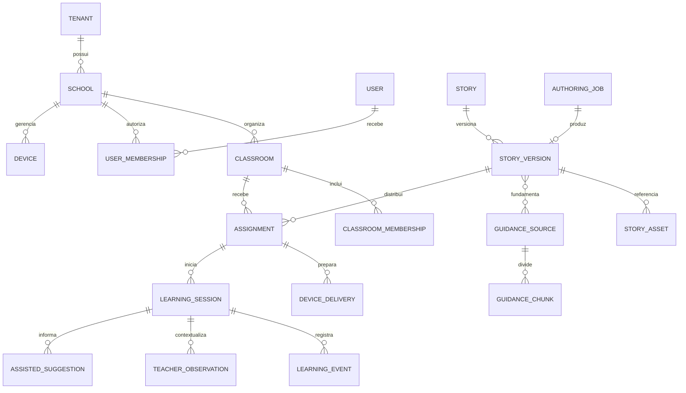

# Modelo de dados 2.0

## Regra central

Conteúdo, entrega e evidência são domínios separados. Uma história pode ganhar novas versões sem
reescrever sessões antigas; uma atribuição pode existir sem o aparelho estar pronto; um evento não
vira automaticamente uma conclusão pedagógica.

## Entidades e invariantes

| Entidade | Campos essenciais | Invariante |
|---|---|---|
| `Tenant/School` | nome, política, retenção | toda consulta adulta tem escopo escolar |
| `UserMembership` | usuário, escola, papel | papel não vem do cliente |
| `Classroom` | escola, período, estado | arquivar não apaga histórico |
| `LearnerIdentityVault` | identidade institucional, alias | isolado do app e do executor de IA |
| `Device` | escola, chave revogável, capacidades | dispositivo não é identidade da criança |
| `Story` | proprietário, título, estado | contêiner lógico editável |
| `StoryVersion` | versão, pack hash, aprovação | publicada é imutável |
| `StoryAsset` | objeto, hash, procedência, revisão | bruto privado; tablet recebe derivado aprovado |
| `AuthoringJob` | pedido, estado, custo, fontes | retry por etapa e chave idempotente |
| `GuidanceSource` | escopo, versão, validade, revisão | somente fonte aprovada participa do RAG |
| `Assignment` | versão, alvo, janela | aponta para versão exata |
| `DeviceDelivery` | estado, bytes, último contato | `READY` exige recibo do Android |
| `LearningSession` | contexto imutável, recibo | vínculo histórico não muda após início |
| `LearningEvent` | sequência, nó, objetivo, apoio | idempotente por `eventId` |
| `TeacherObservation` | autora, texto, visibilidade, revisões | texto humano nunca é reescrito pela IA |
| `AssistedSuggestion` | evidências, limites, estado | requer revisão e pode ser descartada |
| `AuditEvent` | ator, ação, alvo, data, correlação | append-only e sem segredo/conteúdo infantil bruto |

## Identidade da criança

O alias pedagógico é diferente do nome institucional. Apenas o cofre de identidade, acessível a
perfis autorizados, relaciona os dois. O pacote, o RAG, o Codex e os provedores de geração não
recebem nome, matrícula, áudio ou relatório individual.

Em tablet compartilhado, `participantScope=GROUP`, `learnerAlias=null` e a quantidade de integrantes
é registrada. Não se divide artificialmente o resultado coletivo entre crianças.

## Concorrência e versões

- `StoryVersion` usa controle otimista; salvar sobre uma revisão antiga retorna conflito.
- Aprovação congela JSON e hashes; publicação referencia exatamente esse artefato.
- Edição depois da aprovação cria uma nova versão em rascunho.
- A sessão fixa `storyVersion` até o encerramento, mesmo que outra versão seja publicada.
- Expurgo de ativos só ocorre quando nenhuma versão, atribuição ou sessão retida os referencia.

## Outbox e sincronização

Publicação, atribuição e agregação escrevem o estado de domínio e uma `OutboxMessage` na mesma
transação. Workers processam pelo menos uma vez; consumidores deduplicam por identificador.
Eventos Android aceitam reenvio e só avançam a sequência confirmada depois da persistência local.

## Classificação de dados

| Classe | Exemplos | Tratamento |
|---|---|---|
| Público | descrição institucional aprovada | cache/CDN permitido |
| Interno | rascunho, fonte, custo de IA | RBAC e auditoria |
| Pessoal | usuário, alias vinculado, observação | criptografia, retenção e acesso restrito |
| Sensível infantil | identidade, eventual mídia autorizada | cofre separado; nunca entra no RAG/Codex |
| Segredo | chave de provedor, token de dispositivo | Vault/secret, rotação e nunca em log |

