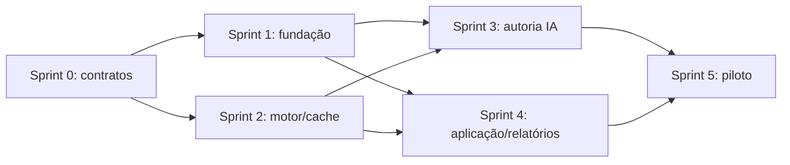

# Plano de execução — primeira rodada 2.0

## Resultado da rodada

Uma professora cria uma história a partir de uma imagem, recebe roteiro/imagens/atividades no
estúdio, revisa uma versão, publica para a turma, acompanha o preparo automático nos aparelhos e
consulta evidências contextualizadas depois da jornada. A história continua sem conexão depois que
o bloco necessário está no cache.

Sprints são unidades de uma semana útil para planejamento. O compromisso de datas é fechado depois
da Sprint 0 conforme equipe, disponibilidade da Oracle e revisão pedagógica.

## Definition of Done comum

- contrato/API versionado e migração compatível;
- autorização e auditoria nos fluxos adultos;
- teste de regra de domínio e integração proporcional ao risco;
- estados de carregamento, vazio, parcial, offline e falha recuperável;
- acessibilidade e responsividade verificadas;
- telemetria sem conteúdo infantil bruto;
- documentação de operação e rollback;
- demonstração do incremento usando dados sintéticos.

## Sprint 0 — contrato, UX e risco

### Objetivo

Eliminar decisões ambíguas antes de criar infraestrutura.

### Entregas

- validar `LearningStoryPack` e o exemplo da maçã;
- protótipo navegável do Estúdio nas quatro áreas;
- modelo de autorização `rede → escola → turma → usuário/dispositivo`;
- contexto imutável de sessão e catálogo de eventos v2;
- catálogo inicial de componentes Android e matriz de compatibilidade;
- lista de fontes do RAG com responsável e versão;
- ameaça/modelo de dados do upload até a publicação;
- orçamento estimado por história e limites de geração.

### Aceite

- produto, pedagogia e engenharia aprovam um pacote executável completo;
- cinco tarefas docentes são percorridas no protótipo sem configuração técnica;
- nenhuma etapa depende de Codex para definir contrato ou regra obrigatória;
- riscos sem decisão têm responsável e prazo.

## Sprint 1 — fundação Oracle e identidade

### Objetivo

Criar a base segura e recuperável do estúdio.

### Entregas

- ambientes `dev` e `staging` na Oracle;
- Caddy/HTTPS, API Spring, worker e PostgreSQL;
- armazenamento privado de objetos e sessão de upload;
- OIDC para professor e RBAC por escola/turma;
- pareamento por código efêmero e credencial revogável do dispositivo;
- fila persistente, idempotência, auditoria e painel operacional mínimo;
- backup e ensaio de restauração.

### Aceite

- professora de uma escola não acessa outra escola;
- tarefa enfileirada sobrevive a reinício do worker;
- objeto bruto não tem URL pública;
- segredo não entra no Git, APK, navegador ou log;
- banco e objeto são restaurados em staging.

## Sprint 2 — motor de histórias e cache automático

### Objetivo

Executar conteúdo variável mantendo o caminho infantil local.

### Entregas

- parser/validador Kotlin do pacote;
- renderização dos componentes `COMIC`, `PUZZLE` e `WORD_BUILDER`;
- gibi atual migrado para pacote sem perda visual/funcional;
- Room como fonte local para catálogo, versão, sessão e entrega;
- manifesto incremental, recursos por hash e arquivos temporários;
- preparo automático, retry por WorkManager e pin de sessão ativa;
- acervo embarcado e fallback offline preservados.

### Aceite

- o mesmo APK executa `BOLA` e `MAÇÃ` por dados, sem constantes específicas;
- queda de rede durante download não corrompe o pacote;
- queda após início não interrompe a jornada preparada;
- atualização publicada não troca a versão de uma sessão ativa;
- celulares e tablets alvo passam pela auditoria visual.

## Sprint 3 — autoria assistida, RAG e Codex

### Objetivo

Entregar o ciclo pedido → proposta → recursos → revisão no Estúdio.

### Entregas

- ingestão e versionamento da biblioteca pedagógica;
- recuperação com filtros de escopo, objetivo, faixa e modalidade;
- planejador LangChain4j com saída estruturada;
- adaptadores de visão, imagem e voz;
- executor Codex isolado e ferramentas delimitadas;
- estados persistidos da tarefa e retry por etapa;
- procedência, custo, latência e fontes usadas em cada rascunho;
- prévia da história em celular e tablet.

### Aceite

- imagem de maçã gera rascunho válido usando fontes identificáveis;
- ausência de fonte aparece como limitação, sem citação inventada;
- regenerar uma imagem preserva roteiro e outras cenas;
- Codex não consegue publicar nem consultar relatórios/dados infantis;
- saída inválida não chega à revisão como pacote publicável;
- a professora edita e aprova a versão dentro do InterpretaAI.

## Sprint 4 — aplicação em turma e relatórios

### Objetivo

Fechar o ciclo pedagógico e a verdade operacional da entrega.

### Entregas

- atribuição para turma, grupo, indivíduo e tablet compartilhado;
- estados `ENVIADA → RECEBIDA → PREPARANDO → PRONTA → INICIADA → CONCLUÍDA`;
- contexto imutável de sessão e eventos v2;
- observação docente com histórico;
- visões Aula/Turma e Criança;
- agregados Escola/Secretaria com supressão configurável;
- assistente de síntese com referências e revisão obrigatória.

### Aceite

- painel só mostra `PRONTA` após confirmação do Android;
- evento offline sincronizado depois mantém turma/participante originais;
- tablet compartilhado não cria evidência individual;
- falha técnica não aparece como abandono;
- sugestão assistida exibe evidências e pode ser editada/descartada.

## Sprint 5 — piloto, desempenho e fechamento

### Objetivo

Validar o percurso completo com professoras, aparelhos e rede disponíveis.

### Entregas

- teste de usabilidade docente com as cinco tarefas;
- observação infantil do gibi e das atividades inseridas;
- teste de rede fraca, queda, reconexão e cache cheio;
- teste de carga de publicação/preparo por turma;
- orçamento real de IA e tempo por etapa;
- revisão de privacidade, acessibilidade e procedência;
- runbook de suporte, rollback e recuperação.

### Aceite

- quatro de cinco professoras concluem cada tarefa sem instrução técnica;
- jornada infantil não aguarda geração remota;
- conteúdo preparado abre offline;
- falhas injetadas são recuperadas sem perder rascunho/sessão;
- equipe consegue reverter pacote, app e backend de forma documentada;
- limitações observadas viram backlog priorizado, não alegações de eficácia.

## Dependências e caminho crítico

Motor/cache e fundação podem avançar em paralelo depois da Sprint 0. Autoria depende do contrato
executável; relatórios dependem da identidade e do contexto de sessão.

## Backlog posterior

- novas mecânicas depois de validar o contrato das três primeiras;
- busca vetorial/`pgvector` baseada em avaliação do RAG textual;
- editor visual avançado de quadrinhos;
- biblioteca compartilhada entre escolas com curadoria formal;
- atividades para casa e responsáveis;
- portal específico da secretaria;
- escalabilidade horizontal e separação de serviços quando medida.

