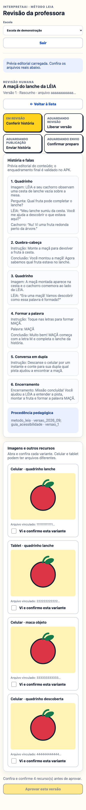
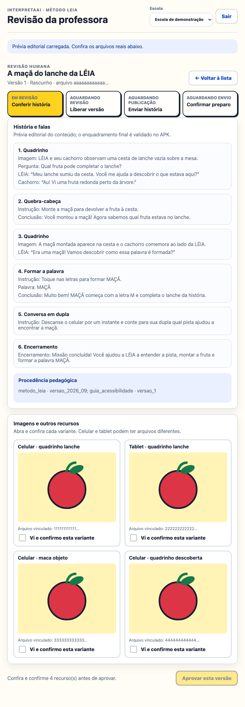
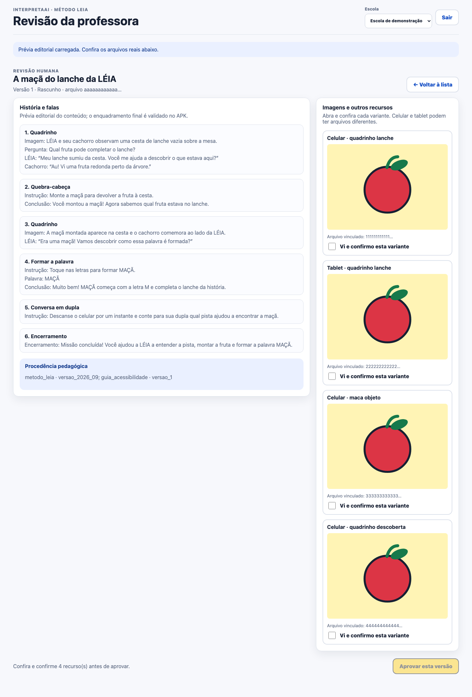

# Estúdio docente — revisão editorial 2.0

Estado em 17/09/2026: interface e BFF implementados e testados **localmente**. A Oracle pública ainda retorna 404 em `/studio/` e `/api/v2/identity/me`; nenhum deploy foi feito nesta entrega.

## Jornada implementada

A professora entra via OIDC institucional, escolhe uma escola do seu vínculo ativo e pode gerar um código temporário para conectar um tablet somente a uma turma vinculada. O código aparece uma vez, não é armazenado no navegador e o BFF mantém o token OIDC fora do JavaScript. Depois, abre um rascunho e confere cenas, diálogos, palavra-alvo, procedência e cada variante privada de imagem/áudio. Só consegue aprovar depois de confirmar todos os arquivos carregados. A aprovação envia revisão, hash do rascunho e hashes das mídias ao servidor; o backend repete autorização e validações. Publicar é uma segunda ação explícita. Depois, a professora escolhe uma turma vinculada e disponibiliza a versão publicada. **Publicar não atribui à turma; atribuir não comprova que os tablets prepararam o cache.** Após a atribuição, o painel consulta separadamente aparelhos compatíveis pareados e recibos de cache verificado nas últimas 24 horas, com atualização manual. A professora também pode retirar o envio com confirmação explícita; isso não apaga a publicação. Quando não há histórias, a interface mostra estado vazio verdadeiro, não conteúdo de demonstração.

## Fronteira de segurança

O navegador usa sessão HTTP segura, CSRF e rotas `/studio/api/**`; tokens OIDC, chaves dos provedores e caminhos privados de objetos não entram no JavaScript. A identidade vem do `sub` OIDC e o papel/escola do banco, nunca de campos enviados pelo navegador. A interface é auxiliar: confirmar caixas não contorna o portão do backend. Conteúdo de histórias entra no DOM via `textContent`; prévias são autenticadas e `no-store`. O Estúdio fica **desligado por padrão** (`STUDIO_ENABLED=false`) e falha ao iniciar se habilitado sem OIDC.

Para ativar em staging, configurar um cliente OIDC Spring `studio` com issuer, client ID e secret guardados fora do Git, `OIDC_ENABLED=true` e `STUDIO_ENABLED=true`. O proxy HTTPS precisa encaminhar `/studio/**`, `/login`, `/oauth2/authorization/**` e `/login/oauth2/code/**`, com cabeçalhos de encaminhamento corretos. `STUDIO_COOKIE_SECURE=true` deve permanecer em HTTPS. O provedor, callback, Nginx e PostgreSQL reais ainda exigem teste ponta a ponta antes de abrir a docentes.

## Evidência e limites

- `./gradlew :server:test` cobre segurança habilitada/desabilitada, isolamento por escola/autoria, CSRF, aprovação/publicação, atribuição idempotente, retirada e recibo de preparo; hash errado, recibo antigo e aparelho revogado não contam. OIDC é simulado.
- `uv run --with playwright python3 tools/audit-studio-review.py` confere layout e os fluxos código de pareamento e revisão → publicação → turma em 390×844, 800×1280 e 1440×1000. As capturas em `output/screenshots/v2-studio-review-fixture/` usam **fixture sintética**, não pareamento, geração ou Oracle reais.
- Não há edição, pedido de ajuste/rejeição, relatório docente nem geração de pacote pelo Codex nesta interface. A conexão geração → revisão → publicação → atribuição → cache offline ainda está pendente de teste integrado em aparelhos escolares e servidor real.
- O recibo é afirmação de um aplicativo autenticado após verificar arquivos locais; não prova permanência futura do cache, execução pela criança ou aprendizado. A retirada remove o vínculo local na próxima sincronização online via `404` da reconfirmação, não por push; aparelhos offline e cenas já abertas em memória podem continuar temporariamente. O contador não é métrica infantil.
- Não houve teste com professoras ou crianças. A auditoria visual técnica não prova usabilidade humana.
- Um smoke em PostgreSQL 17.11 local e descartável aplicou as 20 migrações até V20, confirmou a tabela de recibos e iniciou o JAR. Isso não substitui teste de consulta com dados em PostgreSQL nem valida sessão OIDC e PostgreSQL da Oracle.

### Capturas de auditoria (fixture sintética)

| Celular | Tablet | Desktop |
|---|---|---|
|  |  |  |

Após a atribuição: [celular](../../output/screenshots/v2-studio-review-fixture/mobile-assigned.png), [tablet](../../output/screenshots/v2-studio-review-fixture/tablet-assigned.png), [desktop](../../output/screenshots/v2-studio-review-fixture/desktop-assigned.png). Com confirmação simulada: [celular](../../output/screenshots/v2-studio-review-fixture/mobile-confirmed.png), [tablet](../../output/screenshots/v2-studio-review-fixture/tablet-confirmed.png), [desktop](../../output/screenshots/v2-studio-review-fixture/desktop-confirmed.png). Após retirada simulada: [celular](../../output/screenshots/v2-studio-review-fixture/mobile-withdrawn.png), [tablet](../../output/screenshots/v2-studio-review-fixture/tablet-withdrawn.png), [desktop](../../output/screenshots/v2-studio-review-fixture/desktop-withdrawn.png). Todas são capturas sintéticas.

Pareamento sintético: [celular](../../output/screenshots/v2-studio-review-fixture/mobile-pairing.png), [tablet](../../output/screenshots/v2-studio-review-fixture/tablet-pairing.png), [desktop](../../output/screenshots/v2-studio-review-fixture/desktop-pairing.png).
