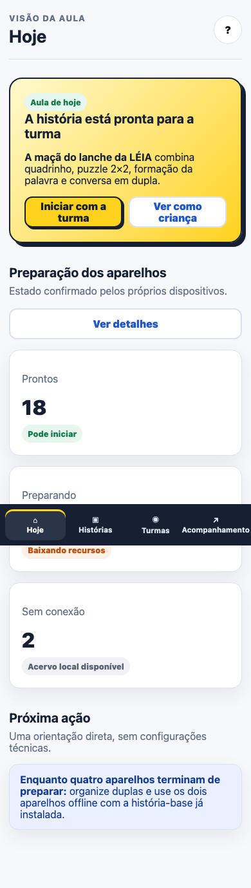
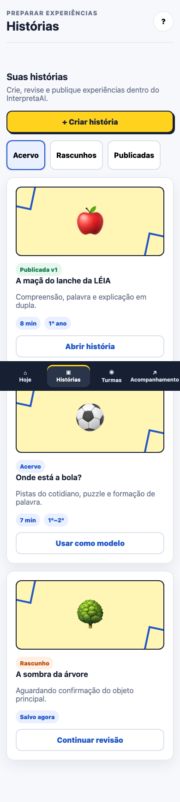
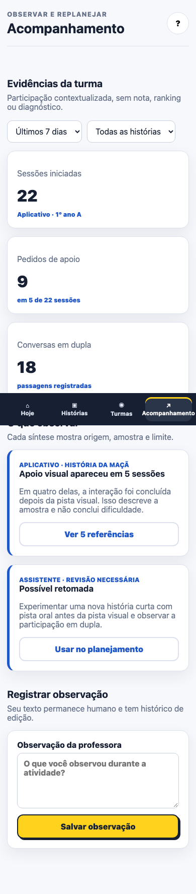
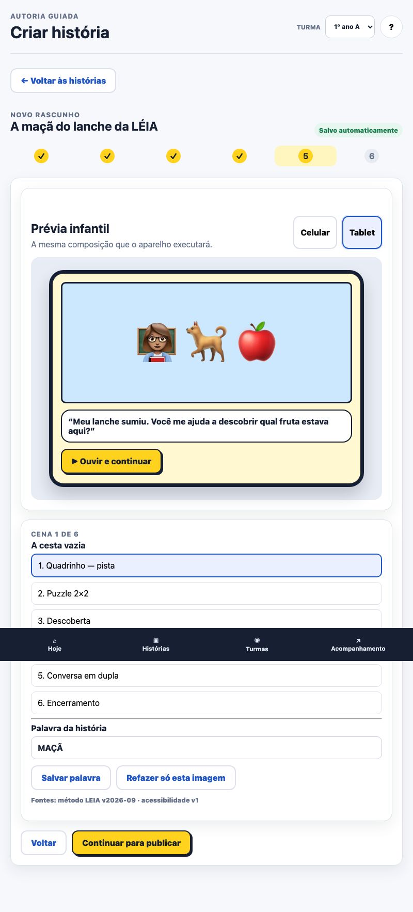

# Auditoria técnica e visual do protótipo docente

## Escopo executado

Data: 2026-09-16. Ambiente: Chromium temporário em modo headless, conteúdo servido somente em
`127.0.0.1`. Foram percorridas as tarefas:

1. abrir Histórias e iniciar uma nova criação;
2. escolher objetivo, imagem de demonstração e palavra;
3. corrigir `MACA` para `MAÇÃ`, regenerar somente uma cena e alternar celular/tablet;
4. publicar a versão e conferir estados dos aparelhos;
5. abrir Acompanhamento e salvar uma observação docente.

Resultado: percurso concluído sem erro JavaScript ou erro de console. As quatro áreas também foram
verificadas sem overflow horizontal em 390, 800 e 1440 pixels. A OpenAPI e os schemas são validados
em outra etapa; este teste não os chama porque o protótipo é estático.

## Capturas verificadas

### Hoje — desktop

### Revisão da história — prévia tablet

### Acompanhamento — desktop

### Hoje — celular

### Histórias — celular

### Acompanhamento — celular

### Hoje — tablet

### Revisão — tablet

## Parecer da inspeção

- hierarquia e ação principal permanecem visíveis nos dois formatos;
- navegação adulta pode rolar; a restrição sem rolagem continua exclusiva da jornada infantil;
- botões, cartões e campos não apresentam corte horizontal em 390, 800 ou 1440px;
- a prévia separa claramente conteúdo infantil das propriedades de edição;
- relatório diferencia Aplicativo e Assistente e mostra denominador/limitação;
- barra inferior fixa aparece sobre um ponto intermediário da captura de página inteira, como é
  esperado em screenshot `fullPage`; no viewport real ela permanece no rodapé, e o `padding-bottom`
  permite trazer o último controle acima dela.

## Limites do resultado

Este teste prova navegação simulada e enquadramento nas capturas, não usabilidade real. O aceite
continua dependendo de professoras executarem as cinco tarefas sem instrução técnica. Também não
prova persistência, autorização, geração por IA, cache Android ou eficácia pedagógica.
